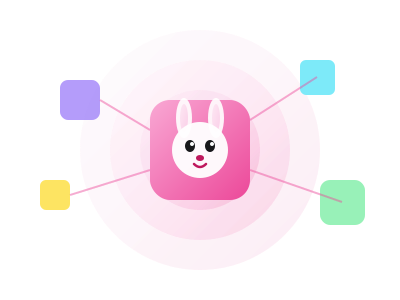
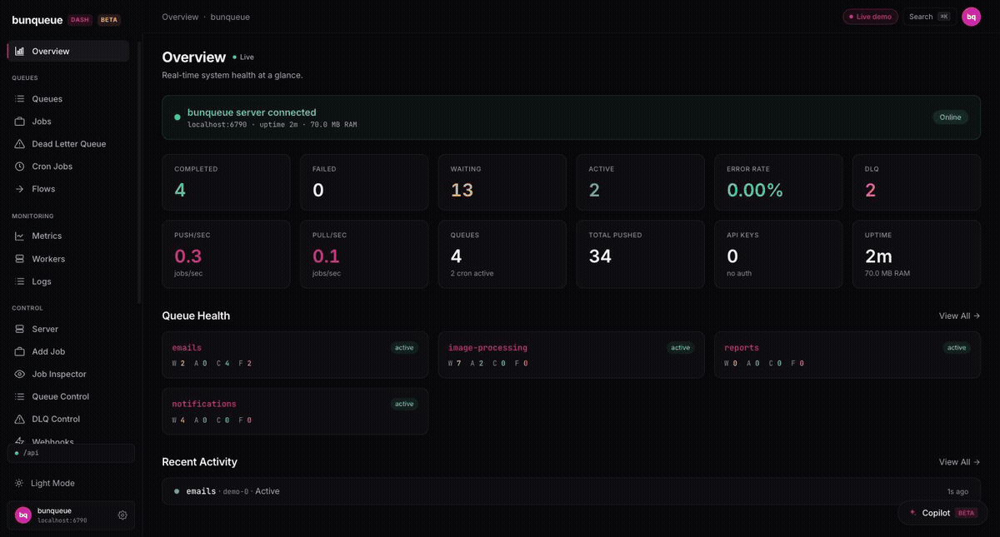
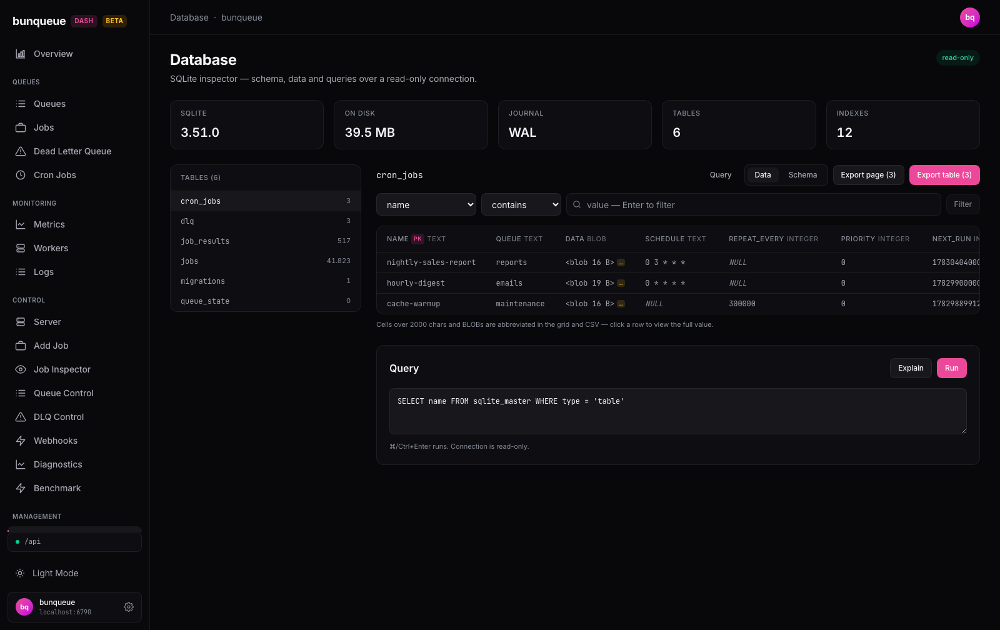
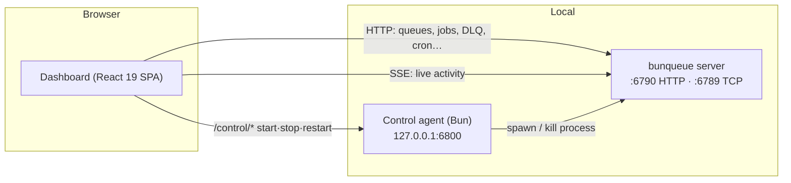

<div align="center">



# bunqueue dashboard

**The only queue dashboard that also _runs_ the server.** Monitor and control queues, jobs, DLQ,
cron, webhooks, workers, and a live activity stream for a [bunqueue](https://bunqueue.dev) server
(a fast, Redis-free, Bun-native background-job queue), plus **start / stop / restart of the server
process itself**, all from one place.

For Bun developers and AI-agent builders running bunqueue who want to _operate_ their queue, not just watch it.

### [▶ Try the live demo](https://egeominotti.github.io/bunqueue-dashboard/)

The full dashboard running on sample data, no server needed.

[](https://www.npmjs.com/package/bunqueue-dashboard)
[](https://github.com/egeominotti/bunqueue-dashboard/actions/workflows/ci.yml)
[](https://github.com/egeominotti/bunqueue-dashboard/actions/workflows/pages.yml)
[](https://github.com/egeominotti/bunqueue-dashboard/actions/workflows/docker.yml)
[](LICENSE)
[](https://egeominotti.github.io/bunqueue-dashboard/docs/)
[](https://egeominotti.github.io/bunqueue-dashboard/)


<br />



<sub>A quick tour. <a href="https://egeominotti.github.io/bunqueue-dashboard/">Try it live →</a></sub>

<br /><br />


<sub>The Overview page. <a href="https://egeominotti.github.io/bunqueue-dashboard/docs/user-guide">See every screen in the illustrated guide →</a></sub>

<details>
<summary><b>More screenshots</b></summary>
<br />



</details>

</div>

---

> ⚠️ **Beta.** bunqueue dashboard is under active development, interfaces and
> behavior may change between releases. Review it before relying on it for
> unattended production use.

## 📚 Documentation

**Full, illustrated docs live at
[egeominotti.github.io/bunqueue-dashboard/docs](https://egeominotti.github.io/bunqueue-dashboard/docs/).**

- **[Illustrated user guide](https://egeominotti.github.io/bunqueue-dashboard/docs/user-guide)**, one detailed, screenshot-backed page per dashboard section.
- **[Deployment](https://egeominotti.github.io/bunqueue-dashboard/docs/deploy/)**, Docker (Caddy), Kubernetes, PM2, and hosting platforms (Vercel, Netlify, Cloudflare, Fly.io, Render, Cloud Run).
- **[Architecture](https://egeominotti.github.io/bunqueue-dashboard/docs/architecture)** and **[API mapping](https://egeominotti.github.io/bunqueue-dashboard/docs/api-mapping)**, how it fits together and every endpoint it drives.
- **[llms.txt](https://egeominotti.github.io/bunqueue-dashboard/docs/llms.txt)**, the whole site as a single file for LLMs.

## Table of contents

- [Documentation](#-documentation)
- [Why](#why)
- [Features](#features)
- [Quick start](#quick-start)
- [Architecture](#architecture)
- [Configuration](#configuration)
- [Scripts](#scripts)
- [Docker](#docker)
- [Deployment](#deployment)
- [Testing & quality gate](#testing--quality-gate)
- [Project structure](#project-structure)
- [Security](#security)
- [Contributing](#contributing)
- [License](#license)

## Why

bunqueue exposes a rich HTTP API, but operating it by hand (curl, ad-hoc scripts) is slow and
error-prone. This dashboard is a **complete operator console**: everything the API can do, plus the
one thing it can't, managing the server *process*, behind a fast, keyboard-friendly UI.

It talks **only** to bunqueue's public HTTP API (`:6790`) and a small local **control agent**. It
never imports or modifies bunqueue itself, so it tracks any bunqueue server you point it at.

## Features

| Area | Where | What you can do |
| --- | --- | --- |
| **Home** | Overview | Live health banner, throughput, queue health, recent activity |
| **Server** | Control ▸ Server | **Start / stop / restart** the server process, edit its config, tail process logs |
| **Enqueue** | Control ▸ Add Job | Add jobs (single or bulk) with every option |
| **Inspect** | Control ▸ Job Inspector | Look up any job; promote / retry / discard / cancel / re-prioritize / delay; view data & result |
| **Queues** | Control ▸ Queue Control | Pause / resume / drain / clean / promote / retry-completed, rate-limit, concurrency, stall & DLQ policy |
| **Cron** | Control ▸ Cron Manager | Create (cron or interval) and delete schedules |
| **DLQ** | Control ▸ DLQ | Inspect dead-letter entries, retry one / all, purge |
| **Webhooks** | Control ▸ Webhooks | Create / enable / delete job-event webhooks |
| **Ops** | Control ▸ Diagnostics | Health, ping, storage, memory, connections, totals |
| **Browse** | Queues / Jobs / DLQ / Cron / Metrics / Workers / Logs | Read-only browsing with basic actions |

> Every job action is **gated by the job's real state** (`src/lib/jobActions.ts`), so the UI never
> offers an action the server would reject.

## Quick start

**Prerequisites:** [Bun](https://bun.sh) ≥ 1.3 and a reachable bunqueue server (or let the control
agent start one for you from the **Server** page).

### Run from npm (no clone)

```bash
bunx bunqueue-dashboard
```

One command, **zero dependencies** (a 543 kB download): serves the prebuilt dashboard on
http://127.0.0.1:8080, proxies `/api/*` to your bunqueue server (`BUNQUEUE_URL`, default
`http://localhost:6790`), and runs the control agent on `127.0.0.1:6800`. Same env knobs as the
standalone binaries: `PORT` · `BIND_ADDR` · `BUNQUEUE_URL` · `AGENT_PORT` ·
`AGENT_ALLOWED_ORIGINS` · `AGENT_TOKEN` · `BUNQUEUE_START_CMD`.

Install it permanently instead of running via `bunx`:

```bash
bun add -g bunqueue-dashboard   # or: npm i -g bunqueue-dashboard (still runs on Bun)
bunqueue-dashboard
```

### Run from source

```bash
git clone https://github.com/egeominotti/bunqueue-dashboard.git
cd bunqueue-dashboard
bun install
bun start
```

`bun start` boots **both** the control agent and the dashboard in one terminal and shuts both down
on `Ctrl-C`:

| Service | URL | Role |
| --- | --- | --- |
| Dashboard | http://localhost:5273 | The UI (`/api/*` is proxied to `:6790` in dev) |
| Control agent | http://127.0.0.1:6800 | Starts / stops / restarts the server process |
| bunqueue server | http://localhost:6790 | Your queue server, started from the **Server** page or run separately |

Prefer separate terminals? The individual commands still exist, see [Scripts](#scripts).

## Architecture



- **Reads** by polling (`usePolledData`) and a Server-Sent Events stream (`useActivityStream`).
- **Writes** through the same HTTP API, with every mutation shape-verified against the live server.
- **Process lifecycle**, the one thing HTTP can't do, is delegated to the local control agent.

Two HTTP clients coexist on purpose: `src/lib/api.ts` (first-generation view pages) and
`src/lib/bq.ts` (the complete, shape-verified client used by every `Control ▸ *` page). See
[`docs/`](docs/README.md) for the full, source-verified reference.

## Configuration

All dashboard variables are build-time (`VITE_*`) and can **also** be changed at runtime from the
in-app **Settings** page. Copy [`.env.example`](.env.example) to `.env` to set defaults.

| Variable | Purpose | Default |
| --- | --- | --- |
| `VITE_BUNQUEUE_URL` | bunqueue server origin | `/api` (dev proxy → `:6790`) |
| `VITE_BUNQUEUE_TOKEN` | Bearer token, if the server has `AUTH_TOKENS` set | _none_ |
| `VITE_BUNQUEUE_AGENT_URL` | Control-agent origin | `http://localhost:6800` |
| `AGENT_PORT` | Control-agent port | `6800` |
| `AGENT_ALLOWED_ORIGINS` | Extra browser origins allowed to drive the agent (comma-separated) | dev defaults |
| `AGENT_TOKEN` | Optional bearer token required on state-changing agent requests | _none_ (off) |

## Scripts

| Command | Does |
| --- | --- |
| `bun start` | **Agent + dashboard together** (one-command dev) |
| `bun dev` | Dashboard only (Vite dev server) |
| `bun run agent` | Control agent only |
| `bun run build` | Typecheck (`tsc --noEmit`) + production build → `dist/` |
| `bun run preview` | Preview the production build |
| `bun run check` | Biome lint + format (the CI gate) |
| `bun run check:fix` | Biome lint + format with safe fixes applied |
| `bun test` | Unit + agent-lifecycle tests |

## Docker

A multi-stage image builds the SPA with Bun and serves it with Caddy (gzip/zstd, SPA history fallback, immutable asset caching). Published to the GitHub Container Registry on every push.

```bash
# Pull & run the published image (`edge` tracks main; use `vX.Y.Z`/`latest` after a release)
docker run --rm -p 8080:80 ghcr.io/egeominotti/bunqueue-dashboard:edge
# → http://localhost:8080  (set the server URL from the Settings page)

# …or build locally, optionally baking in a default server origin
docker build --build-arg VITE_BUNQUEUE_URL=https://queue.example.com -t bunqueue-dashboard .
docker run --rm -p 8080:80 bunqueue-dashboard
```

Tags: `latest` and `vX.Y.Z` on releases, `edge` on `main`.

## Deployment

- **Standalone executables**, every [release](https://github.com/egeominotti/bunqueue-dashboard/releases)
  ships self-contained binaries for **Linux (x64/arm64), macOS (x64/arm64) and Windows (x64)**:
  download one file and run it, it serves the dashboard (assets embedded), proxies `/api` to your
  bunqueue server (`BUNQUEUE_URL`, default `:6790`) and includes the control agent.
  ```bash
  ./bunqueue-dashboard-vX.Y.Z-darwin-arm64        # → http://localhost:8080
  PORT=3000 BUNQUEUE_URL=https://queue.example.com ./bunqueue-dashboard-vX.Y.Z-linux-x64
  ```
- **GitHub Pages**, every push to `main` builds and publishes the static SPA
  (`.github/workflows/pages.yml`). The workflow **attempts** to auto-provision Pages; if the first
  run reports `Get Pages site failed`, enable it once under **Settings ▸ Pages ▸ Source → GitHub
  Actions** (the default `GITHUB_TOKEN` can't create a Pages site on its own). The build sets the
  correct sub-path base and a `404.html` SPA fallback automatically.
- **Container**, self-host the published `ghcr.io` image behind any reverse proxy.
- **Static host**, `bun run build` emits a plain `dist/` you can serve from any CDN or static host.

Because the deployed build is a static shell, point it at a reachable bunqueue server via
`VITE_BUNQUEUE_URL` (build time) or the **Settings** page (runtime).

## Testing & quality gate

Three commands must be green before a change is considered done, the same checks CI runs:

```bash
bun run build     # tsc --noEmit + vite build
bun run check     # Biome lint + format (production-grade config)
bun test          # unit + agent-lifecycle tests
```

CI enforces this on every push and pull request. See [Contributing](#contributing).

## Project structure

```
bunqueue-dashboard/
├── .github/workflows/   # CI, Pages deploy, Docker publish, Release
├── agent/               # Bun control agent (process lifecycle), server.ts, manager.ts, index.ts
├── docker/              # Caddyfile for the container image
├── docs/                # source-verified reference (architecture, pages, API mapping, known issues)
├── scripts/dev.ts       # one-command dev launcher (`bun start`)
├── src/
│   ├── lib/             # api.ts, bq.ts, hooks, formatters, job-action gating
│   ├── components/      # layout shell, UI kit, Zustand stores
│   └── pages/           # view pages + Control ▸ * operator pages
└── test/                # bun test (format, sse, manager, agent lifecycle, s3 store)
```

Full walkthrough in [`docs/README.md`](docs/README.md).

## Security

The control agent can spawn processes, so it is hardened by design (`agent/server.ts`):

- Binds **`127.0.0.1` only**.
- **CORS locked to an allowlist**, `Access-Control-Allow-Origin` is never `*`.
- Requests carrying a **disallowed `Origin` are rejected (403)** before reaching the process manager, blocking drive-by CSRF from a malicious tab.
- Optional **`AGENT_TOKEN`** adds a bearer-token gate on state-changing requests.

Keep the agent on loopback (or an equivalently trusted network) and set `AGENT_TOKEN` for shared
machines. See [`docs/known-issues.md`](docs/known-issues.md) for the honest, verified limitations.

## Contributing

1. Keep it **additive**, prefer new files + minimal glue over rewriting existing ones
   (see [`CLAUDE.md`](CLAUDE.md)).
2. Make the [gate](#testing--quality-gate) green: `bun run build && bun run check && bun test`.
3. Open a PR, the template walks you through the checklist. CI must pass.

## License

[MIT](LICENSE) © Egeo Minotti
