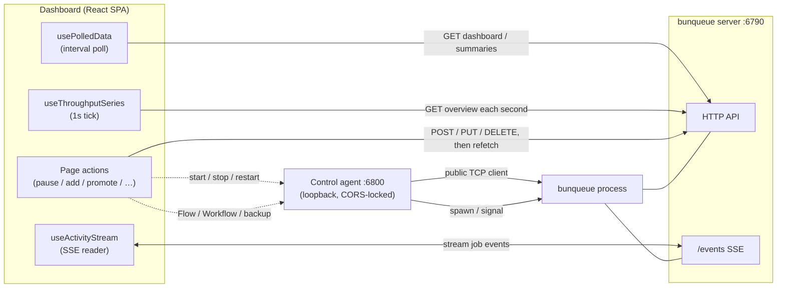

# Architecture

```
┌────────────────────────────────────────────────────────────────────┐
│                        Browser (SPA, :5273)                        │
│                                                                    │
│  main.tsx → <App/> (React Router)                                  │
│    └─ AppLayout ─ Sidebar + Topbar + <Outlet/>                     │
│         └─ pages/*  and  pages/control/*                           │
│                                                                    │
│  Data layer                                                        │
│    usePolledData(fetcher) ── interval ──► lib/bq.ts / lib/api.ts   │
│    useActivityStream()     ── SSE ───────► lib/sse.ts              │
│    useThroughputSeries()   ── 1s tick ───► bq.overview()            │
│    stores/: theme · connection · alerts · s3 (Zustand + persist)   │
└───────────┬──────────────────────────────┬────────────────────────┘
            │ HTTP /api (proxy → :6790)     │ /agent (→ :6800)
            ▼                               ▼
   ┌─────────────────┐            ┌───────────────────────┐
   │ bunqueue server │            │ control agent (Bun)   │
   │  HTTP :6790     │◄──spawn────│  ProcessManager       │
   │  SSE /events    │   /health  │  public client + CLI  │
   └─────────────────┘            └───────────────────────┘
```

The single-pair diagram is one connection profile. A production fleet repeats
that server/agent pair per broker. The Dashboard stores up to 32 named profiles,
and `/fleet` probes all pairs concurrently while the rest of the UI follows one
atomic active identity. Brokers reporting the same credential-free PostgreSQL
target and namespace are grouped as one shared queue topology; their control
agents remain distinct node-local control planes.

## Components

### Feature-slice architecture

New operational surfaces use a small hexagonal (ports-and-adapters) feature
slice instead of importing transport code inside React components:

```text
src/features/<capability>/
├── domain/          # pure state, traversal, validation and selection rules
├── application/     # repository ports and use-case orchestration
├── infrastructure/  # Bunqueue HTTP/agent adapters and response validation
└── ui/              # views and interaction state
```

Workflow, Job Flow, Queue SDK, S3, and Fleet operations follow this boundary. Tests
inject repository ports into the UI and fake runtime ports into agent routes;
real E2E scripts exercise the same adapters against a disposable Bunqueue
2.9.2 process. Non-idempotent commands use synchronous leases, while reads
carry a target/request generation so a late response cannot cross a server,
queue, workflow, or form retarget.

The agent also owns one shared lifecycle gate across its local and bridged
handlers. Workflow commands parse bounded input first, then atomically recheck
the managed process state and generation before touching the Engine. Stop and
restart close that Engine inside the same gate, so a slow request cannot revive
runtime resources after the managed server has transitioned.

- **Router & layout**, `App.tsx` declares every route (see
  [pages.md](pages.md) for the full, verified table, several routes'
  page-family assignment is not what the path name would suggest) under one
  `AppLayout` (`Sidebar` + `Topbar` + `<Outlet/>`). See
  [components.md](components.md) for the layout shell in detail.
- **Pages**, two families, distinguished by which API client they use, not
  by any visual marker:
  - `src/pages/*`, first-generation **classic** view pages. Use `lib/api.ts`.
  - `src/pages/control/*`, the **Pro**, full-control pages. Use `lib/bq.ts`.
    `pages/control/job/` and `pages/control/queue/` hold page-specific
    subcomponents too small to be their own page (e.g. `JobTimeline`, `JobBackoff`, `QueueActions`, `ConfigForms`).
  - The two families are not cleanly partitioned by route path. Pro pages
    render at the plain operational paths and the retained classic pages use
    `-classic` suffixes. Settings is shared, while Fleet is a direct
    multi-target operational page. See
    [pages.md](pages.md#route-table-from-srcapptsx) for the authoritative
    table, don't infer family from the URL.
  - One page mixes clients: `LogsPro` calls `bq.queues()` for the queue
    filter dropdown but `useActivityStream` (shared with the classic `Logs`
    page) builds its SSE URL via `api.eventsUrl()`. Not a bug, the SSE
    endpoint is identical either way, but worth knowing if you're grepping
    for "does this page use `bq` or `api`".
- **UI kit & stores**, see [components.md](components.md) for the full
  reference (`Card`, `StatCard`, `StatusBadge`, `Button`, `form.tsx`, `feedback.tsx`, `PageHeader`, `AreaChart`, `CopyButton`, inline SVG `icons`, and the four Zustand stores).

## Data flow



- **Polling.** `usePolledData(fetcher, deps)` runs immediately, then schedules
  the next tick only after the current request settles. Dependency/server/token
  generations hide the previous view synchronously, abort obsolete work, and
  discard late results. The last good snapshot remains visible on a same-scope
  refresh error, while identical serialized snapshots avoid a React re-render.
  Its connection generation includes active profile id, server URL, agent URL,
  and both credentials; switching nodes therefore hides old data before any
  action can target the new node.
- **Live activity.** `useActivityStream(queue?)` streams SSE from `/events`
  (or `/events/queues/:q`) via a fetch-based reader (`lib/sse.ts`) that
  supports a bearer token, unlike `EventSource`. It keeps a bounded ring
  buffer of recent events (`MAX_EVENTS = 250`), cumulative counters, and a
  rolling 5s throughput. Powers `OverviewPro`'s Recent Activity and both
  `LogsPro`/`Logs`; any delivered frame proves liveness, and a clean stream end
  reconnects with bounded backoff.
- **Throughput sampling.** `useThroughputSeries(windowSize=60)` is
  independent of both of the above, it ticks on its own 1-second
  `setInterval`, calling `bq.overview()` each time and appending
  `throughput.{pushPerSec,completePerSec,failPerSec}` into a rolling window
  for `MetricsPro`'s `AreaChart`. This means the chart's cadence is fixed at
  1s regardless of `connectionStore.refreshMs`.
- **Writes.** Page actions call `bq.*`/`api.*` and then `refetch()`, behind
  synchronous server/credential/owner leases and strict `{ok:true}` checks.
  Confirmations remain for authorized high-impact writes such as process
  lifecycle and webhook deletion. Cancel, queue Discard,
  Drain/Clean/Obliterate, every DLQ Retry/Purge and completed-job requeue are
  disabled because a confirmation cannot compensate for missing atomic
  generation/state/topology guarantees. DLQ `maxAge`/`maxEntries` are rendered
  read-only and omitted from saves; auto-retry can only be disabled.
- **Job action gating.** Anywhere job lifecycle actions are rendered
  (`JobInspector`, `JobsPro`), the button set is computed by the single shared
  `lib/jobActions.ts::actionGates(state)`. Promote is available only for delayed
  jobs. DLQ retry remains false because a fresh exact-ID GET cannot atomically
  constrain the later POST, which may hit a recreated job; completed-job
  requeue remains false because `retryCompleted` does not rebuild dependency
  registration or flow order. Cancel and Discard are always false. See
  [api-mapping.md](api-mapping.md#job-action-gating) for the full table.
- **Copilot mutations.** The assistant can read queue, job, DLQ, worker, cron
  and health data, but exposes only Promote, Pause and Resume as confirmed
  mutations. It has no DLQ retry or completed-job requeue tool.

## The API layer

Two clients, on purpose (see the additive rule in the project `CLAUDE.md`):

- **`lib/api.ts`**, the original client, used only by classic pages.
  It throws on non-2xx responses and logical HTTP-200 `{ ok:false }`
  failures, and its storage, job-timestamp and DLQ types mirror the server.
- **`lib/bq.ts`**, the complete, shape-verified client behind every
  `pages/control/*` page and the control agent. Its `call()` helper throws on
  non-2xx **and** on a parsed `{ ok: false }` body, with one deliberate
  carve-out: `health()` passes `strict:false` because `GET /health`'s `ok`
  field means "server healthy" (can legitimately be `false` on disk-full with
  HTTP 200), not "request succeeded", see api-mapping.md for why that
  distinction matters and which other endpoints are strict.
- Types for `bq` live in `lib/bqTypes.ts` (verified against a live server, see api-mapping.md); types for `api` live in `lib/types.ts`.
- **New work always uses `bq`**, which exposes the complete control surface.

## The control agent

A tiny local Bun process (`agent/`) that supervises a bunqueue server child
process, because a browser can't start/stop an OS process and bunqueue's HTTP
API has no process-lifecycle endpoint. See [agent.md](agent.md) for the full
reference (endpoints, `ServerConfig`/`runningConfig` split, `dbStats()`).
Because it can spawn processes it binds `127.0.0.1` only and is guarded by a
**locked-CORS Origin allowlist** (never `*`) plus an optional `AGENT_TOKEN`
bearer gate, see [agent.md](agent.md#security) and [SECURITY.md](../SECURITY.md).
Keep its port on loopback (or an equally trusted network) regardless.
The all-in-one server independently gates every remote/proxied administrative
`/api/*` request with `BUNQUEUE_TOKEN`; this is not the agent credential.

## Theming

Tailwind CSS v4 with CSS-variable tokens (`--bg`, `--surface`, `--line`, `--fg`, `--muted`, `--accent`, …) mapped into Tailwind via `@theme inline`, so utilities
like `bg-surface` / `text-muted` / `border-line` flip instantly when
`data-theme` changes. Dark is the default; `light:` is a custom variant. Inter +
JetBrains Mono (variable) via Fontsource; numbers use tabular figures (`.tnum`).
`themeStore.initTheme()` applies the persisted theme before the first render
(no flash-of-wrong-theme); see the Stores section in
[components.md](components.md).
