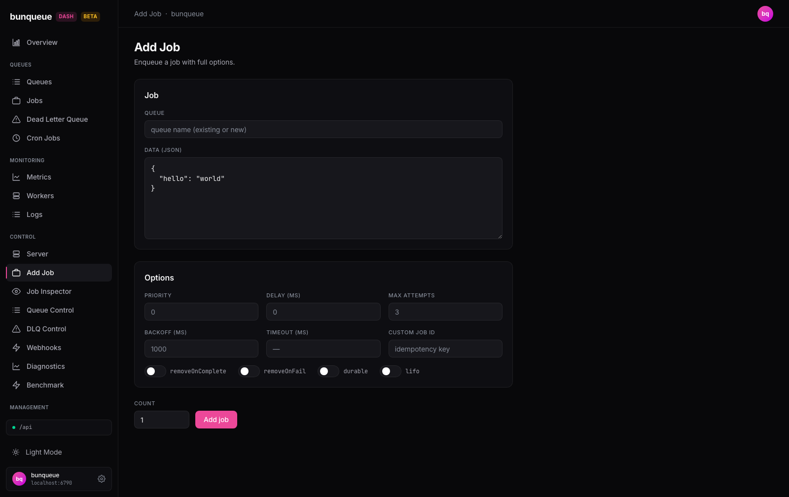

# Add Job

Add Job lets you drop a job straight into any queue — one job or thousands of copies — without writing any code.

**Where:** open `/add-job` from the sidebar.

## What you'll see

The page is a single form with two cards and a submit row — no live counters or tables, just the fields you fill in.

**Job**

| Element | What it's for |
| --- | --- |
| **Queue** | The queue to add the job to. Start typing to pick from your existing queues, or enter a brand-new name to create one. |
| **Data (JSON)** | The job's payload, written as JSON. Comes pre-filled with a small example you can replace. |

**Options** — every field is optional. Leave a box empty and the server's default (shown as the placeholder) applies.

| Element | What it's for |
| --- | --- |
| **Priority** | Order in the queue. Lower numbers run first. |
| **Delay (ms)** | Hold the job for this long before it can run. |
| **Max attempts** | How many tries before the job is exhausted and sent to the dead-letter queue. |
| **Backoff (ms)** | Wait time between retries. |
| **Timeout (ms)** | Maximum time a single attempt may run. Blank means no limit. |
| **Custom job ID** | Your own ID for the job. Reusing an ID prevents duplicates. |
| **removeOnComplete** | Delete the job record once it finishes successfully. |
| **removeOnFail** | Delete the job record once it fails for good. |
| **durable** | Keep the job persisted. |
| **lifo** | Add to the front of the queue instead of the back. |

**Submit row**

| Element | What it's for |
| --- | --- |
| **Count** | How many copies of this job to add. Defaults to 1. |
| **Add job** | Submits the form. A message appears next to it: green with the new job ID on success, red if something went wrong. |

::: tip
The four toggles (removeOnComplete, removeOnFail, durable, lifo) all start off. Leaving one off means "use the server default" — it isn't forced to false.
:::

## What you can do

**Add one job.** Pick a queue, edit the JSON, adjust any options, and press **Add job**. On success you'll see `Created job <id>`.

**Add many jobs at once.** Set **Count** above 1 to enqueue that many copies of the same job in one go. The result line tells you how many were created.

**Create a new queue on the fly.** Type a queue name that doesn't exist yet — the queue is created the moment you add the first job.

**Fine-tune with options.** Fill in any option field to override its default; leave it blank to keep the default.

Nothing is sent until you press **Add job**, and there's no confirmation step — the job goes in immediately. Before it sends, a few checks run:

1. **Queue** must not be empty.
2. **Data** must be valid JSON — any error shows in red under the editor.
3. **Count** must be a whole number of at least 1.
4. **Count** can be at most 10,000.

::: warning
Typing a queue name that doesn't exist creates a brand-new queue. Double-check the name before a large bulk add, or a typo will scatter jobs into an unintended queue.
:::

## Good to know

- **Jobs have no name.** The only identity you control is the **Custom job ID** — everything else lives in the JSON data.
- **Bulk copies are identical.** Every job in a bulk add shares the exact same data. For different payloads, add them separately.
- **Bulk plus a custom ID collapses into one job.** If you set **Count** above 1 *and* a **Custom job ID**, every copy shares that ID, so the server dedupes them into a single job. The result line honestly reports how many distinct jobs were actually created — often just one. See [Known issues](/known-issues).
- **Fire-and-forget.** This page reports the new job ID but doesn't track the job afterward. Use the Job Inspector or the Jobs page to watch it run.
- **A couple of advanced options aren't here.** This form covers the common enqueue options; a few rarely used ones can only be set through the raw API.
- **Autocomplete needs a connection.** Queue suggestions come from your live server. If it's unreachable the field still works as free text — you just won't get suggestions, and submitting shows the error in the result line.

::: details Under the hood (for developers)
- Uses the **`bq`** client throughout (never `api.ts`).
- Queue autocomplete: `GET /dashboard/queues`, polled every **30 s**.
- Single add (Count = 1): `POST /queues/:q/jobs`.
- Bulk add (Count > 1): `POST /queues/:q/jobs/bulk` with N copies of the body.
- The client treats an HTTP 200 carrying `{ ok: false }` as an error, so logical failures surface in the red result line instead of being swallowed.
:::
