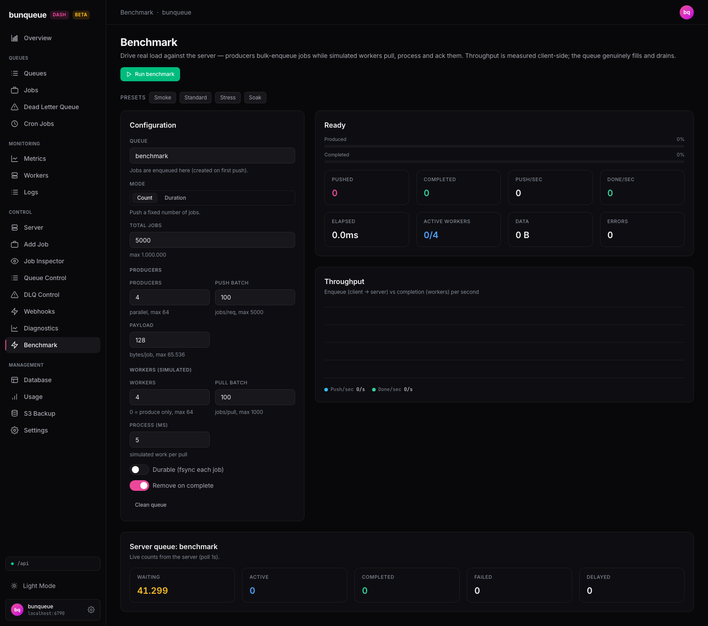

# Benchmark

> Route `/benchmark` · source `src/pages/control/Benchmark.tsx`

A browser-driven load-testing rig for the bunqueue server: parallel **producers** bulk-enqueue jobs while parallel **simulated workers** pull, "process" (a configurable sleep), and ack them, so the target queue genuinely fills and drains. Every throughput number is measured client-side from your browser — there is no server-side benchmark engine — and the server's own live queue counts are polled alongside as proof the load actually lands.

## What it shows

The page is a three-column grid: a **Configuration** card on the left, and on the right a live **run panel** (progress + stat cards) stacked over a **Throughput** chart. Below the grid sit a post-run **Summary** card, a **Server queue** counts card, and a **Run history** table.

### Header

- **Title/description** — a fixed `PageHeader` describing the rig.
- **Live error banner** — a red bar appears above the presets whenever `live.error` is set (e.g. server unreachable during preflight, or the first push/ack error surfaced during a run).
- **Heading + ETA** — the run panel's title reflects the current phase: `Ready` → `Producing…` (count mode) or `Running…` (duration mode) → `Draining…` → `Stopping…` → `Result`, or `Error`. The small right-aligned text shows `ETA <time>` while running/draining (or `finishing…` when the ETA reaches 0), `stopped early`, or `complete`.

### Progress bars

| Bar | Meaning |
| --- | --- |
| **Produced** (accent) | Count mode: `pushed / total` as a percent. |
| **Elapsed** (accent) | Duration mode: `elapsedMs / (durationS × 1000)` as a percent. |
| **Completed** (emerald) | Count mode only, shown only when workers > 0: `completed / total` as a percent. |

Percentages derive from the config the run was **started** with (`runCfg`), not the still-editable form — editing a field mid-run won't rewrite the shown progress.

### Live stat cards (run panel)

Eight compact `StatCard`s, updated ~5×/sec (200 ms sampler) while running/draining:

| Field | Meaning |
| --- | --- |
| **Pushed** | Jobs successfully enqueued so far (`live.pushed`). |
| **Completed** | Jobs pulled and acked by simulated workers (`live.completed`). |
| **Push/sec** | Instantaneous enqueue rate (jobs pushed since last 200 ms sample ÷ dt). |
| **Done/sec** | Instantaneous completion rate. |
| **Elapsed** | Wall-clock since the run started (`formatMs`). |
| **Active workers** | `activeWorkers / workers` — how many of the configured worker loops are mid pull→process→ack cycle right now. |
| **Data** | Total payload bytes pushed (`formatBytes`); shows the summary total once the run ends. |
| **Errors** | `pushFailed + ackFailed`; turns red when non-zero. |

Rates are formatted by `fmtRate`: `1.5K`, `2.30M`, or a plain rounded integer below 1000.

### Throughput chart

An `AreaChart` of the last 60 samples: **Push/sec** (`#38bdf8`, cyan) vs **Done/sec** (`#34d399`, green), i.e. enqueue rate (client → server) vs completion rate (workers). A mono legend below repeats the current instantaneous values as `.../s`.

### Summary card (after a run)

Rendered only once a run finishes (or is stopped). Eight cards plus a latency sentence:

| Field | Meaning |
| --- | --- |
| **Pushed** / **Completed** | Final totals. |
| **Duration** | Actual wall-clock of the run (`formatMs`). |
| **Avg push/s** / **Avg done/s** | Totals ÷ elapsed seconds (cumulative average, not the instantaneous rate). |
| **Data rate** | `bytes / secs`, shown as `<bytes>/s`. |
| **Push p95** / **Push p99** | 95th / 99th percentile of **push-batch** latency. |

The sentence beneath reads: `Push-batch latency avg … · p50 … · p95 … · p99 … · max …`, and appends `First error: …` if any push/ack error was captured. All latency stats are over **push-batch request** timings only (each `POST …/jobs/bulk` round-trip) — worker pull/ack latency is not measured.

### Server queue card

Live server-side counts for the **debounced** target queue (`Server queue: <name>`), polled every 1 s. Five cards: **Waiting** (amber), **Active** (blue), **Completed** (green), **Failed** (red when non-zero), **Delayed**. This is independent of the client-side counters and is the ground truth that load is landing and draining. If the server can't be reached it shows a `stale — server unreachable` warning and keeps the last good counts; before any answer it shows "No counts yet…".

### Run history table

Newest-first, up to 12 rows, in-memory. Columns: **Mode**, **Prod** (producers), **Wkr** (workers), **Pushed**, **Done**, **Push/s**, **Done/s**, **p95**, **Dur**.

## What you can do

| Action | Effect | Confirm? |
| --- | --- | --- |
| **Presets** (Smoke / Standard / Stress / Soak) | Merge a partial config into the form. Smoke = 200 jobs (2 prod × 1 wkr, 50-batch, 0 ms). Standard = 5,000 (4×4, 5 ms). Stress = 50,000 (16×16, 500-batch, 0 ms). Soak = duration mode, 30 s (4 prod × 8 wkr, 10 ms). Disabled while a run is active. | No |
| **Run benchmark** | Starts the run with the current form (`toConfig(draft)`), after a preflight `bq.overview()` reachability check. | No |
| **Stop** | Sets the stop flag; loops settle in-flight work, heading shows `Stopping…`, final phase becomes `stopped`. | No |
| **Clean queue** | Best-effort purge of `waiting`/`completed`/`failed`/`delayed` jobs from the queue. | **Yes** — `Remove benchmark jobs from "<queue>"?` |
| **Copy** / **Export JSON** (Run history) | Copy the history array or download it as `benchmark-history-<ts>.json`. | No |
| **Clear** (Run history) | Empties the in-memory history. | No |

### Configuration inputs

All inputs are disabled while a run is active. Numeric fields are string-backed in the form (so they can be emptied while typing) and clamped to `LIMITS` at the Run boundary — invalid/empty values fall back to the lower bound.

| Input | Type | Default | Limit / note |
| --- | --- | --- | --- |
| **Queue** | text | `benchmark` | Created on first push; debounced 400 ms before the counts poll refetches. |
| **Mode** | segmented | `count` | `count` = push a fixed number; `duration` = run producers + workers for a fixed time. |
| **Total jobs** | number (count mode) | 5000 | max 1,000,000. |
| **Duration (s)** | number (duration mode) | 30 | max 600. |
| **Producers** | number | 4 | parallel, max 64; min 0 in duration mode, min 1 in count mode. |
| **Push batch** | number | 100 | jobs per request, max 5000. |
| **Payload** | number | 128 | bytes of dummy `blob` per job, max 65,536 (0 = empty). |
| **Workers** | number | 4 | 0 = produce only, max 64. |
| **Pull batch** | number | 100 | jobs reserved per pull, max 1000. |
| **Process (ms)** | number | 5 | simulated work per pulled batch, max 60,000. |
| **Durable** | toggle | off | fsync each job. |
| **Remove on complete** | toggle | on | drop completed jobs server-side. |

## States & gating

- **Ready / idle** — no run has started (or after Reset). Progress bars sit at 0%, no Summary card.
- **Running / draining / stopping** (`active`) — the header action becomes **Stop** (or a disabled `Stopping…` button); every config input, both toggles, all presets, and **Clean queue** are disabled. In count mode with workers > 0, the phase advances to **draining** once producers finish but workers are still acking.
- **Preflight failure** — if the queue name is empty → `Queue name is required.` If `bq.overview()` throws → `Server unreachable — start it on the Server page first.` Either sets phase `error` and the red banner; no loops start.
- **done / stopped / error** — instantaneous rates zero out (cards and legend agree instead of freezing a stale sample), the Summary card renders, and a `RunRecord` is prepended to history.
- **Re-entry guard** — a synchronous `runningRef` blocks a double-click from starting two engines over the same stats.
- **Unmount** — leaving the page flips the stop flag, so the load stops exactly like pressing Stop (no orphaned traffic).
- **Server queue card** — renders counts once the server answers; otherwise a placeholder line. A poll error shows the `stale` badge but keeps the last good counts.
- **Run history** — hidden entirely when empty (`RunHistory` returns `null`).

::: info This page has no job-state action gating
Unlike the Jobs/DLQ pages, Benchmark does not use `src/lib/jobActions.ts`. Its only "gate" is the `active` flag that locks inputs during a run, plus the `window.confirm` on Clean queue.
:::

## Behind the scenes

Everything uses the **`bq`** client (never `api`). The load engine lives in `src/pages/control/benchmark/useBenchmark.ts`; pure helpers/limits/presets in `benchmark/engine.ts`.

| Call | Endpoint / method | When |
| --- | --- | --- |
| `bq.overview()` | `GET /dashboard` | Preflight reachability check before each run. |
| `bq.addJobsBulk(queue, jobs)` | `POST /queues/:q/jobs/bulk` → `{ ok, ids }` | Each producer batch. Body is `{ jobs: [...] }`. |
| `bq.pullBatch(queue, workerBatch)` | `POST /queues/:q/jobs/pull-batch` → `{ ok, jobs:[{id}] }` | Each worker reserve. Body `{ count }`. |
| `bq.ackBatch(ids)` | `POST /jobs/ack-batch` → `{ ok }` | Completes a pulled batch. Body `{ ids }`. |
| `bq.counts(queue)` | `GET /queues/:q/counts` → `{ ok, counts }` (**flat**, no `data`) | Server queue card, polled every **1 s** via `usePolledData`. |
| `bq.clean(queue, {state, limit})` | `POST /queues/:q/clean` → `{ ok, count }` | Clean queue, once per state (`waiting`/`completed`/`failed`/`delayed`), `limit` = 1,000,000. |

There is **no SSE stream** on this page. Two independent timers run: the 200 ms client-side sampler that derives per-second rates and the rolling 60-point series while active, and the 1 s server-counts poll. `bq.call()` throws on `HTTP 200 + {ok:false}`, so logical push/ack failures are counted as errors (the first message is captured into `summary.error`).

## Gotchas

::: warning Clean queue can't touch active jobs
Pulled-but-unacked (**active**) jobs cannot be cleaned. `cleanup()` reads the counts again afterward and reports `Cleaned — N active job(s) remain (requeued after the stall timeout)` — the server re-queues them once its stall timeout elapses. The four `bq.clean` calls are individually try/caught, so a state the server refuses to clean is silently skipped.
:::

- **Run history is in-memory only** — capped at 12 rows and lost on reload. Export JSON before refreshing if you want to keep a comparison.
- **Latency percentiles are push-batch only** — `avg/p50/p95/p99/max` measure the `POST …/jobs/bulk` round-trip, not worker pull/ack latency. `percentile()` is nearest-rank over the sorted samples.
- **Throughput is client-measured** — Push/sec and Done/sec are computed in your browser, so they reflect your machine, network, and browser event-loop scheduling as much as the server. Cross-check against the server-side counts card.
- **The bulk endpoint dedupes on shared `jobId`** (see `docs/api-mapping.md` / `docs/known-issues.md`) — benchmark jobs don't set a custom `jobId`, so this doesn't affect a normal run, but it's why you should trust the server counts card over the client `pushed` counter if they ever diverge.
- **Real load, real cost** — Stress (50k) and duration/Soak runs genuinely write to the server (and fsync if Durable is on). Run against a disposable/dev server, and use **Clean queue** or **Remove on complete** to avoid leaving a large backlog behind (the demo server in the screenshot shows 41,299 leftover waiting jobs from a prior run).
- **Duration mode with 0 producers** is allowed (min drops to 0) — useful to drain an already-filled queue with just workers.
