# Appendix — classic pages

The first-generation pages, kept intact per the additive rule. Several have
been superseded by a Pro page at the plain path (the classic version moved to a
`-classic` suffix); `QueueDetail` is still the only per-queue drill-in view.

## Queue Detail (classic)

> Route `/queues/:name` · source `src/pages/QueueDetail.tsx`

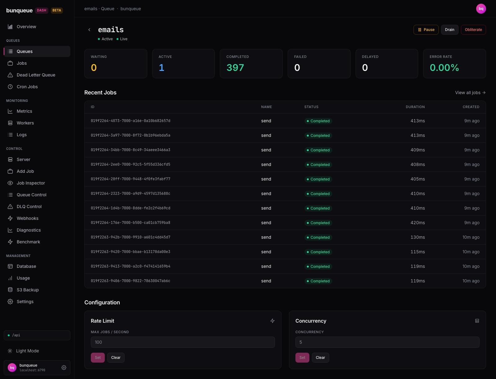

**What it shows:** The single-queue drill-in, opened by clicking a row on the classic Queues list. The screenshot shows the `emails` queue: six stat cards (Waiting 0, Active 1, Completed 397, Failed 0, Delayed 0, Error Rate 0.00%), a 12-row Recent Jobs table (ID, Name from each job's `data.name` — here `send` — Status, Duration, Created) with a "View all jobs" link that opens Jobs pre-filtered to this queue, and a Configuration section with Rate Limit and Concurrency cards (Set/Clear with inline Saved/error feedback). Header buttons Pause/Resume, Drain, and Obliterate act on the bunqueue HTTP API; Drain and Obliterate ask for confirmation, and Obliterate returns you to the queue list. Data refreshes by polling — the green "Live" pill is decorative, not a real connection indicator.

**Differences vs the Pro page:** no Pro drill-in exists; [Queue Control](/guide/queue-control) offers the same actions plus stall/DLQ configuration, but via a queue dropdown rather than a per-queue URL.

## Overview (classic)

> Route `/overview-classic` · source `src/pages/Overview.tsx`

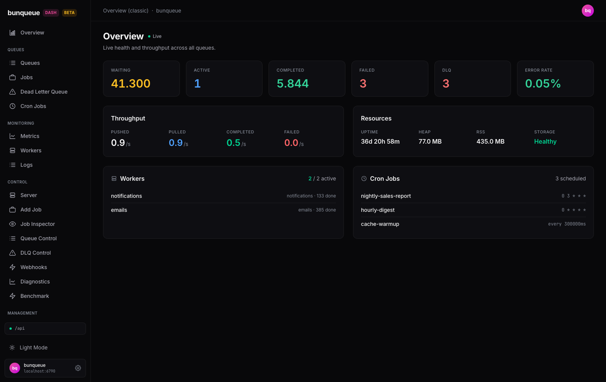

**What it shows.** A single-poll health summary of the whole bunqueue server: six stat cards (Waiting, Active, Completed, Failed, DLQ, Error Rate — DLQ and Error Rate turn red when non-zero / above 5%), a Throughput card with pushed/pulled/completed/failed rates per second, a Resources card (uptime, heap, RSS, and a Healthy/Disk-full storage flag), plus compact Workers and Cron Jobs lists (first 6 of each). In the screenshot the seeded server has 41,300 waiting jobs, two active workers (`emails`, `notifications`) and three crons (`nightly-sales-report`, `hourly-digest`, `cache-warmup`). Read-only — everything comes from one polled `api.overview()` call to the bunqueue HTTP API.

**Differences vs the Pro page ([`/`](/guide/overview)):** OverviewPro adds a connection banner, a per-queue health grid, and a live Recent Activity feed.

::: warning Known issue
Uptime renders ~1000× too large (milliseconds passed to a seconds-based formatter) — the "36d" shown is really about 53 minutes. See [Known issues](/known-issues).
:::

## Queues (classic)

> Route `/queues-classic` · source `src/pages/Queues.tsx`

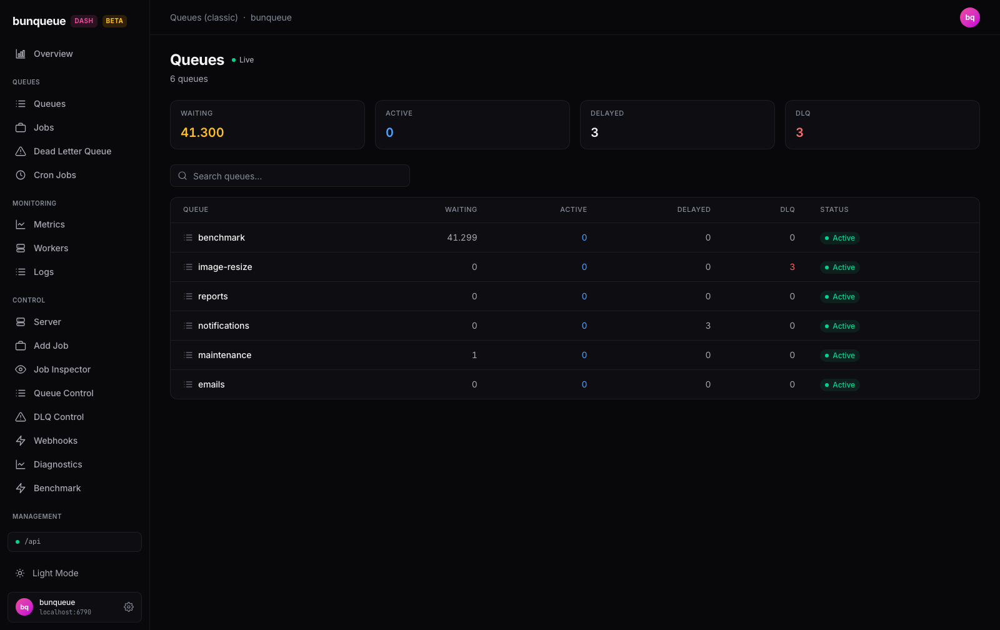

**What it shows.** A live-polled, read-only list of every queue on the bunqueue server, 20 per page. Four stat cards summarize Waiting / Active / Delayed / DLQ counts; below them, each row shows the same counts per queue plus an Active/Paused badge — in the screenshot, six seeded queues (benchmark with 41,299 waiting, image-resize with 3 DLQ entries in red, reports, notifications with 3 delayed, maintenance, emails), all Active. The search box filters by name, and clicking any row drills into `/queues/:name` (QueueDetail). There are no actions here — pausing, draining, and limits live in Queue Control.

**Differences vs the Pro page:** [`/queues`](/guide/queues) (QueuesOverview) fetches the full list in one `bq.queuesSummary()` call and adds inline pause/resume; this classic page is paginated and read-only.

::: tip Known limitation
The header cards and search only cover the current 20-row page, not all queues (see [Known issues](/known-issues)).
:::

## Jobs (classic)

> Route `/jobs-classic` · source `src/pages/Jobs.tsx`

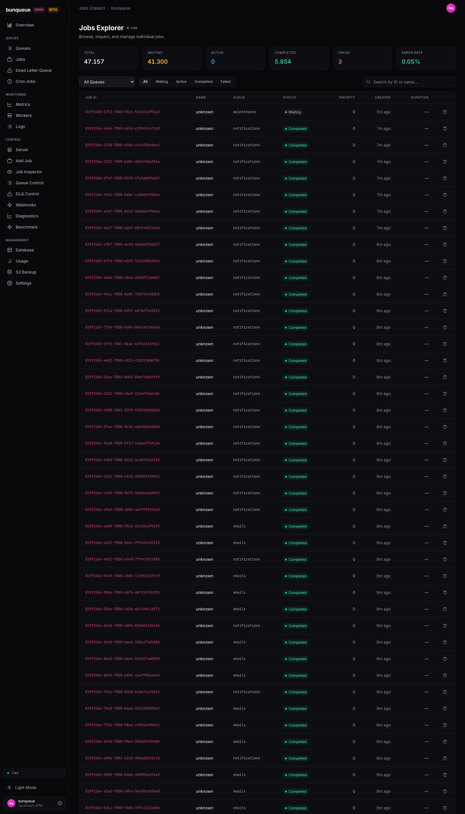

**What it shows.** A cross-queue job explorer over the bunqueue HTTP API: six stat cards (in the screenshot: 47,157 total, 41,300 waiting, 5,854 completed, 3 failed, 0.05% error rate) above a merged job table — here mostly completed `notifications` and `emails` jobs plus one waiting `maintenance` job. Filter with the queue dropdown and the All/Waiting/Active/Completed/Failed segments, search by job ID, and cancel a job with the trash icon (confirm prompt). "All Queues" fans out over the first 25 queues, 40 jobs each, newest-first, capped at 100 rows; arriving via `?queue=` preselects a queue.

::: warning Known limitations
The Name column is always "unknown", the Duration column is always "—", and searching by name is dead — real jobs carry none of the fields this page reads (see [Known issues](/known-issues)).
:::

**Differences vs the Pro page:** [`/jobs`](/guide/jobs) (JobsPro) is the replacement — single-queue, server-paginated, with multi-select bulk actions and correct Name/Duration.

## DLQ (classic)

> Route `/dlq-classic` · source `src/pages/Dlq.tsx`

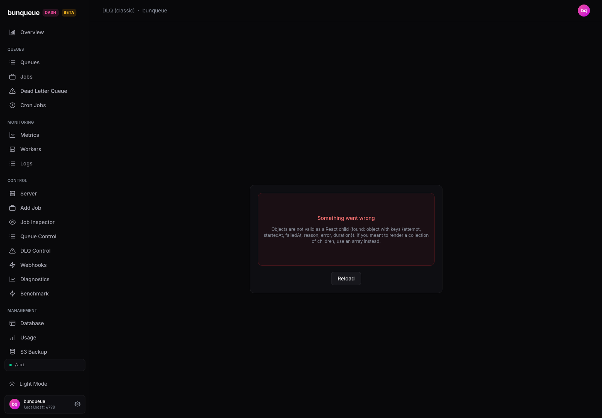

**What it shows.** The first-generation dead-letter view: a queue selector (with per-queue DLQ counts), a "DLQ Entries" stat card, a paginated entries table (Job ID, Name, Reason, Attempts, Failed), and Retry all / Purge buttons with confirmation prompts. It polls the bunqueue HTTP API via the legacy `api` client.

::: danger Known bug — broken for real entries
`api.ts` models a flat `DlqEntry` shape the server never returns (entries are nested `{ job, enteredAt, reason, attempts[] }`). With a non-empty DLQ the page crashes rendering the `attempts` array — the screenshot shows exactly that: the error boundary ("Something went wrong … Objects are not valid as a React child") with a Reload button, instead of the seeded queues' entries.
:::

**Differences vs the Pro pages:** use [`/dlq`](/guide/dlq) (DlqPro, cross-queue dashboard with filters and per-row retry) or [`/dlq-control`](/guide/dlq-control) (single-queue actions) — both read the correct nested shape and work.

## Cron (classic)

> Route `/cron-classic` · source `src/pages/Cron.tsx`

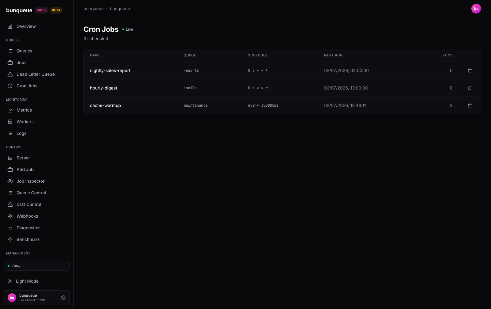

**What it shows.** A live-polling, read-only list of every scheduled job on the bunqueue server, paginated 15 per page. Each row shows the schedule's name, target queue, its trigger — a cron expression or an interval (`every 300000ms`) — the next run time, and how many times it has executed. In the screenshot three schedules are registered: `nightly-sales-report` on the **reports** queue (`0 3 * * *`), `hourly-digest` on **emails** (`0 * * * *`), and `cache-warmup` on **maintenance** every 5 minutes (2 runs so far). The only action is the trash icon, which deletes a schedule after a confirmation prompt; if the server is unreachable an offline banner appears with a retry button.

**Differences vs the Pro page.** This page is list + delete only — creating schedules lives in [Cron Manager](/guide/cron). No known bugs; the classic/Pro duplication is intentional.

## Metrics (classic)

> Route `/metrics-classic` · source `src/pages/Metrics.tsx`

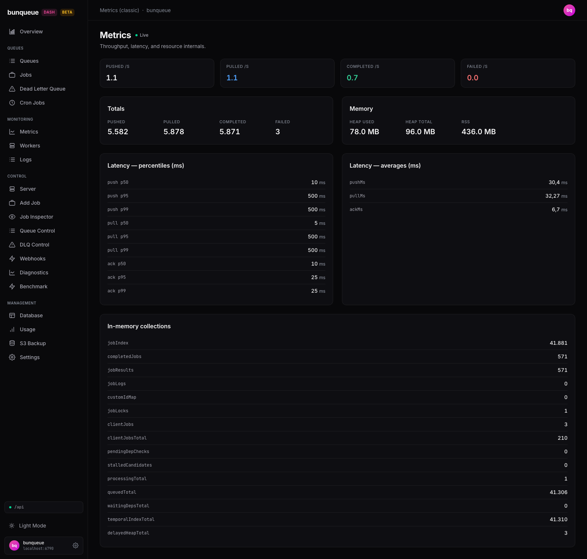

**What it shows.** A read-only, auto-refreshing dump of the raw `GET /dashboard` payload from the bunqueue API. The top row is live throughput per second (Pushed/Pulled/Completed/Failed — 1.1 / 1.1 / 0.7 / 0.0 in the screenshot). Below sit lifetime Totals (5,582 pushed, 5,871 completed, 3 failed across the seeded emails/image-resize/reports/notifications/benchmark workload), server Memory (heap 78/96 MB, RSS 436 MB), latency percentiles per operation (`push`/`pull`/`ack` × p50/p95/p99), latency averages (`pushMs`/`pullMs`/`ackMs`), and the server's in-memory collections (`jobIndex` 41,881, `queuedTotal` 41,306, …). Nothing is clickable; it refreshes at the global polling interval from Settings.

**Differences vs the Pro page:** [`/metrics`](/guide/metrics) (MetricsPro) adds a rolling 60-second throughput chart, a success-rate gauge, and per-queue counts — this page is flat key-value lists only.

Note: the percentile list once rendered broken values (`[object Object]`/zeros); per [Known issues](/known-issues) it now correctly flattens the nested per-operation percentiles.

## Workers (classic)

> Route `/workers-classic` · source `src/pages/Workers.tsx`

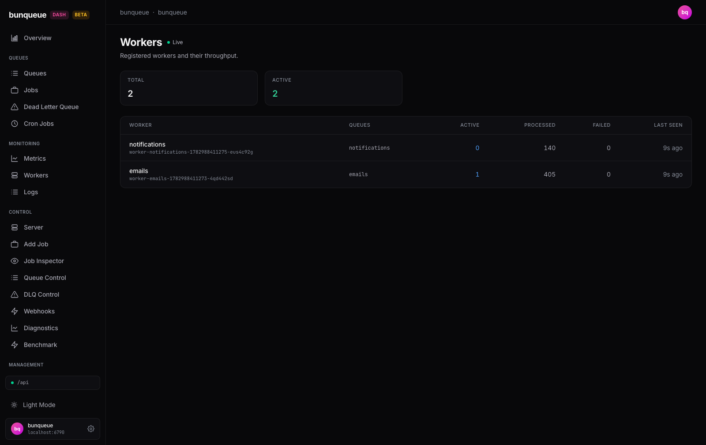

**What it shows.** A live, read-only table of every worker registered with the bunqueue server, polled via the same `api.overview()` call the classic Overview uses. Two stat cards summarize Total and Active counts (2 / 2 in the screenshot). Each row lists the worker's name and full ID (here `notifications` and `emails` workers from the seeded demo), the queues it consumes, and its Active / Processed / Failed job counts plus a relative "Last Seen" timestamp (9s ago). The list is client-paginated at 20 rows; if the server truncates the list at 100 workers, an amber "showing first N of M" hint appears. Nothing here is clickable — the page is purely for monitoring throughput.

**Differences vs the Pro page:** [`/workers`](/guide/workers) (WorkersPro) adds an active/stale status indicator and a per-row Unregister action.

## Logs (classic)

> Route `/logs-classic` · source `src/pages/Logs.tsx`

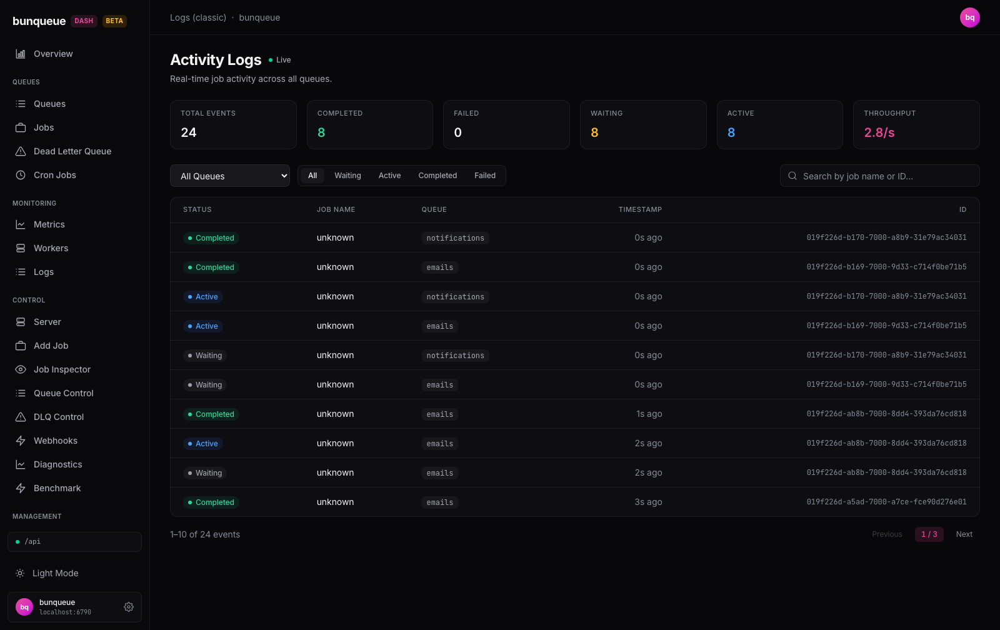

**What it shows.** A live activity feed of job events streamed over SSE from the bunqueue API — the same stream the Pro Logs page uses. Six stat cards count events since the page opened (Total, Completed, Failed, Waiting, Active) plus a rolling Throughput rate (2.8/s in the screenshot). Below, a table lists each event's status badge, job name, queue, relative timestamp, and job ID, 10 per page. Filter with the queue dropdown (list refreshed every 30 s), the All/Waiting/Active/Completed/Failed segments, or the search box (matches job ID, name, or queue). In the screenshot, seeded `emails` and `notifications` jobs cycle through Waiting → Active → Completed. Counters reset on reload — this is a session view, not history.

**Differences vs the Pro page:** [`/logs`](/guide/logs) adds an event-type column (working around this page's known bug: Job Name here is permanently "unknown" because SSE events carry no name) and export/clear controls.

## Usage (classic)

> Route `/usage-classic` · source `src/pages/Usage.tsx`

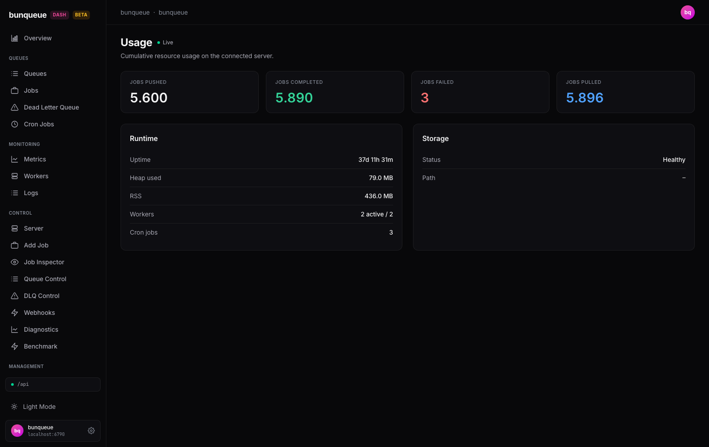

**What it shows.** A read-only snapshot of cumulative server usage, polled live from the bunqueue HTTP API via a single `api.overview()` call. Four stat cards give lifetime totals — in the screenshot the seeded demo workload shows 5,600 jobs pushed, 5,890 completed (green), 3 failed (red), 5,896 pulled (blue). Below them, a **Runtime** card lists uptime, heap used (79.0 MB), RSS (436.0 MB), workers ("2 active / 2") and cron jobs (3), and a **Storage** card shows Status and Path. There is nothing to click; if the server is unreachable the page renders zeroed values with an offline banner instead of an error.

::: warning Two known bugs
See [Known issues](/known-issues): the Storage card reads a response shape `/storage` never returns, so Status is always "Healthy" (masking a real disk-full condition) and Path is always "—"; and uptime is milliseconds fed to a seconds formatter, so the screenshot's "37d 11h 31m" is really about 54 minutes.
:::

**Differences vs the Pro page:** [`/usage`](/guide/usage) (UsagePro) fixes both issues — honest disk-full detection and correct uptime — and adds an error-rate figure.

## S3 Backup (classic)

> Route `/s3-classic` · source `src/pages/S3Backup.tsx`

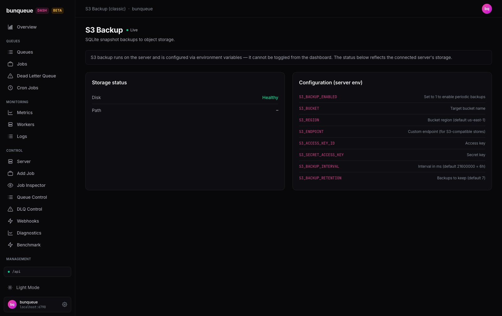

**What it shows.** A read-only reference for bunqueue's S3 snapshot backups. A banner reminds you that backups are configured on the **server via environment variables** and cannot be toggled from the dashboard. Two cards follow: **Storage status** (polls `GET /storage` on the bunqueue API — the screenshot shows Disk "Healthy" and an empty Path) and **Configuration (server env)**, a static cheat-sheet of the eight variables that actually control backups (`S3_BACKUP_ENABLED`, `S3_BUCKET`, `S3_REGION`, `S3_ENDPOINT`, access/secret keys, `S3_BACKUP_INTERVAL`, `S3_BACKUP_RETENTION`) with defaults. There is nothing to click — use it as a lookup while editing your server's env.

::: warning Known issue
The classic `api.ts` client misreads the `/storage` response shape, so Disk always reads "Healthy" (even when the disk is full) and Path is always "—"; `/storage` returns no path at all.
:::

**Differences vs the Pro page:** [`/s3`](/guide/s3) (S3BackupPro) adds a local-only config-builder form, a working "Test Connection", and an honest storage check via `bq.storage()`.

## Not found (404)

> Route `*` · source `src/pages/NotFound.tsx`

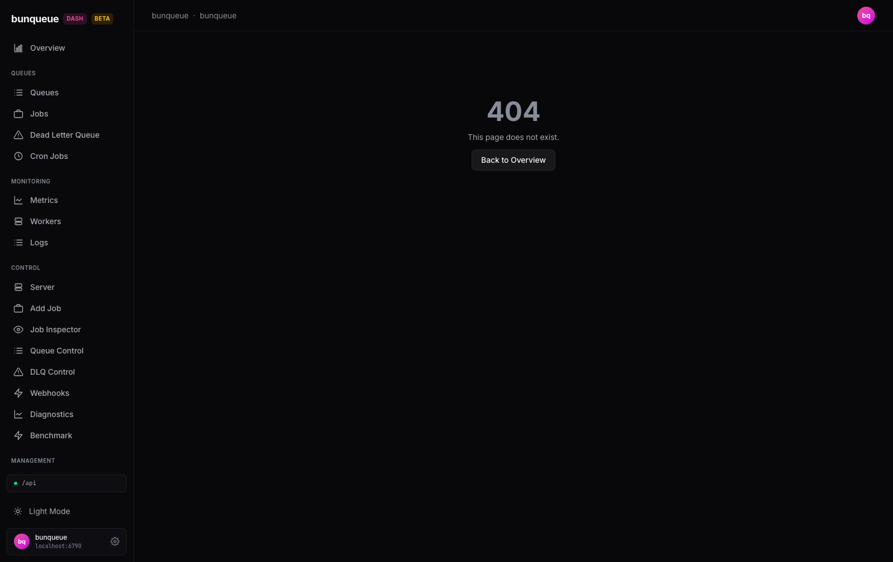

Any unknown path renders this catch-all inside the normal layout shell — the
sidebar stays usable and a **Back to Overview** button returns to `/`. Note the
Topbar falls back to a generic "bunqueue · bunqueue" title here, as it does for
every route missing from its title map (see [Known issues](/known-issues)).
