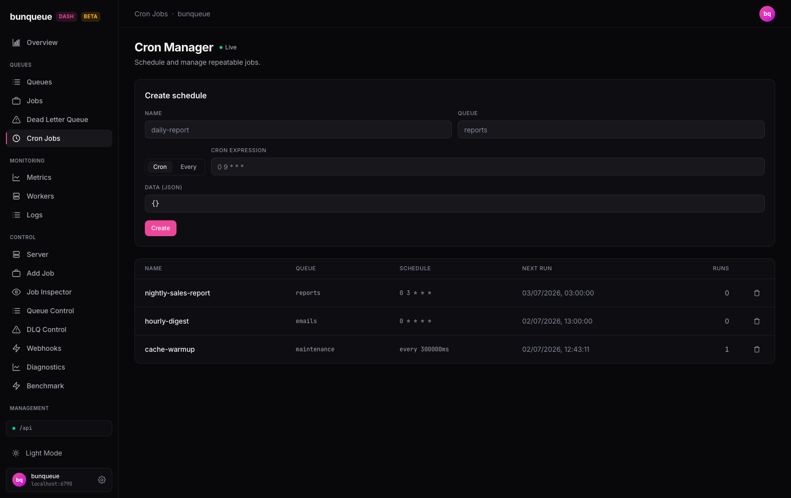

# Cron Jobs

This screen lets you set up jobs that run on a repeating schedule, then see them all in one place.

**Where:** open `/cron` from the sidebar.

## What you'll see

At the top is a **Create schedule** card for adding new schedules. Below it is a table listing every schedule already registered on the server, 15 rows per page. A **live** indicator shows the list is refreshing on its own, so the run counts and next-run times stay current without a manual reload.

Each row is one schedule:

| Column | What it tells you |
| --- | --- |
| **Name** | The schedule's unique name. |
| **Queue** | The queue that receives a job every time the schedule fires. |
| **Schedule** | When it fires, a cron expression like `0 9 * * *`, or `every <N>ms` for an interval schedule. |
| **Next Run** | The local date and time of the next run. |
| **Runs** | How many times this schedule has fired so far. |

Each row also has a trash icon at the end for deleting that schedule.

## What you can do

**Create a schedule**, fill in the form and click **Create**:

1. Enter a **Name** (for example `daily-report`) and a **Queue** (for example `reports`). Both are required.
2. Pick how it repeats with the mode toggle:
   - **cron**, enter a **Cron expression** (for example `0 9 * * *`).
   - **every**, enter an interval in **milliseconds** (a whole number greater than 0).
3. Optionally set **Data (JSON)**, the payload attached to every job this schedule creates. It must be valid JSON; leave it as `{}` if you don't need one.
4. Click **Create**. On success the form clears and a green **Cron created** badge appears for a few seconds. If something is wrong, the reason shows in red right in the form.

The button is disabled while it's working, so a fast double-click can't create the same schedule twice.

**Delete a schedule**, click the trash icon on its row.

::: warning
Deleting asks you to confirm first, then removes the schedule permanently. If a delete fails, the reason is shown in a red banner above the form rather than passing silently.
:::

## Good to know

- **No editing or pausing.** A schedule can only be created or deleted. To change one, delete it and create a new one.
- **Intervals are in milliseconds.** `every 300000ms` is 5 minutes, it's easy to type seconds by mistake. The field only checks that the number is a positive whole number, not that the size is sensible.
- **Cron expressions are checked by the server.** The form only makes sure the expression isn't empty. If it's malformed, the server rejects it and the reason appears in the form.
- **Timezone and priority aren't set here.** The create form doesn't expose those options even though the server supports them.
- **You may reach this screen from more than one link.** An older, list-and-delete-only version of this page also exists. The sidebar's **Cron Jobs** entry always opens this full version. See [Known issues](/known-issues) for details.

::: details Under the hood (for developers)
- Uses the `bq` client, not the legacy `api`.
- **List:** `GET /crons` (a flat `{ ok, crons[] }` response), polled on the global refresh interval (default 3s, floored at 500ms), one request in flight at a time.
- **Create:** `POST /crons` with `{ name, queue, data, schedule? | repeatEvery? }`.
- **Delete:** `DELETE /crons/:name`.
- A logically-failed create or delete (HTTP 200 with `ok: false`) surfaces as an error rather than a silent no-op.
:::
