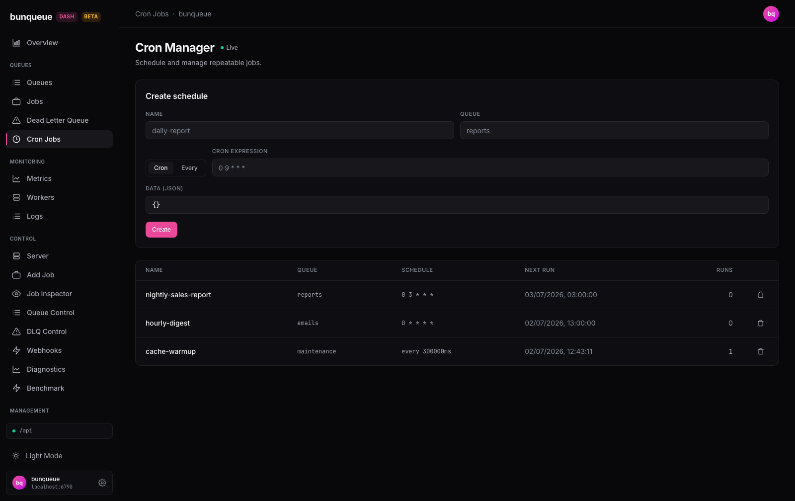

# Cron Jobs

This screen lets you set up jobs that run on a repeating schedule, then see them all in one place.

**Where:** open `/cron` from the sidebar.

## What you'll see

At the top is a **Create schedule via upstream upsert** card. Below it is a table listing every schedule already registered on the server, 15 rows per page. A **live** indicator shows the list is refreshing on its own.

Each row is one schedule:

| Column | What it tells you |
| --- | --- |
| **Name** | The schedule's unique name. |
| **Queue** | The queue that receives a job every time the schedule fires. |
| **Schedule** | When it fires, a cron expression like `0 9 * * *`, or `every <N>ms` for an interval schedule. |
| **Next Run** | The local date and time of the next run. |
| **Runs** | How many times this schedule has fired so far. |

Each row also has a trash icon at the end for deleting that schedule.

## What you can do

**Submit a schedule upsert**, fill in the form and click **Submit upsert**:

1. Enter a **Name** (for example `daily-report`) and a **Queue** (for example `reports`). Both are required.
2. Set the **Spawned job name** workers will receive. It defaults to `default` and is separate from schedule data.
3. Pick how it repeats with the mode toggle:
   - **cron**, enter a **Cron expression** (for example `0 9 * * *` or `0 */10 * * * *` with leading seconds).
   - **every**, enter an interval in **milliseconds** (a whole number greater than 0).
4. Optionally set **Data (JSON)**, the payload attached to every job this schedule creates. It must be valid JSON; leave it as `{}` if you don't need one.
5. Open **Advanced options** for timezone/priority/execution limits, overlap and restart policy, cron deduplication (`ttl`/`extend`/`replace`), and spawned-job retry, timeout, delay, stall timeout, and removal policy.
6. Click **Submit upsert**. The confirmation explicitly asks you to authorize last-writer-wins behavior. On an exact name/queue acknowledgement the form clears and a green **Cron upsert acknowledged** badge appears. This is an acknowledgement, not proof that no concurrent writer replaced it afterward.

The button is disabled while it's working, so a fast double-click can't create the same schedule twice. Creation also re-fetches the cron list immediately before POST and fails closed if the name now exists.

::: warning Upstream creation is not atomic
`POST /crons` is an upsert in Bunqueue v2.9.0 and has no create-only or version precondition. The dashboard refuses a name already observed and rechecks immediately before POST, but a simultaneous client can still race between that GET and POST. The UI never claims atomic creation; use a globally unique name and continue only when last-writer-wins is acceptable.
:::

**Delete a schedule**, click the trash icon on its row.

::: warning
Deleting asks you to confirm first, then removes the schedule permanently. If a delete fails, the reason is shown in a red banner above the form rather than passing silently.
:::

## Good to know

- **No editing or pausing.** The form refuses an already observed name; delete it, wait for refresh, then submit a replacement upsert. The unavoidable absent-name race remains documented above.
- **Intervals are in milliseconds.** `every 300000ms` is 5 minutes, it's easy to type seconds by mistake. The field only checks that the number is a positive whole number, not that the size is sensible.
- **Cron syntax follows Bunqueue 2.9 and Bun 1.4.** The dashboard accepts standard five-field expressions (including Bun's optional leading `+` on numeric values), six fields with leading seconds, and the official `@yearly`, `@annually`, `@monthly`, `@weekly`, `@daily`, `@midnight`, and `@hourly` shortcuts. Seven-field years and Croner-only `L`, `W`, `#`, and `?` extensions are rejected before submission.
- **Upgrade old persisted schedules first.** A Croner-only definition created before Bunqueue 2.9 can make the broker fail closed at startup. Update or remove it while still running Bunqueue 2.8, then upgrade.
- **Switches mirror the submitted value.** Overlap and missed-run defaults are
  initialized to the v2.9.0 defaults and every switch is sent explicitly, so
  an off switch cannot silently fall back to an on server default.
- **You may reach this screen from more than one link.** An older, list-and-delete-only version of this page also exists. The sidebar's **Cron Jobs** entry always opens this full version. See [Known issues](/known-issues) for details.

::: details Under the hood (for developers)
- Uses the `bq` client, not the legacy `api`.
- **List:** `GET /crons` (a flat `{ ok, crons[] }` response), polled on the global refresh interval (default 3s, floored at 500ms), one request in flight at a time.
- **Create:** `POST /crons` with `{ name, queue, data, schedule? | repeatEvery?, timezone?, priority?, maxLimit?, dedup?, jobOptions?, … }`.
- **Delete:** `DELETE /crons/:name`.
- A logically-failed create or delete (HTTP 200 with `ok: false`) surfaces as an error rather than a silent no-op.
:::
