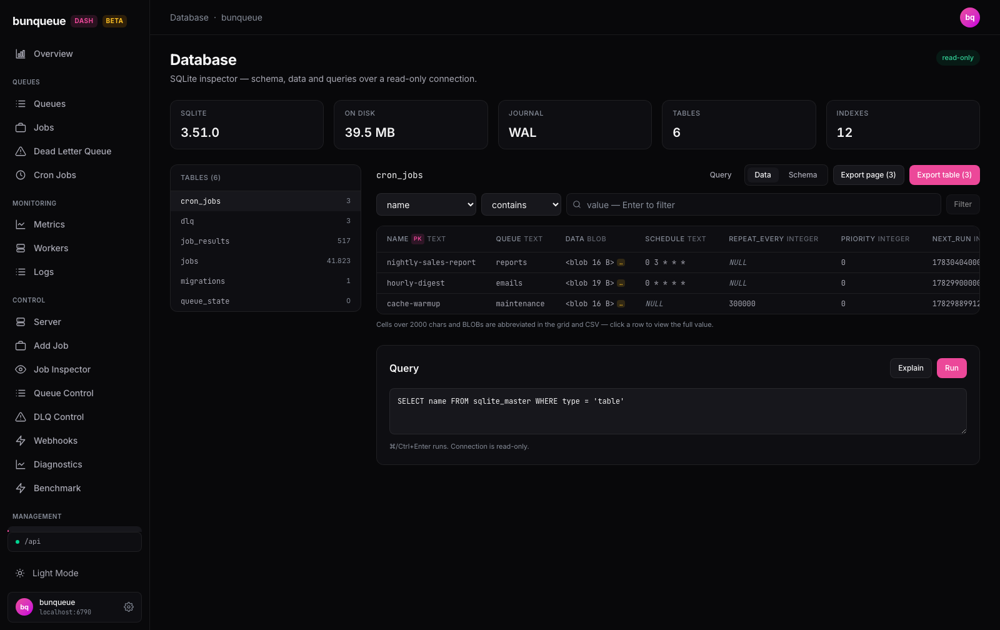

# Database

Browse and inspect your bunqueue server's underlying SQLite database, read-only, with no risk of changing anything.

**Where:** open `/database` from the sidebar.

## What you'll see

The page opens on a set of stat cards summarising the database, a list of tables on the left, and a data grid on the right. A **read-only** badge in the header is literal: nothing on this screen can change your data.

The stat cards across the top tell you:

| Element | What it tells you |
| --- | --- |
| **SQLite** | The database engine version. |
| **On disk** | Total size on disk, including the write-ahead log. |
| **Journal** | The journal mode (usually `WAL`). |
| **Tables** | How many tables the database has. |
| **Indexes** | How many indexes exist across those tables. |

The **Tables** list on the left shows every table with its live row count; the one you're viewing is highlighted. Pick a table and the right side fills in.

For the selected table you get two tabs:

- **Data**, a sortable, paginated grid (50 rows per page). Primary-key columns carry a **PK** badge and each column shows its type. `NULL` values are shown faint and italic. A small amber `…` chip marks a value that was shortened to fit, click the row to read it in full.
- **Schema**, the table's columns and their constraints, its indexes, and the original `CREATE TABLE` statement (with a copy button).

At the bottom, a **Query** panel lets you run your own read-only SQL and see the results in the same kind of grid.

## What you can do

- **Pick a table** from the left list to load its rows.
- **Switch between Data and Schema** with the tabs above the grid.
- **Sort a column** by clicking its header, it cycles ascending, descending, then off.
- **Filter rows** using the filter bar: choose a column, an operator (`contains`, `=`, `≠`), type a value, and press Enter or **Filter**. Use **Clear** to remove it. (The **Filter** button stays disabled until you type a value.)
- **Open a row** with its **View** button. A drawer slides in with every column's full, untruncated value and a copy button on each. Close it with the X, the backdrop, or `Escape`.
- **Export the current page** as a CSV file, or **Export table** to download one bounded, point-in-time CSV of the filtered and sorted table view.

Running your own query:

1. Type SQL into the **Query** box, or click **Query** on a table to pre-fill a `SELECT` for it.
2. Press **Run** (or `⌘/Ctrl+Enter`) to see the results, or **Explain** to see the query plan.
3. Reuse a recent query from the **History** chips, and download results with **CSV** or **JSON**.

::: tip Nothing here is destructive
Every action is a read or a download, so nothing asks for confirmation. Even hand-typed SQL can only read: writes are rejected before they reach the database.
:::

## Good to know

- **It's a viewer, not a console.** Only read queries run, anything that would change data is refused. Your SQL must start with `SELECT`, `WITH`, `EXPLAIN`, `VALUES`, or `PRAGMA`.
- **Query results are capped at 500 rows.** Larger results show a `≥ 500 rows` note and only the first 500; narrow the query, or use **Export table** for a larger bounded snapshot.
- **A full-table export is one agent-side SQLite snapshot.** The current table, sort, and filter are captured when you click; the agent reads them in one read-only transaction, so concurrent WAL writes cannot mix database snapshots into the file. The CSV is not rebuilt from browser pages.
- **Table CSVs stop at the first active cap:** 200,000 data rows or a 16 MiB response body (including the header and row separators). A byte-limited export keeps only complete CSV records. The completion message says whether the row or byte cap truncated the result.
- **Grid and export truncation differ from the row drawer.** Grid cells are shortened at 2,000 characters and BLOBs are represented by their byte size; **Export current page** writes those displayed values. For the agent's full-table CSV, a TEXT value over 2,000 UTF-8 bytes is represented by its first 2,000 SQLite characters plus `…`, and a BLOB becomes `<blob N B>`. Open the row drawer for the separate full-cell read (itself bounded at 1,000,000 characters).
- **CSV text is spreadsheet-safe.** Text beginning with `=`, `+`, `-`, `@`, tab, or carriage return is prefixed with an apostrophe before RFC 4180 quoting, preventing Excel or Sheets from treating stored database text as a formula. Numeric SQLite values remain numeric.
- **No database yet?** Before you start the server for the first time, there's no database file. You'll see a *No database yet* message, start bunqueue once from **Control ▸ Server** to create it.
- **Query history is per-browser.** Your last 10 successful queries are saved locally in this browser only; they aren't shared across devices.
- **Counts can lag a few seconds.** The stats, table list, and rows refresh on their own timers, so on a busy server they may trail live writes slightly.
- **Custom queries have a 5-second response timeout in source and compiled builds.** Queries run in workers with bounded concurrency. A timeout cannot preempt SQLite's synchronous work immediately; the occupied worker slot stays reserved until that work exits. See [Known issues](/known-issues).

::: details Under the hood (for developers)
This screen talks to the local control agent (`:6800`, `/db/*` endpoints) via the `bq` client, never the bunqueue HTTP API. The agent uses a read-only SQLite connection plus a statement allowlist, so writes are impossible.

- `GET /db/info`, store metadata (polls ~15 s)
- `GET /db/tables`, table list + row counts (polls ~10 s)
- `GET /db/tables/<t>/schema`, columns, indexes, DDL (polls ~30 s)
- `GET /db/tables/<t>`, a row page (polls ~6 s)
- `GET /db/tables/<t>/export`, one filtered/sorted CSV from a single read transaction (on **Export table**)
- `GET /db/tables/<t>/cell`, full value for a truncated cell (on drawer open)
- `POST /db/query`, a custom read-only query (on Run)

The export response is raw `text/csv; charset=utf-8`, not JSON. `Content-Length`
and `X-Bunqueue-Db-Export-{Version,Table,Rows,Bytes,Cap}` let the client validate
the table identity, exact byte count, and whether `rows` or `bytes` stopped the
export before starting the download; the response is `no-store` and `nosniff`.

Server-side limits: 500-row cap per query, 2,000-character grid-cell truncation,
the full-table TEXT rule described above, 1,000,000-character full-cell cap,
200,000-row / 16 MiB full-table export caps, and a 5-second query timeout
in both source and compiled builds, subject to the worker limitation above.
:::
