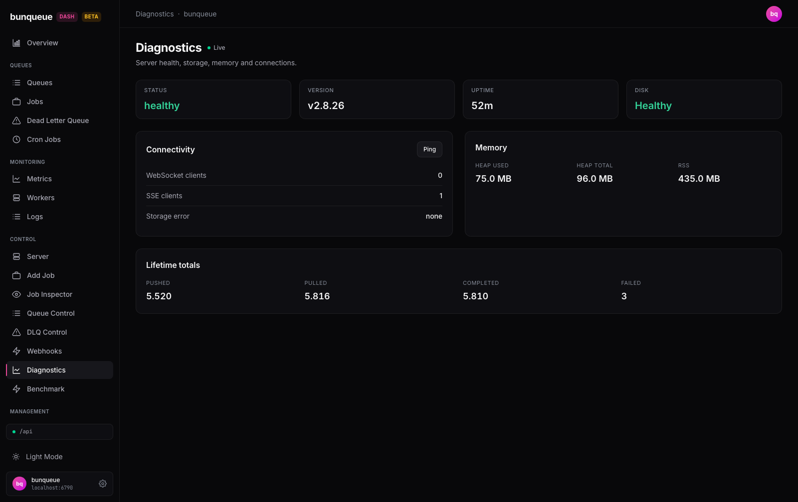

# Diagnostics

A single-glance health check for your bunqueue server — is it up, how long has it been running, is the disk full, what's connected, and how much memory is it using.

**Where:** open `/diagnostics` from the sidebar.

## What you'll see

The page opens with a row of status cards across the top, two cards below it (**Connectivity** and **Memory**), and a **Lifetime totals** card at the bottom. Everything updates on its own — this is your first stop whenever the dashboard feels off.

### Status row

| Element | What it tells you |
| --- | --- |
| **Status** | The server's overall health. Green when healthy, red when `degraded`. |
| **Version** | The bunqueue server version (for example `v2.8.26`), or `—` if the server doesn't report one. |
| **Uptime** | How long the server has been running (for example `52m`). |
| **Disk** | `Healthy` (green) normally, or `Full` (red) when the server is out of disk space. |

### Connectivity

| Element | What it tells you |
| --- | --- |
| **WebSocket clients** | How many live WebSocket clients are attached to the server. |
| **SSE clients** | How many live Server-Sent-Events subscribers are attached. The dashboard's own live activity stream counts as one, so `1` is normal while the dashboard is open. |
| **Storage error** | The server's last storage error, or `none` when everything is fine. |

### Memory

| Element | What it tells you |
| --- | --- |
| **Heap used** | Memory the server is actively using (for example `75.0 MB`). |
| **Heap total** | Memory the server has reserved for its heap. |
| **RSS** | Total resident memory the server process is holding. |

### Lifetime totals

Cumulative counters since the server started tracking: **Pushed** (jobs enqueued), **Pulled** (jobs handed to workers), **Completed** (jobs finished), and **Failed**. This card only appears when the server reports these totals.

## What you can do

This screen is read-only — nothing here changes the server. You have two manual actions:

- **Ping** (in the Connectivity card header) — measures the round-trip time to the server and shows the result on the button (for example `Ping · 34 ms`, or `Ping · unreachable` if it can't reach the server). The result stays until you ping again.
- **Retry** — appears on the offline banner when the server can't be reached. Click it to re-check the server right away.

::: tip
Ping latency is measured from your browser, so it includes the full network path between you and the server — treat it as an end-to-end reachability check, not the server's internal processing time.
:::

## Good to know

- **An SSE count of `1` is not a leak.** The dashboard's own live activity stream registers as one SSE client, so expect at least `1` while the dashboard tab is open.
- **A degraded server still shows here.** If the server is unhealthy (for example the disk is full), the **Status** and **Disk** cards turn red but the page stays live and keeps updating — you won't lose visibility.
- **Some failures are quiet.** If the server's storage or totals data can't be loaded, the page keeps working: **Disk** may read `Healthy` and **Storage error** `none`, or the **Lifetime totals** card simply disappears. Only when the core health check itself fails do you get an offline banner.
- **The Live indicator follows the health check.** The header's Live dot tracks the main health check, so it can stay green even if storage or totals data is lagging. See [Known issues](/known-issues) for the details.

::: details Under the hood (for developers)
- Data comes from three read-only endpoints via the `bq` client: `GET /health` (status, version, uptime, connections, memory), `GET /storage` (disk state, storage error), and `GET /stats` (lifetime totals).
- All three are polled together on every tick at the global refresh interval (default **3000 ms**, adjustable in Settings). `/storage` and `/stats` failures are swallowed so they don't take the page offline — only `/health` throwing shows the offline banner.
- The **Ping** button hits `GET /ping` on demand only and reports the browser-measured round-trip time; it is not part of the poll loop.
- Memory values are reported in MB and uptime in seconds; the page formats them for display.
:::
