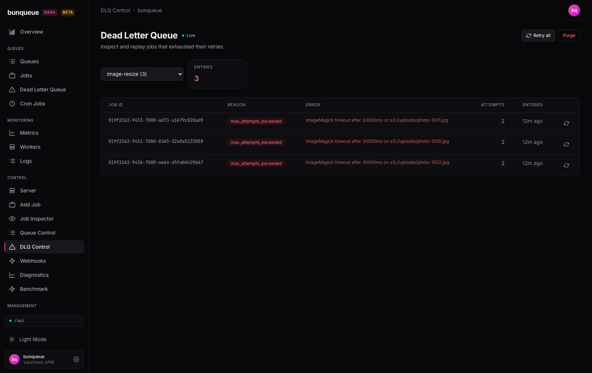

# DLQ Control

Pick one queue and deal with the jobs that failed for good — replay them or clear them out, one at a time or all at once.

**Where:** open `/dlq-control` from the sidebar.

## What you'll see

The header reads **Dead Letter Queue** with a **live** badge, meaning the table refreshes on its own. Below it is a queue picker and a summary card, then the table of failed jobs.

| Element | What it tells you |
| --- | --- |
| **Queue** dropdown | Which queue you're looking at. Each option shows its name and, in parentheses, how many jobs are stuck in its DLQ (e.g. `image-resize (3)`). Queues with none show just the name. |
| **Entries** card | The total number of dead-lettered jobs in the selected queue. It turns **red** when there are any, and stays neutral at `0`. |
| **Job ID** | The failed job's identifier. |
| **Reason** | Why the job was dead-lettered, shown as a red badge (for example, `max_attempts_exceeded`). |
| **Error** | The last error message the job hit. Shows `—` when there's nothing to display. |
| **Attempts** | How many times the job ran before giving up. |
| **Entered** | When the job landed in the DLQ, as relative time (e.g. "12m ago"). |

When there are more than 25 jobs, use the **pagination** control at the bottom to move through the pages.

## What you can do

- **Switch queue** — pick a different queue from the dropdown to load its DLQ. The table jumps back to the first page. On first open, the screen automatically selects the first queue that actually has failed jobs.
- **Retry one job** — click the retry icon on any row to replay that single job immediately.
- **Retry all** — the header button replays *every* failed job in the selected queue, not just the ones on screen. You'll be asked to confirm first.
- **Purge** — the header's danger button permanently deletes *every* failed job in the queue. You'll be asked to confirm first.

After any action, a short message appears next to the **Entries** card: green with a count on success (e.g. `Retried 3 entries`), or red with the error if something went wrong. While an action is running, the buttons are disabled until it finishes.

::: warning Retrying a single row is instant
The per-row retry icon fires the moment you click it — there's no confirmation dialog and no undo.
:::

::: warning Purge cannot be undone
Purge deletes the jobs on the server. There is no recovery from the dashboard, so double-check the queue name in the confirmation prompt before you accept.
:::

## Good to know

- **Retry all and Purge always act on the whole queue.** The confirmation names the full total, which may be larger than the 25 rows you can see on the current page.
- **The buttons stay disabled** when no queue is selected, or while another action is still running.
- **If the DLQ is empty**, you'll see "Dead letter queue is empty" and the **Entries** card reads `0`.
- **The dropdown count and the Entries card update on slightly different clocks**, so right after an action the number in parentheses may briefly lag behind the card. Give it a moment and they'll line up.
- **If the server can't be reached**, a banner with a **Retry** button appears and the last loaded rows stay on screen so you don't lose your place.
- **This is the focused, single-queue view.** For a cross-queue DLQ with filters, use the DLQ Pro screen instead. Avoid the older off-menu classic DLQ page, which is known to break on non-empty queues — see [Known issues](/known-issues).

::: details Under the hood (for developers)
- Every request uses the `bq` client against the bunqueue HTTP API — never the legacy `api` layer.
- Queue list: `GET /dashboard/queues`, polled every **30 s** (this feeds the dropdown counts).
- Table: `GET /queues/:q/dlq?limit=25&offset=…`, polled at the connection store's global cadence (**default 3 s**, floored at 500 ms). Response is flat — `{ ok, entries[], total }`, no `data` wrapper.
- Retry: `POST /queues/:q/dlq/retry`; sending a `jobId` retries one, omitting it retries all. Returns `{ ok, count }`, which drives the feedback message.
- Purge: `POST /queues/:q/dlq/purge`, also returning `{ ok, count }`.
- A DLQ entry is `{ job, enteredAt, reason, error, attempts[] }` — the id and attempt count live nested under `job`, with no top-level `id`.
:::
