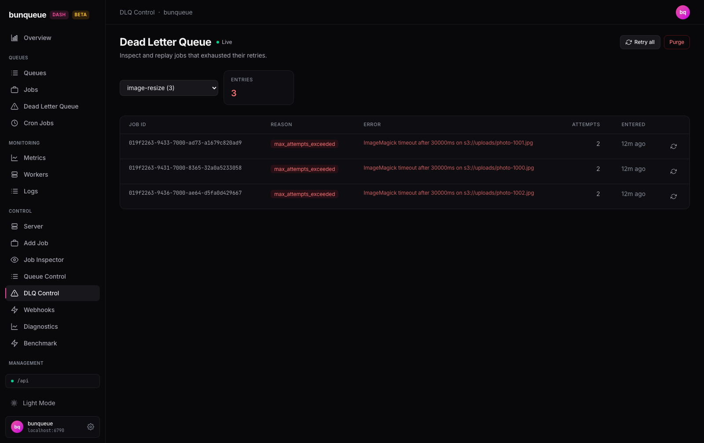

# DLQ Control

Pick one queue to inspect and export the jobs that failed for good. All row,
bulk and queue-wide retry mutations are unavailable under the v2.9.0
fail-closed policy.

**Where:** open `/dlq-control` from the sidebar.

## What you'll see

The header reads **Dead Letter Queue** with a **live** badge, meaning the table refreshes on its own. Below it is a queue picker and a summary card, then the table of failed jobs.

| Element | What it tells you |
| --- | --- |
| **Queue** dropdown | Which queue you're looking at. Each option shows its name and, in parentheses, how many jobs are stuck in its DLQ (e.g. `image-resize (3)`). Queues with none show just the name. |
| **Entries** card | The total number of dead-lettered jobs in the selected queue. It turns **red** when there are any, and stays neutral at `0`. |
| **Job ID** | The failed job's identifier. |
| **Reason** | Why the job was dead-lettered, shown as a red badge (for example, `max_attempts_exceeded`). |
| **Error** | The last error message the job hit. Shows `, ` when there's nothing to display. |
| **Attempts** | How many times the job ran before giving up. |
| **Entered** | When the job landed in the DLQ, as relative time (e.g. "12m ago"). |

When there are more than 25 jobs, use the **pagination** control at the bottom to move through the pages.

## What you can do

- **Switch queue**, pick a different queue from the dropdown to load its DLQ. The table jumps back to the first page. On first open, the screen automatically selects the first queue that actually has failed jobs.
- **Export**, download the currently displayed entries as CSV.
- **Retry one job**, **Retry all** and **Purge** are visible but permanently
  disabled. The retry POST cannot atomically require the generation, state and
  topology observed by a prior GET; purge cannot inspect hidden reverse
  dependencies.

The disabled controls explain the policy in their tooltips and send no mutation
request. Export is a browser-side download and does not change the queue.

::: warning An exact ID is not an atomic identity
Between `GET /jobs/:id` and `POST /queues/:q/dlq/retry`, the observed job can be
removed and a new job created under the same ID. Bunqueue v2.9.0 gives the POST
no generation/state/topology precondition, so even an exact, fresh,
topology-empty snapshot cannot make row retry safe.
:::

## Good to know

- **Individual removal is not exposed; Retry all and Purge stay disabled** for every queue and page.
- **If the DLQ is empty**, you'll see "Dead letter queue is empty" and the **Entries** card reads `0`.
- **The dropdown count and the Entries card update on slightly different clocks**, so after an external mutation or server-side retention event the number in parentheses may briefly lag behind the card. Give it a moment and they'll line up.
- **If the server can't be reached**, a banner with a **Retry** button appears and the last loaded rows stay on screen so you don't lose your place.
- **This is the focused, single-queue view.** For a cross-queue DLQ with filters, use the DLQ Pro screen instead. Avoid the older off-menu classic DLQ page, which is known to break on non-empty queues, see [Known issues](/known-issues).

::: details Under the hood (for developers)
- Every request uses the `bq` client against the bunqueue HTTP API, never the legacy `api` layer.
- Queue list: `GET /dashboard/queues`, polled every **30 s** (this feeds the dropdown counts).
- Table: `GET /queues/:q/dlq?limit=25&offset=…`, polled at the connection store's global cadence (**default 3 s**, floored at 500 ms). Response is flat, `{ ok, entries[], total }`, no `data` wrapper.
- The page never calls a DLQ retry, removal or purge route; all corresponding
  controls are disabled because no upstream mutation has an atomic generation
  and topology precondition.
- A DLQ entry is `{ job, enteredAt, reason, error, attempts[] }`, the id and attempt count live nested under `job`, with no top-level `id`.
:::
