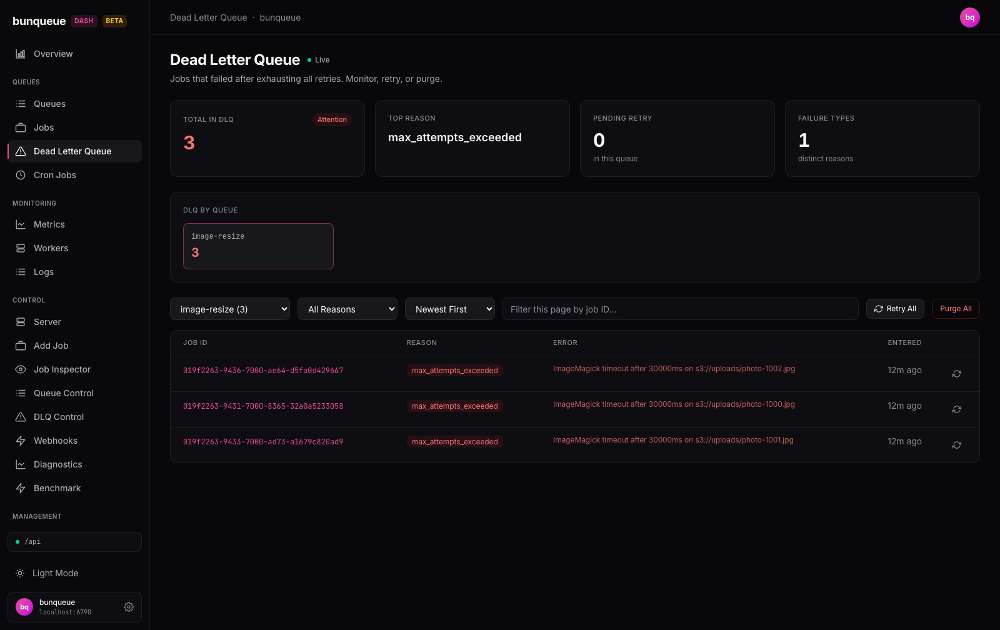

# Dead Letter Queue

This screen is where jobs land after they fail and run out of retries — so you can see what broke, send it back to run again, or clear it out.

**Where:** open `/dlq` from the sidebar.

## What you'll see

At the top are four summary cards. Below them, a grid of tiles — one per queue that currently has failures — lets you drill into a single queue. Pick a queue and its failed jobs appear in the table underneath, with a toolbar to filter and sort them.

Only **Total in DLQ** counts every queue at once. The other three cards describe the queue you've selected, and show a placeholder (`Select a queue` or `—`) until you pick one.

| Card | What it tells you |
| --- | --- |
| **Total in DLQ** | Failed jobs across every queue. The badge reads **Healthy** (green) at zero, **Attention** (red) when there's anything to look at. |
| **Top Reason** | The most common failure reason in the selected queue. |
| **Pending Retry** | Jobs in the selected queue waiting to be retried automatically, but not yet retried. |
| **Failure Types** | How many different failure reasons the selected queue has. |

Once you pick a queue, its failed jobs list in a table:

| Column | What it tells you |
| --- | --- |
| **Job ID** | The failed job's ID. Click it to open the job in the inspector. |
| **Reason** | Why it failed, shown as a red badge (for example `max_attempts_exceeded`). |
| **Error** | The error message, shortened to fit. A dash means no message was recorded. |
| **Entered** | How long ago the job landed in the dead letter queue. |
| _(last column)_ | A per-row retry button. |

::: tip
Jobs don't have names in bunqueue, so the Job ID is how you identify a failure. Click it to see the full timeline and error detail.
:::

## What you can do

- **Pick a queue** — choose it from the dropdown or click a tile. Its failures load, and the reason filter resets to show everything.
- **Filter by reason** — narrow the list to a single failure reason.
- **Sort by newest or oldest** — order the list by when jobs entered the queue.
- **Search by Job ID** — type part of an ID to find a specific failure fast.
- **Open a job** — click any Job ID to inspect its full history.
- **Page through** — the pager moves 25 entries at a time.

**Retry one job** — click the retry button on its row. You'll confirm first, then that single job is sent back to run again.

**Retry all** — click **Retry All** to send every failed job in the selected queue back to run again. You'll confirm first.

**Purge all** — click **Purge All** to delete every failed job in the selected queue.

::: warning Purge is permanent
Retry moves jobs back out of the dead letter queue so they can run again. **Purge deletes them for good — there's no undo.** Both act on the whole selected queue at once, and both ask you to confirm before they run.
:::

## Good to know

- **The reason filter, ID search, and sort work on the page you're viewing, not the whole queue.** When a queue has more than one page of failures, these tools only touch the 25 entries currently on screen — the sort labels say "(this page)", and if a filter finds nothing it'll remind you to check other pages with the pager. This is a known limitation of the server, not a bug. See [Known issues](/known-issues).
- **The by-queue tiles hide empty queues.** Only queues that actually have failures show up, so the grid stays focused on what needs attention. If nothing has failed anywhere, the grid disappears entirely.
- **The three per-queue cards can go blank.** If the queue's stats fail to load, Top Reason, Pending Retry, and Failure Types fall back to placeholders — but the table still works. **Total in DLQ** is always independent.
- **Total in DLQ can lag by a few seconds.** It refreshes on a slower cycle than the rest of the page, so right after a retry or purge the grand total may take a moment to catch up.
- **Retry All / Purge All are disabled** until you've selected a queue, and while an action is still running.

::: details Under the hood (for developers)
- Uses the shape-verified **`bq`** client throughout.
- Two polls run in parallel. The queue list (for the grand total, tiles, and dropdown counts) refreshes every **10s** via `GET /dashboard/queues`. The selected queue's entries (`GET /queues/:q/dlq`) and stats (`GET /queues/:q/dlq/stats`) refresh on the global interval (default **3s**, set in Settings); a stats failure is swallowed so the table still renders.
- Retry hits `POST /queues/:q/dlq/retry` (with `{ jobId }` for one entry, no body for all); purge hits `POST /queues/:q/dlq/purge`. Both return a count, and the page refreshes entries plus the queue list afterward.
:::
