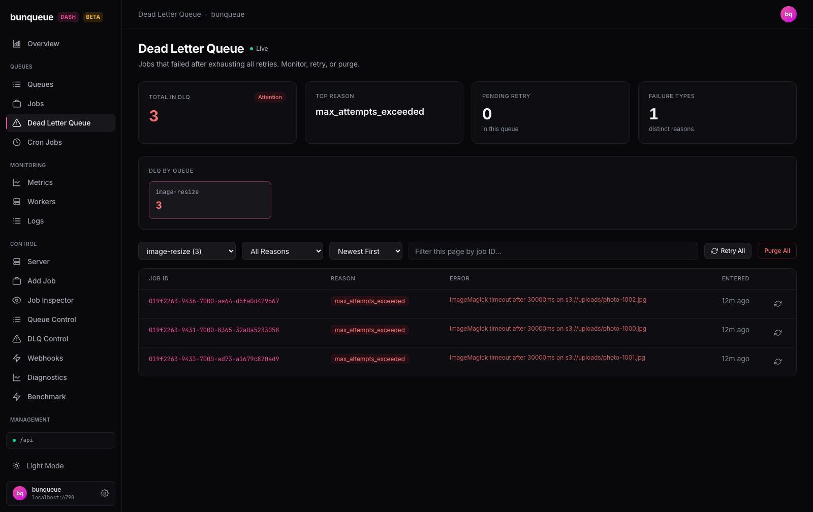

# Dead Letter Queue

This screen is where jobs land after they fail and run out of retries. You can
inspect, filter and export failures; every manual, bulk and queue-wide retry
control is unavailable under the v2.9.0 fail-closed policy.

**Where:** open `/dlq` from the sidebar.

## What you'll see

At the top are four summary cards. Below them, a grid of tiles, one per queue that currently has failures, lets you drill into a single queue. Pick a queue and its failed jobs appear in the table underneath, with a toolbar to filter and sort them.

Only **Total in DLQ** counts every queue at once. The other three cards describe the queue you've selected, and show a placeholder (`Select a queue` or `, `) until you pick one.

| Card | What it tells you |
| --- | --- |
| **Total in DLQ** | Failed jobs across every queue. The badge reads **Healthy** (green) at zero, **Attention** (red) when there's anything to look at. |
| **Top Reason** | The most common failure reason in the selected queue. |
| **Pending Retry** | Jobs in the selected queue waiting to be retried automatically, but not yet retried. |
| **Failure Types** | How many different failure reasons the selected queue has. |

Once you pick a queue, its failed jobs list in a table:

| Column | What it tells you |
| --- | --- |
| **Job ID** | The failed job's ID. Click it to open the job in the inspector. |
| **Reason** | Why it failed, shown as a red badge (for example `max_attempts_exceeded`). |
| **Error** | The error message, shortened to fit. A dash means no message was recorded. |
| **Entered** | How long ago the job landed in the dead letter queue. |
| _(last column)_ | A disabled retry button; destructive removal is not exposed. |

::: tip
Jobs can have first-class names in Bunqueue 2.9, but names are not unique and this table uses the
Job ID as the stable failure identifier. Click it to see the name, full timeline, and error detail.
:::

## What you can do

- **Pick a queue**, choose it from the dropdown or click a tile. Its failures load, and the reason filter resets to show everything.
- **Filter by reason**, narrow the list to a single failure reason.
- **Sort by newest or oldest**, order the list by when jobs entered the queue.
- **Search by Job ID**, type part of an ID to find a specific failure fast.
- **Open a job**, click any Job ID to inspect its full history.
- **Page through**, the pager moves 25 entries at a time.
- **Export this page**, download the currently loaded entries as CSV.
**Retry one job** is visible but disabled. A preliminary exact-ID GET cannot
authorize the separate retry POST: the endpoint has no atomic precondition for
job generation, state or topology, so the original job can disappear and a
different job recreated under the same ID can receive the POST.

**Retry all** is visible but disabled for the same reason, with the additional
problem that the targeted DLQ can move while the request is in flight.

**Purge all** is visible but disabled because deletion can strand hidden cross-queue dependents.

::: warning Atomic safety takes precedence
[Bunqueue v2.9.2](https://github.com/egeominotti/bunqueue/releases/tag/v2.9.2)
exposes no generation/state/topology-conditional DLQ retry and no
reverse-dependency-aware purge. A warning, confirmation, pinned target or fresh
queue/job scan cannot make either mutation atomic, so the dashboard calls none
of those routes.
:::

## Good to know

- **The reason filter, ID search, and sort work on the page you're viewing, not the whole queue.** When a queue has more than one page of failures, these tools only touch the 25 entries currently on screen, the sort labels say "(this page)", and if a filter finds nothing it'll remind you to check other pages with the pager. This is a known limitation of the server, not a bug. See [Known issues](/known-issues).
- **The by-queue tiles hide empty queues.** Only queues that actually have failures show up, so the grid stays focused on what needs attention. If nothing has failed anywhere, the grid disappears entirely.
- **The three per-queue cards can go blank.** If the queue's stats fail to load, Top Reason, Pending Retry, and Failure Types fall back to placeholders, but the table still works. **Total in DLQ** is always independent.
- **Total in DLQ can lag by a few seconds.** It refreshes on a slower cycle than the rest of the page, so after an external mutation or server-side retention event the grand total may take a moment to catch up.
- **Every Retry / Retry All / Purge All control remains disabled by design**, even after selecting a queue.
- **Individual permanent removal is unavailable.** Bunqueue 2.9's
  `Queue.removeDlqJob()` still accepts only queue + job ID, which cannot prove a
  custom ID was not reused for a different generation after the row was read.
- **Existing server retention can remove entries without a dashboard action.**
  `maxEntries` may evacuate entries immediately and `maxAge` drives destructive
  expiry. Queue Control shows both values read-only and cannot save them.

::: details Under the hood (for developers)
- Uses the shape-verified **`bq`** client throughout.
- Two polls run in parallel. The queue list (for the grand total, tiles, and dropdown counts) refreshes every **10s** via `GET /dashboard/queues`. The selected queue's entries (`GET /queues/:q/dlq`) and stats (`GET /queues/:q/dlq/stats`) refresh on the global interval (default **3s**, set in Settings); a stats failure is swallowed so the table still renders.
- Row, queue-wide and global retry/removal controls are disabled. No DLQ
  mutation request is sent from this page.
:::
