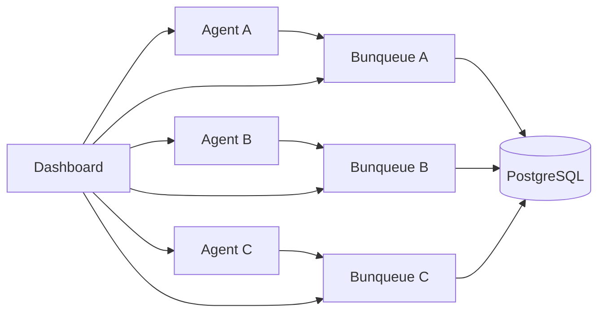

# Fleet

Fleet is the multi-broker control surface. It checks every configured Bunqueue
API and its paired control agent without changing the Dashboard's active node,
groups brokers that report the same PostgreSQL target and namespace, and lets
you start, stop, restart, or select each broker.

**Where:** open `/fleet` from the sidebar.

## Three Bunqueue brokers and one PostgreSQL database

Use one connection profile per broker and one control agent beside each broker:



All three brokers must use the same `BUNQUEUE_POSTGRES_URL` and
`BUNQUEUE_POSTGRES_NAMESPACE`. Give each broker unique HTTP/TCP ports and each
agent a unique URL. In **Settings**, create three profiles containing the
matching Bunqueue API URL, agent URL, server token, and agent token.

## What you can do

- See API and agent reachability independently for every node.
- Confirm the Bunqueue version, managed process state, storage driver,
  PostgreSQL target, and namespace.
- Detect accidental split topology: different database targets or namespaces
  appear as separate PostgreSQL groups.
- Start a stopped managed broker, or stop/restart a running one, through that
  broker's paired agent. Stop and Restart require confirmation.
- Click **Use node**, or use the node selector under the sidebar, to retarget
  every other Dashboard page atomically. Old polls are aborted and stale data
  from the previous broker is hidden before the new node renders.
- Refresh all nodes immediately; otherwise Fleet polls every 10 seconds with
  endpoint-level failure isolation and a 7.5-second deadline.

Each profile keeps its server and agent bearer tokens separate. Profile names
and URLs survive reloads; tokens are memory-only and must be entered again in a
new browser session.

## Shared versus node-local state

| Scope | Dashboard behaviour with PostgreSQL |
| --- | --- |
| Queues, jobs, FlowProducer DAGs, DLQ, crons, worker registry, queue/group limits, deduplication, durable events and metrics | Stored under the PostgreSQL namespace and observable through every healthy broker in that group. Use any member, including after another member created the state. |
| Broker lifecycle, launch configuration, health, memory/connections and process logs | Node-local. Fleet sends the command to the selected card's paired control agent. |
| Webhooks | Bunqueue 2.9.3 keeps these in the broker process. Configure and inspect them on the intended active node; they are not a PostgreSQL-wide registry. |
| Workflow Engine | The Dashboard agent uses that profile's local `dataPath` for Workflow state and module handlers. It is not merged merely because queue storage is PostgreSQL. |
| Database inspector and S3 backup | Deliberately unavailable in PostgreSQL mode because both operate on Bunqueue's SQLite file. The pages return an explicit SQLite-only message instead of touching the Workflow database or another local file. |
| Alerts and Copilot setup | Browser-local. Their live reads and allowed commands follow the currently active profile. |

## Real compatibility gate

The repository's canonical E2E gate starts a disposable PostgreSQL 18.6
container, three Bunqueue 2.9.3 brokers, and three authenticated agents. It
proves cross-broker enqueue, inspect, leased pull/ack, pause/resume, cron, and
rate-limit operations, then removes every process, container, and temporary
file:

```bash
bun run test:e2e:postgres-fleet
```

The Benchmark consumer also requests explicit owner/lease tokens and forwards
them to heartbeat, acknowledge, and compensation calls, so a PostgreSQL claim
remains valid when completion is handled through another broker.

::: warning Upgrade one namespace as a unit
Bunqueue 2.9.3 upgrades the published 2.9.2 package's PostgreSQL schema 19 to
schema 20. Stop or coordinate
every broker that shares a namespace before the upgrade; every member must run
2.9.3 before normal traffic resumes, because a 2.9.2 broker cannot join schema
20. The disposable three-broker runtime and Dashboard browser scenarios assert
schema 20 before testing cross-broker jobs, policies, groups and lifecycle.
:::
