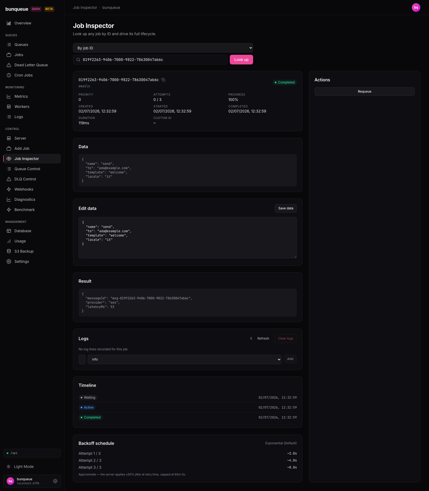

# Job Inspector

Look up any single job and drive its whole lifecycle from one screen: inspect its data, result, error, logs and history, edit its payload, and run every action the job's state allows.

**Where:** open `/job` from the sidebar.

## What you'll see

At the top there's always a **lookup bar**: a mode dropdown (**By job ID** / **By custom ID**), a search box, and a **Look up** button. Below it, a single status line shows the result of your last action, green for success, red for failure.

Once a job is loaded, the screen splits into two: a wide left column with detail cards, and a narrow **Actions** rail on the right.

The overview card at the top summarizes the job:

| Element | What it tells you |
| --- | --- |
| Job ID | The job's internal ID, with a copy button. |
| Queue | The queue this job belongs to. |
| Status badge | The job's current state, color-coded. |
| Priority | The job's priority number, shown as-is. |
| Attempts | How many times it has run vs. its max (e.g. `0 / 3`). |
| Progress | Reported progress, as a percentage. |
| Created / Started / Completed | Local timestamps for each stage (blank until reached). |
| Duration | How long the run took, once it has finished. |
| Custom ID | Your own / idempotency ID, if the job has one (with a copy button). |

The other cards appear depending on the job:

| Card | What it shows |
| --- | --- |
| Data | The job's payload as read-only formatted JSON. |
| Edit data | An editable copy of the payload with a **Save data** button. |
| Result | The stored return value, only for **completed** jobs. |
| Error | The last error message and full stack trace, only for **failed** jobs. |
| Logs | The job's log lines, with controls to refresh, clear, and add lines. |
| Child values | Resolved return values from a flow job's children, only for parent jobs. |
| Timeline | The job's state history: enqueued, started, finished, and any retries. |
| Backoff | A preview of when the remaining retries would run. |

## What you can do

**Look up a job**

1. Pick **By job ID** or **By custom ID** in the dropdown.
2. Type the ID and press Enter (or click **Look up**).
3. The job loads and the page URL updates so you can bookmark or share a direct link to it.

Every job ID elsewhere in the dashboard (Jobs, DLQ, Activity) links straight to this screen, so you rarely have to type an ID by hand.

**Edit the payload**

1. Change the JSON in the **Edit data** card.
2. Click **Save data**. Valid JSON is saved and the job reloads; invalid JSON shows an inline message and nothing is sent.

**Run an action**, the Actions rail only shows the actions that are valid for the job's current state. Depending on state, you may see:

| Action | What it does |
| --- | --- |
| **Promote (run now)** | Pulls a delayed job forward to run immediately. |
| **Retry (move to waiting)** | Sends an active job back to waiting. |
| **Retry from DLQ** | Retries a job that's in the dead-letter queue. |
| **Requeue** | Re-runs a completed job as a fresh run (see Good to know). |
| **Move to delayed** | Parks an active job as delayed for a number of milliseconds you enter. |
| **Discard (to DLQ)** | Pushes the job into the dead-letter queue. |
| **Set priority** | Sets a new priority number. |
| **Set delay** | Sets a new delay in milliseconds. |
| **Fail** | Force-fails an active job (optional reason). |
| **Cancel (delete)** | Removes the job entirely. |

**Work with logs**, use **Refresh** to reload the lines, type a message and pick a level (`info` / `warn` / `error`) then **Add** to append one, or **Clear logs** to wipe them all.

**See child values**, on a flow parent, click **Show** to load and view the resolved return values of its children.

::: warning Some actions ask you to confirm, and a few are destructive
**Fail**, **Cancel (delete)**, and **Clear logs** each pop up a confirmation first. **Cancel** permanently removes the job, and **Clear logs** permanently deletes its log lines, there's no undo.
:::

## Good to know

- **Actions are state-aware.** The rail only offers what the server will accept right now. If nothing applies, you'll see "No actions available for a job in state …". Which actions show up follows the job's location, for example, only delayed jobs can be promoted, and only active jobs can be failed or moved to delayed.
- **Backoff times are approximate.** The retry schedule is a preview and doesn't include the random jitter the server adds at retry time (up to ±50%, or ±20% for fixed backoff), so read the numbers as "about". "exponential (default)" just means the job uses standard backoff, not that it has none.
- **Timeline keeps the last 20 entries.** Very retry-heavy jobs only show their most recent transitions; older attempts (and the errors attached to them) drop off.
- **Requeue is a fresh run, not a replay.** Requeuing a completed job resets its attempts and timestamps and re-runs it, it does not replay the stored result.
- **The result is fetched on demand.** A completed job with nothing stored shows "No result stored for this job." rather than an error.
- **Rapid lookups are safe.** If you hammer Enter, the newest lookup always wins, a slow earlier response can't overwrite it.
- **This is the modern inspector.** The classic Jobs and DLQ views have separate, documented quirks. If something looks off, check [Known issues](/known-issues).

::: details Under the hood (for developers)
- Uses the shape-verified **`bq`** client throughout (never the legacy `api`).
- Lookup calls `GET /jobs/:id` or `GET /jobs/custom/:customId`; a completed job also fetches `GET /jobs/:id/result`. Logs use `GET/POST/DELETE /jobs/:id/logs`; children use `GET /jobs/:id/children` (lazily, on expand).
- Actions map to `POST /jobs/:id/promote | move-to-wait | discard | fail | move-to-delayed`, `PUT /jobs/:id/data | priority | delay`, `DELETE /jobs/:id`, plus the queue-scoped `POST /queues/:q/dlq/retry` and `POST /queues/:q/retry-completed`.
- **No polling or SSE.** It fetches once per lookup, then re-fetches only after an action, a Logs refresh, or expanding child values. Deep links (`/job?id=<id>`) auto-load on open.
:::
