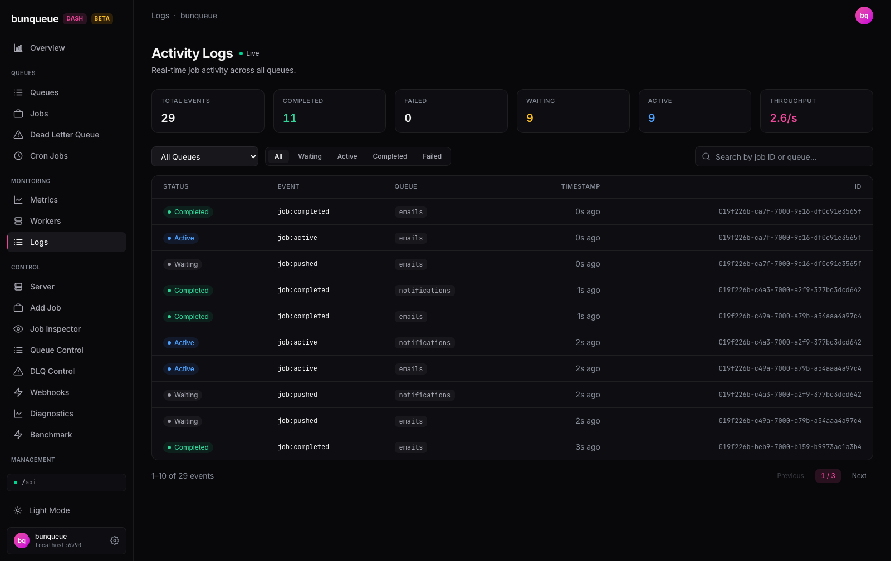

# Logs

Watch job activity across all your queues as it happens, in one live feed.

**Where:** open `/logs` from the sidebar.

## What you'll see

The page is titled **Activity Logs**. At the top, a **Live** indicator shows whether you're connected to the event stream right now. Below it sit six stat cards, a row of filters, and a table of recent events (10 per page).

The stat cards count what has come through *since you opened the page* — they are running totals for this session, not all-time server figures.

| Element | What it tells you |
| --- | --- |
| **Total Events** | Every job event received since you started watching. |
| **Completed** | Events for jobs that finished successfully. |
| **Failed** | Events for jobs that failed. Turns red when the count is above zero. |
| **Waiting** | Events for jobs that were just queued and are waiting to run. |
| **Active** | Events for jobs currently being picked up or making progress. |
| **Throughput** | Current pace of events, in events per second, over the last 5 seconds. |

Each row in the table is a single event:

| Column | What it tells you |
| --- | --- |
| **Status** | A colored badge for the event's state (waiting, active, completed, failed). |
| **Event** | The exact event type, such as `job:completed`, `job:pushed`, or `job:failed`. |
| **Queue** | Which queue the event came from, or `—` if none was reported. |
| **Timestamp** | How long ago the event happened, shown as relative time. |
| **ID** | The job's ID, or `—` if it wasn't included. |

## What you can do

This is a watch-only screen. Nothing here changes your server — the controls only narrow down what the feed shows you.

- **Pick a queue.** Use the queue dropdown to focus on one queue, or choose **All Queues** to watch everything. Switching restarts the feed for the new scope (the counts start over).
- **Filter by status.** Use the status buttons (all / waiting / active / completed / failed) to show only events in that state.
- **Search.** Type into the search box to match by job ID or queue name. It's a plain, case-insensitive substring match.
- **Page through events.** Use **Previous** / **Next** to move through the matching events, 10 at a time.

::: tip
Changing the queue, status, or search jumps you back to the first page, so you always land on the newest matching events.
:::

## Good to know

- **This is a live view, not a history log.** It keeps only the most recent 250 events and starts counting from the moment you opened the page. Reloading, navigating away, or switching the queue clears the feed and resets every counter.
- **You can only search what's on screen.** Because the feed holds the last 250 events, older events that have scrolled off can't be searched or paged back to.
- **Switching queues restarts the feed.** Moving between **All Queues** and a specific queue reconnects the stream, so the list clears and the rates briefly drop to zero before filling again.
- **There's no job-name column.** Job events don't carry a name, so the table shows the event type and job ID instead. (The older `/logs-classic` page shows a permanently blank "Job Name" for the same reason — see [Known issues](/known-issues).)
- **The empty table tells you what's happening.** You'll see **"Connecting to the event stream…"** while it connects, **"Waiting for activity…"** once connected but idle, and **"No events match the current filters."** when your filters hide everything.
- **It reconnects on its own.** If the connection drops, the **Live** indicator goes off and the feed retries automatically after a couple of seconds. If the server is unreachable, a banner with a **Retry** button appears under the header.

::: details Under the hood (for developers)
- The live feed reads a Server-Sent Events stream: `GET /events` for all queues, or `GET /events/queues/:q` when a queue is selected. Only frames whose event name starts with `job:` become rows; the buffer is capped at 250 events and flushed to the UI on a ~150 ms timer.
- The stream is opened through the `api` client (URL + bearer auth), not a raw `EventSource`.
- The queue dropdown's options come separately from `bq.queues()` (`GET /dashboard/queues`), polled every 30 s so it never competes with the live cadence.
- A dropped stream retries after a 2 s backoff.
:::
