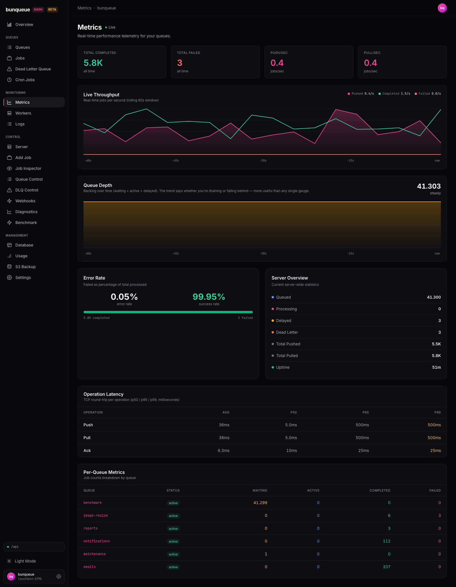

# Metrics

A live, read-only dashboard that shows how well your server is keeping up right now: throughput, backlog trend, error rate, latency, and a per-queue breakdown.

**Where:** open `/metrics` from the sidebar.

## What you'll see

The page updates on its own — there's nothing to click to refresh. At the top a **Live** dot tells you the connection is healthy. Below it, stat cards give you the headline numbers, two charts show trends over the last 60 seconds, and tables break down latency and per-queue counts.

| Element | What it tells you |
| --- | --- |
| **Total Completed** | All-time completed jobs. Shown abbreviated (e.g. `5.8K`, `3.4M`), so it trades exact digits for readability. |
| **Total Failed** | All-time failed jobs, shown as an exact count. |
| **Push/sec** / **Pull/sec** | How many jobs per second are currently being added and taken off the queues. |
| **Live Throughput** chart | Jobs per second over a rolling 60-second window — pushed, completed, and failed. The legend above it shows each series' current value. |
| **Queue Depth** chart | Your backlog (waiting + active + delayed jobs) over time, with a big current number and a trend label: `draining`, `steady`, or `accumulating`. |
| **Error Rate** card | Failed jobs as a percentage of everything processed, plus the matching success rate and the exact completed/failed counts. |
| **Server Overview** card | Current server-wide counts — queued, processing, delayed, dead-letter, totals pushed/pulled, and uptime. |
| **Operation Latency** table | Network round-trip time per operation (`push`, `pull`, `ack`) — average plus p50/p95/p99. |
| **Per-Queue Metrics** table | One row per queue with its status and job counts (waiting, active, completed, failed). |

::: tip Watch the trend, not just the number
On the Queue Depth chart, the trend label matters more than the raw figure. A backlog of 40,000 that's `draining` is fine; the same number `accumulating` means you're falling behind. The label turns green when draining and red when accumulating.
:::

## What you can do

This screen is observe-only — there are no buttons that change server state, no forms, and no per-job actions. What you can do is read it:

- **Watch throughput and depth live.** The charts and the header **Live** dot update automatically, roughly once a second.
- **Read the depth trend** to judge whether you're keeping up, instead of eyeballing a single number.
- **Page through the per-queue table** using the next/previous controls when you have more than 15 queues.
- **Retry the connection.** If the server becomes unreachable, an offline banner with a **Retry** button appears under the header — click it to reconnect.

## Good to know

- **Charts start empty.** The 60-second window builds up from the moment you open the page — there's no saved history. Leave it open for about a minute to fill the full window.
- **A hidden tab freezes the charts.** When you switch away, updates pause and don't backfill. The series simply resume when you come back, so a real-world gap compresses into adjacent samples.
- **Total Completed is abbreviated** (`5.8K`, `3.4M`) and loses exact digits. For precise completed and failed counts, read the footer of the **Error Rate** card.
- **Latency is network time, not job time.** The Operation Latency table measures the round-trip for each `push`/`pull`/`ack` request — not how long jobs wait in the queue or take to run. The p99 column is tinted amber to draw your eye to tail latency.
- **The Live dot tracks the queue feed.** It reflects the per-queue data connection. In the rare case that feed is fine but the live charts stall briefly, the dot can still read Live while the charts pause — give it a second to catch up.
- **The Error Rate turns red above 5%.** That's your at-a-glance signal that failures are climbing.

::: details Under the hood (for developers)
- Live cards, both charts and the latency table are fed by a 1-second sampler that calls `GET /dashboard`.
- The per-queue table comes from `GET /queues/summary`, polled on the global refresh interval (default 3s).
- Both calls use the shape-verified `bq` client against the bunqueue HTTP API, not the control agent. Backlog depth (waiting + active + delayed) is computed client-side each tick.
- Earlier bugs are fixed here: the latency percentiles read real per-operation values, and uptime is scaled correctly. See [Known issues](/known-issues) for the remaining classic-page quirks.
:::
