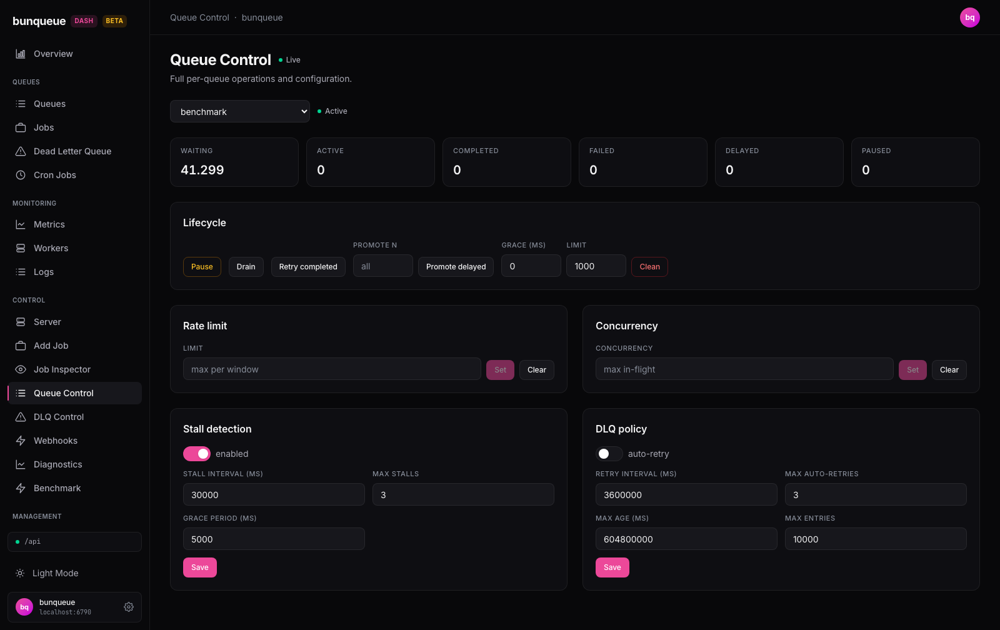

# Queue Control

Your operations console for a single queue — pick one and pause, drain, clean, throttle, and tune it, all from one screen.

**Where:** open `/queue-control` from the sidebar.

## What you'll see

Start with the **queue picker** at the top and choose a queue by name. Next to it, a colored **status dot** shows whether that queue is running, and an inline **message** reports the result of your most recent action. The first queue is selected for you on load.

Once a queue is selected, a row of six count cards summarizes its jobs (numbers shown with thousands separators), followed by cards for every control you can operate.

| Element | What it tells you |
|---------|-------------------|
| Status dot | Green **Active** when running, amber **Paused** when the queue is paused. |
| Last-action message | Green on success (with the affected job count, e.g. `Drained: 120`), red with the error text on failure. |
| **Waiting** | Jobs queued and ready to run. |
| **Active** | Jobs being processed right now. |
| **Completed** | Jobs that finished successfully. |
| **Failed** | Jobs that ran out of retries (dead-lettered). |
| **Delayed** | Jobs scheduled to run later. |
| **Paused** | Jobs held because the queue is paused. |

Below the counts you get the **Lifecycle** card (pause, drain, retry, promote, clean), the **Rate limit** and **Concurrency** cards, and the **Stall detection** and **DLQ policy** forms.

## What you can do

**Pause / Resume** — one button toggles the queue between running and paused; its label and color follow the current state.

**Retry completed** — requeues completed jobs back into waiting. The message reports how many were requeued.

**Promote delayed** — moves delayed jobs to waiting so they run now. Leave the **Promote** box empty to promote all of them, or enter a number to promote just the first *N*.

**Set / Clear rate limit** — enter a maximum number of jobs per window and **Set** it, or **Clear** to remove the limit. Set is disabled until you type a value.

**Set / Clear concurrency** — enter the maximum number of jobs allowed in flight and **Set** it, or **Clear** to remove the cap. Set is disabled until you type a value.

To adjust stall detection:

1. Open the **Stall detection** form.
2. Toggle **enabled**, then fill in **Stall interval (ms)**, **Max stalls**, and **Grace period (ms)** — all three are required.
3. Click **Save**. You'll see `Saved ✓` when it lands.

To adjust the dead-letter policy:

1. Open the **DLQ policy** form.
2. Toggle **auto-retry**, then set **Retry interval (ms)**, **Max auto-retries**, and **Max entries** (all required). **Max age (ms)** is optional — leave it blank to mean *no max age*.
3. Click **Save**.

::: warning Destructive actions — no undo
**Drain** removes all waiting jobs from the queue. **Clean** permanently deletes completed and failed jobs (up to **Limit**, older than **Grace (ms)**). Both ask you to confirm first, naming the queue, but there is no way to reverse them.
:::

## Good to know

- **Switching queues discards unsaved edits.** If you type into the Stall or DLQ form and change queues before saving, your changes are lost.
- **A live update can overwrite your edits.** If the same queue's config changes elsewhere while you're editing, the form may refresh to the new values. Typing is otherwise preserved across background refreshes.
- **Required fields are enforced only on the config forms.** The Stall and DLQ forms reject a save with `All numeric fields must be filled in` if a required box is empty. The rate-limit and concurrency setters simply keep **Set** disabled until you enter a value.
- **DLQ Max age is the exception** — leaving it blank is valid and means "no max age".
- **Some controls appear only when the server supports them.** If a queue has no stall or DLQ configuration, that form is hidden for it.
- **When the queue can't be reached**, a banner with a **Retry** button appears above the content. While an action is running, the buttons are briefly disabled.
- The last-action message is a single shared line — each new action replaces the previous result.

::: details Under the hood (for developers)
This screen uses the `bq` client exclusively. The queue picker polls `GET /dashboard/queues` every 30 s. The selected queue refreshes on the global live cadence (default 3 s, configurable in Settings, floor 500 ms), fetching counts + paused state (`GET /dashboard/queues/<queue>?includeJobs=false`) alongside `GET /queues/<queue>/stall-config` and `.../dlq-config`.

Actions map to: `POST .../pause` · `.../resume` · `.../drain` · `.../retry-completed` · `.../promote-jobs` · `.../clean`; `PUT`/`DELETE .../rate-limit` (body `{ limit }`) and `.../concurrency` (body `{ concurrency }`); and `PUT .../stall-config` · `.../dlq-config` (body `{ config }`). The client throws on any HTTP-200 response with `{ ok: false }`, so logical failures surface as the red inline error.
:::
