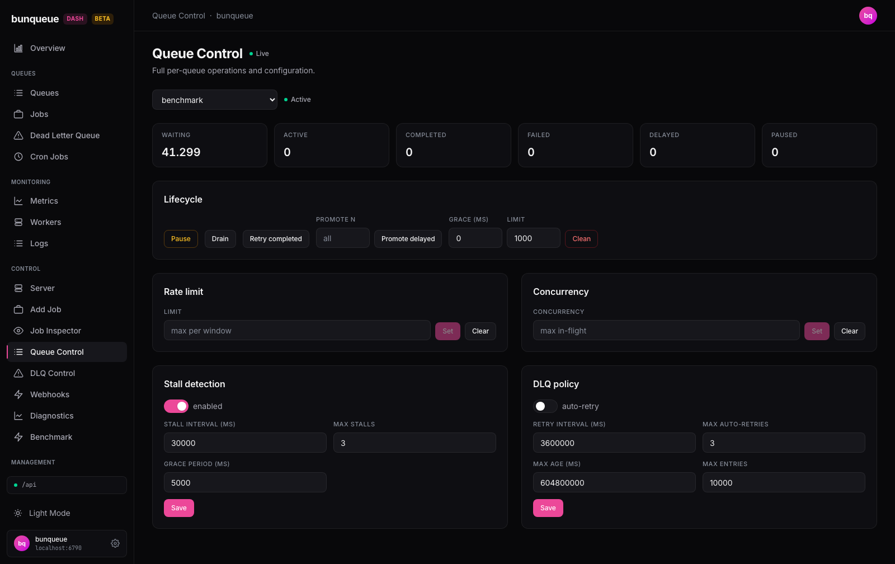

# Queue Control

Your operations console for a single queue: pause, promote, set explicit policies, and tune it with flow-unsafe deletion paths disabled.

**Where:** open `/queue-control` from the sidebar.

## What you'll see

Start with the **queue picker** at the top and choose a queue by name. Next to it, a colored **status dot** shows whether that queue is running, and an inline **message** reports the result of your most recent action. The first queue is selected for you on load.

Once a queue is selected, a row of eight count cards summarizes every v2.8.59 job state (numbers shown with thousands separators), followed by cards for every control you can operate.

| Element | What it tells you |
|---------|-------------------|
| Status dot | Green **Active** when running, amber **Paused** when the queue is paused. |
| Last-action message | Green on success (with an affected count when available), red with the error text on failure. |
| **Waiting** | Jobs queued and ready to run. |
| **Prioritized** | Ready jobs held in the priority-ordered queue. |
| **Active** | Jobs being processed right now. |
| **Completed** | Jobs that finished successfully. |
| **Failed** | Jobs that ran out of retries (dead-lettered). |
| **Delayed** | Jobs scheduled to run later. |
| **Waiting-children** | Flow parents blocked on structural or dependency children. |
| **Paused** | Jobs held because the queue is paused. |

Below the counts you get the **Lifecycle** card (pause, promote, and visibly
unavailable requeue/deletion controls), the **Rate-limit desired state** and
**Concurrency desired state** cards, a live **Queue SDK operations** console,
and the **Stall detection** and **DLQ policy** forms.

## What you can do

**Pause / Resume**, one button toggles the queue between running and paused; its label and color follow the current state.

**Requeue completed** is visible but disabled. Bunqueue v2.8.59's
`retryCompleted` path resets the job without reconstructing dependency
registration or the ordering guarantees of its original flow.

**Promote delayed**, moves delayed jobs to waiting so they run now. Leave the **Promote** box empty to promote all of them, or enter a number to promote just the first *N*.

**Replace rate-limit policy**, enter a positive integer limit and an explicit
positive **Window (ms)**, then choose a permanent policy or **Expires after**
with a TTL. The HTTP mutation remains an explicit desired-state replacement;
the separate SDK readback below shows the authoritative current policy.

**Replace concurrency policy**, enter a positive integer maximum in-flight
count. Clearing either policy is labelled **Ensure no …**, requires typing the
exact queue name, and refreshes the independent SDK readback after the server
acknowledges the mutation.

**Inspect Queue SDK state**, refresh the official global rate-limit,
concurrency, remaining rate-limit TTL, and saturation contracts. The same
console resolves or explicitly releases a deduplication key, reads paged
completed/failed one-minute metric buckets, and trims the bounded lifecycle
event journal after confirmation. Changing queue clears every snapshot and
receipt immediately; no result is relabelled under the new queue.

To adjust stall detection:

1. Open the **Stall detection** form.
2. Toggle **enabled**, then fill in **Stall interval (ms)**, **Max stalls**, and **Grace period (ms)**, all three are required.
3. Click **Save**. You'll see `Saved ✓` when it lands.

To adjust the dead-letter policy:

1. Open the **DLQ policy** form.
2. If upstream auto-retry is already enabled, turn it off. The dashboard never
   permits enabling it because v2.8.59 cannot verify hidden reverse flow
   dependencies. Retry interval and max-auto-retries remain editable.
3. Read **Max age** and **Max entries** as server state only. They are disabled:
   lowering `maxEntries` can immediately evacuate entries, and `maxAge` drives
   destructive expiry without an atomic generation/topology check.
4. Click **Save**. The request deliberately omits `maxAge` and `maxEntries`.

::: warning Flow-destructive operations fail closed
**Drain** and **Clean** are visible but disabled. v2.8.59 has no
reverse-dependency lookup or atomic topology mutation, so no queue scan or
confirmation can prove that deleting those jobs will not strand a cross-queue
parent. **Obliterate**, job Cancel and DLQ Purge follow the same policy. Every
DLQ retry also fails closed because its POST has no atomic
generation/state/topology precondition; completed-job requeue cannot restore
flow dependency registration/order.
:::

## Good to know

- **Switching queues discards unsaved edits.** If you type into the Stall or DLQ form and change queues before saving, your changes are lost.
- **A live update can overwrite your edits.** If the same queue's config changes elsewhere while you're editing, the form may refresh to the new values. Typing is otherwise preserved across background refreshes.
- **Numeric policy fields are validated before sending.** Stall fields and the
  editable DLQ retry interval/count require non-negative safe integers.
  Rate-limit and concurrency require positive safe integers; the rate window
  is mandatory and TTL is an explicit permanent/expiry choice. DLQ retention
  values are never parsed into a save because they are read-only.
- **Some controls appear only when the server supports them.** If a queue has no stall or DLQ configuration, that form is hidden for it.
- **When the queue can't be reached**, a banner with a **Retry** button appears above the content. While an action is running, the buttons are briefly disabled.
- The last-action message is a single shared line, each new action replaces the previous result.

::: details Under the hood (for developers)
This screen uses `bq` for HTTP controls and a repository adapter for the pinned
agent Queue SDK bridge. The queue picker polls `GET /dashboard/queues` every
30 s. The selected queue refreshes on the global live cadence (default 3 s,
configurable in Settings, floor 500 ms), fetching counts + paused state
(`GET /dashboard/queues/<queue>?includeJobs=false`) alongside
`GET /queues/<queue>/stall-config` and `.../dlq-config`.

Enabled actions map to: `POST .../pause` · `.../resume` ·
`.../promote-jobs`; `PUT`/`DELETE .../rate-limit` (body
`{ limit, duration, ttl? }`) and `.../concurrency` (body `{ concurrency }`);
and `PUT .../stall-config` · `.../dlq-config`. The DLQ save projects only
`autoRetry`, `autoRetryInterval` and `maxAutoRetries`; it never sends `maxAge`
or `maxEntries`, and only `autoRetry:false` is permitted. The upstream
retry-completed/drain/clean routes exist but are intentionally never called
here. The client throws on any HTTP-200 response with `{ ok: false }`, so
logical failures surface as the red inline error.

SDK reads and mutations use `/agent/queue-operations/:queue/*`, are pinned to
the process manager's running port, validate exact bounded input, serialize
access, and close their dedicated Bunqueue `Queue` connection after each
operation.
:::
