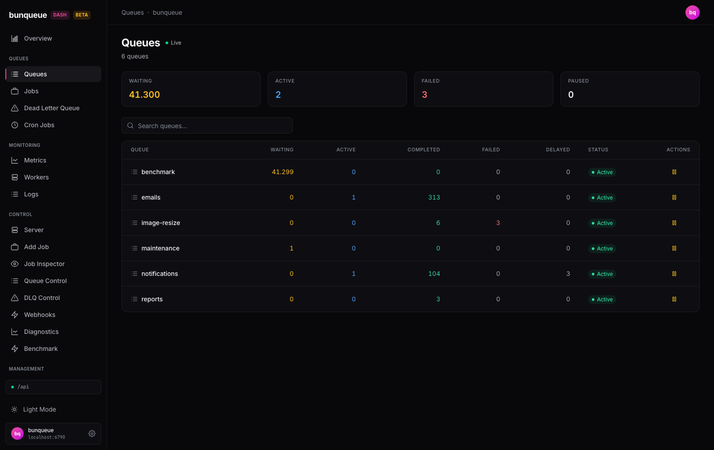

# Queues

See every queue on your server at a glance, check how each one is doing, and pause or resume any of them in one click.

**Where:** open `/queues` from the sidebar.

## What you'll see

At the top, four summary cards give you the totals across your whole server. Below them, a searchable table lists one row per queue with its live job counts and a status pill. A **Live** badge in the header tells you the numbers keep refreshing on their own.

The four summary cards:

| Card | What it tells you |
| --- | --- |
| **Waiting** | Total jobs enqueued and waiting for a worker, across all queues |
| **Active** | Total jobs being processed right now |
| **Failed** | Total jobs that ran out of retries (turns red when above zero) |
| **Paused** | How many queues are currently paused (a queue count, not a job count) |

Each row in the table:

| Column | What it tells you |
| --- | --- |
| **Queue** | The queue name — click it to open that queue |
| **Waiting** | Jobs waiting for a worker |
| **Active** | Jobs being processed now |
| **Completed** | Jobs that finished successfully |
| **Failed** | Jobs that exhausted their retries (red when above zero) |
| **Delayed** | Jobs scheduled to run later |
| **Status** | A green **Active** or orange **Paused** pill |
| **Actions** | The pause/resume button, plus an arrow into the queue |

::: tip
The four summary cards always add up **every** queue, even while you're searching — the totals stay put as you type, so they always reflect the full fleet.
:::

## What you can do

- **Pause a queue.** Click the amber pause icon on a row. That queue stops handing work to workers; its button is briefly disabled, the table refreshes, and a confirmation line appears above it.
- **Resume a queue.** Click the green play icon on a paused row. Work starts flowing again, with the same quick confirmation.
- **Search.** Type in the filter box to narrow the table to queues whose name contains what you typed. It's case-insensitive.
- **Open a queue.** Click a row (or the queue name) to jump into that queue's detail view.
- **Page through queues.** Use the pager below the table — it shows 15 queues per page.
- **Recover from an outage.** If the server drops, a banner appears with a **Retry** button that reconnects.

After each pause or resume you'll see a one-line result above the table: a green confirmation (for example, `payments paused ✓`) on success, or a red message explaining what went wrong. Only the row you clicked is disabled while it's working — every other row stays usable.

::: warning
Pause and resume act **immediately** — there's no confirmation prompt. A single mis-click can pause a live queue, so check the row's **Status** pill afterward to confirm the result. (Heavier, destructive actions like drain live on the individual queue's page, not here.)
:::

## Good to know

- **The summary cards ignore your search.** They're fleet-wide totals and won't change as you filter — that's intentional, but easy to misread.
- **The Paused card counts queues, not jobs.** It tells you how many queues are paused, not how many jobs are held.
- **Numbers are as of the last refresh.** With the default few-seconds cadence — and refreshing paused while the browser tab is in the background — a busy queue can lag reality by a moment. The **Live** badge means the data is polled, not streamed instantly.
- **Empty states are explicit.** With no queues yet you'll see *"No queues yet."*; a search that matches nothing shows *"No queues match your search."*
- **Your place is kept.** If a filter shrinks the list past your current page, you're moved to the last valid page rather than losing your spot.
- No known issues are specific to this screen. See [Known issues](/known-issues) for the current, honest list.

::: details Under the hood (for developers)
- Loads every queue with its counts in a single `GET /queues/summary` call — no per-queue fan-out. Search, sort, and pagination are all client-side.
- Pause/resume post to `POST /queues/:q/pause` and `POST /queues/:q/resume`; a logical `{ ok: false }` surfaces as the red error line.
- Polls at the global refresh interval from Settings (default 3000 ms, floored at 500 ms), one request at a time, suspended while the tab is hidden.
- Uses the `bq` client throughout.
:::
