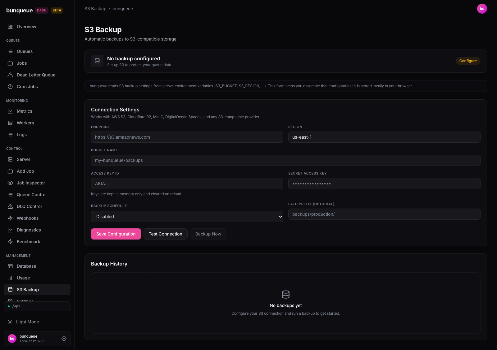

# S3 Backup

This screen helps you assemble the settings for bunqueue's S3-compatible backups and stores them in your browser for safekeeping.

**Where:** open `/s3` from the sidebar.

::: warning READ THIS FIRST
This page does **not** turn backups on. bunqueue reads its backup settings from environment variables on the server itself. Here you just fill in a form so the values are easy to copy into that server config. Nothing you type touches the running server, and your entries are saved only in your browser.
:::

## What you'll see

The page opens with a status banner, a short reminder about how backups are configured, a **Connection Settings** form, and a **Backup History** card.

The status banner reflects one thing only, whether you've entered a bucket name:

| Element | What it tells you |
| --- | --- |
| Title | **Backup configured** once a bucket name is set, otherwise **No backup configured**. |
| Subtitle | Shows **Target: `<bucket>`** when set, otherwise a prompt to set S3 up. |
| Badge | Green **Ready** pill when a bucket name is present; amber **Configure** pill when it's empty. |

The **Connection Settings** form works with AWS S3, Cloudflare R2, MinIO, DigitalOcean Spaces, and any S3-compatible provider:

| Field | What it's for |
| --- | --- |
| Endpoint | Your provider's S3 URL (e.g. `https://s3.amazonaws.com`). |
| Region | The bucket's region (defaults to `us-east-1`). |
| Bucket name | The target bucket, this field also drives the green/amber badge. |
| Access key ID | Your S3 access key. |
| Secret access key | Your S3 secret, shown masked. |
| Backup schedule | Disabled, every 6 hours, every 12 hours, or every 24 hours. |
| Path prefix (optional) | A folder prefix inside the bucket, such as `backups/production/`. |

The **Backup History** card always shows **No backups yet**. The dashboard can't run or read backups, so this stays empty.

## What you can do

- **Fill in the fields**, each change is saved to your browser as you type.
- **Save Configuration**, shows a brief *Saved locally (keys excluded)* confirmation. This only saves to your browser; it never reaches the server, and your keys are not stored.
- **Test Connection**, checks whether the bunqueue server's own disk is healthy. You'll see **Server storage reachable**, a **disk full** warning, or an error message.

**Backup Now** is always disabled, there's no way to trigger a backup from the dashboard.

::: tip What "Test Connection" really checks
It reports on the **bunqueue server's disk**, not your S3 endpoint, bucket, or credentials. A green result means the server has disk space free, it says nothing about whether your S3 details are correct. There is no S3 credential check anywhere on this page.
:::

## Good to know

- **This form doesn't enable backups.** By design, bunqueue reads its S3 settings from server environment variables. Use this page to compose those values, then set them on the server. See [Known issues](/known-issues).
- **The green "Ready" badge is not a health check.** It turns green the moment a bucket name is filled in, it doesn't mean backups are running or your credentials work.
- **Your access key and secret are kept for this session only.** They're never saved to your browser and are cleared when you reload the page, so re-enter them each time.
- **Everything else you type is saved locally.** Endpoint, region, bucket, schedule, and path prefix persist across reloads in your browser.
- **Backup History stays empty.** The dashboard can't list or start backups, so this card never fills in.
- There's no field validation, nothing checks that your endpoint or keys are well-formed.

::: details Under the hood (for developers)
- Uses the **`bq`** client. The only server call is `GET /storage`, fired when you click **Test Connection**, no polling, no stream, no fetch on mount.
- `/storage` returns `{ ok, data: { diskFull, error, since } }`; the page reads `diskFull` to decide reachable vs. disk-full.
- Non-secret fields are persisted to `localStorage` under `bq-dash-s3`; credentials are deliberately excluded from persistence.
- A read-only classic variant lives at `/s3-classic` on the older `api` client (whose response shape can mask a disk-full state), prefer `/s3`.
:::
