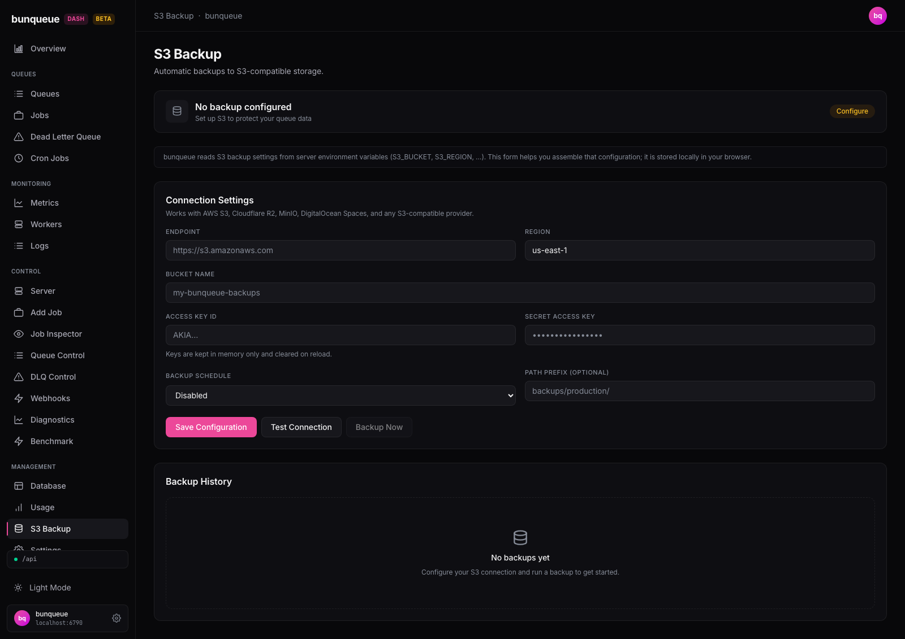

# S3 Backup

The **S3 Backup** screen configures and operates Bunqueue 2.8.57's official
backup implementation. It supports AWS S3 and compatible providers such as R2,
MinIO, DigitalOcean Spaces, and custom endpoints.

**Where:** open `/s3` from the sidebar.

## Configure

The form builds the exact environment accepted by Bunqueue:

| Field | What it's for |
| --- | --- |
| Endpoint | Your provider's S3 URL (e.g. `https://s3.amazonaws.com`). |
| Region | The bucket's region (defaults to `us-east-1`). |
| Bucket name | The target bucket, this field also drives the green/amber badge. |
| Access key ID | Your S3 access key. |
| Secret access key | Your S3 secret, shown masked. |
| Backup schedule | Disabled, every 6 hours, every 12 hours, or every 24 hours. |
| Path prefix (optional) | A folder prefix inside the bucket, such as `backups/production/`. |
| Backups to retain | Number of remote snapshots retained by scheduled cleanup. |
| Addressing style | Path-style or virtual-hosted bucket addressing. |

**Apply configuration** writes only the whitelisted `S3_*` keys into the local
agent's managed server configuration. It preserves unrelated environment
variables and requires confirmation. Restart the managed server before relying
on the periodic scheduler; the live panel states whether the running server is
using the new values.

The non-secret draft is stored in the browser. Access key, secret, and session
token remain session-only and are never written to local storage.

## Operate

The **Live backup operations** panel invokes the exact CLI shipped by the
installed Bunqueue 2.8.57 dependency, with the managed `dataPath` and S3
environment:

- **Status** reports scheduler enablement, bucket, endpoint, interval, and
  retention.
- **Refresh** lists real remote backup objects with key, size, and timestamp.
- **Backup now** creates a transactionally consistent snapshot after
  confirmation.
- **Restore** is available only while the managed Bunqueue server is stopped.
  You must type `RESTORE`; the request also carries the exact database
  path/existence/size/WAL/SHM/mtime snapshot shown at confirmation time. If the
  database changes before the command runs, the agent rejects it.

Only one backup command can run at a time. Child output is bounded, execution
has a timeout, and the agent never invokes a shell. A remote dashboard target,
unknown environment key, malformed object key, running-server restore, or
stale database confirmation fails closed.

::: warning Local agent boundary
These operations intentionally exist only through the dashboard control agent,
which manages the database and process lifecycle. A static GitHub Pages demo or
a dashboard pointed at an arbitrary remote Bunqueue server cannot perform local
backup commands. Configure agent authentication before exposing it through a
trusted proxy.
:::

::: details Under the hood (for developers)
- Agent endpoints are `GET /backup/status`, `GET /backup/list`, and `POST`
  `/backup/configure`, `/backup/now`, `/backup/restore`.
- All routes require a `target` that matches the server managed by the agent.
- The official Bunqueue CLI JSON envelope is validated before it reaches React.
- A read-only classic environment reference remains at `/s3-classic`; prefer
  `/s3` for operational use.
:::
