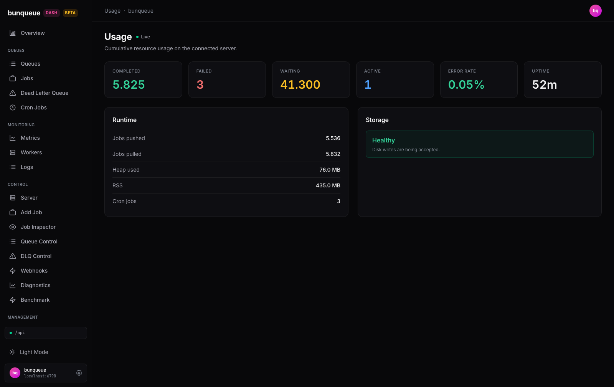

# Usage

A single, read-only snapshot of how hard your bunqueue server is working, lifetime job totals, live queue counts, error rate, memory, uptime, and disk health.

**Where:** open `/usage` from the sidebar.

## What you'll see

The page opens with a **Live** dot next to the title, that means everything on screen refreshes on its own. Below it sit six stat cards, then two detail cards: **Runtime** and **Storage**.

The six top cards:

| Card | What it tells you |
| --- | --- |
| **Completed** | Total jobs that have finished successfully since the server started counting. Always shown in green. |
| **Failed** | Total jobs that have failed. Turns red when the number is above zero. |
| **Waiting** | Jobs queued right now, waiting for a worker. Shown in amber. |
| **Active** | Jobs being processed at this very moment. Shown in blue. |
| **Error Rate** | Share of finished jobs that failed, as a percentage. Green when healthy, red once it passes 5%. |
| **Uptime** | How long the server process has been running. Shows a dash (`, `) if the server just started. |

The **Runtime** card breaks down the workload and process footprint:

| Row | What it tells you |
| --- | --- |
| **Jobs pushed** | Total jobs ever added to the server. |
| **Jobs pulled** | Total jobs ever picked up by workers. |
| **Heap used** | Memory actively in use by the server process. |
| **RSS** | Total memory the process is holding. |
| **Cron jobs** | How many scheduled (cron) jobs are registered. |

The **Storage** card is a single health verdict:

- **Healthy** (green), "Disk writes are being accepted."
- **Disk full, writes suspended** (red), appears when the server can no longer write to disk. When available, it also shows the underlying error and how long ago writes stopped.

::: tip
Large counts use your locale's thousands separator, so a value like `5825` may appear as `5,825` (or `5.825` in some locales).
:::

## What you can do

This screen is a dashboard, not a control panel, there are no buttons that change anything on the server.

- **Watch totals climb live.** Numbers update on their own as workers run; you never need to refresh.
- **Spot trouble at a glance.** A red **Failed** or **Error Rate** card, or a red **Storage** panel, is your signal to jump to DLQ Control, Queue Control, or the server host to investigate.
- **Retry when offline.** If the server can't be reached, a banner appears at the top with a **Retry** button that re-checks the connection.

## Good to know

- **It's read-only by design.** Nothing here mutates the server, to act on failures, head to DLQ Control, Queue Control, or the server host.
- **Uptime shows a dash, not `0m`,** when the server has just started or can't be reached.
- **If the server goes offline,** the layout stays put: an offline banner appears at the top while every card falls back to zeros and Storage shows "Healthy." That's intentional so a temporarily down server doesn't wipe the screen, trust the banner over the numbers when it's showing.
- **This is the trustworthy Usage screen.** An older `/usage-classic` page still exists but reports uptime roughly 1,000× too large and always claims storage is "Healthy," even when the disk is full. This page fixes both and adds the Error Rate card. See [Known issues](/known-issues) for the full list.
- **It's a focused summary.** Latency charts, throughput, and the full worker and cron lists aren't shown here, use Metrics and Workers for those.

::: details Under the hood (for developers)
- Uses the `bq` client (not the legacy `api`).
- Polls two endpoints in parallel each cycle: `GET /dashboard` (job stats, memory in MB, cron count) and `GET /storage` (disk-health flag, wrapped in `data`).
- Refresh cadence follows the global interval from Settings (default **3000 ms**, floored at 500 ms). No SSE, pure polling, with change-detection to skip redundant re-renders.
- `/dashboard` reports `uptime` in milliseconds and memory in megabytes; the page converts both before display.
:::
