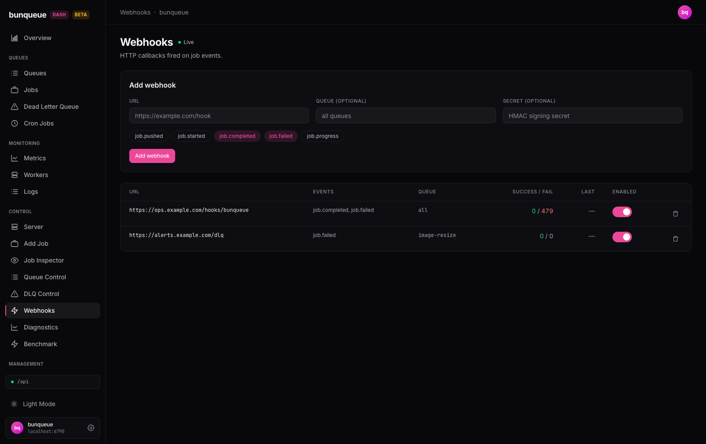

# Webhooks

> Route `/webhooks` · source `src/pages/control/Webhooks.tsx`

Register HTTP callbacks that bunqueue fires whenever a job changes state, so you can push job events to an ops endpoint, alerting system, or Slack bridge without polling. The page reads and mutates webhook registrations through the bunqueue HTTP API (the `bq` client) and auto-refreshes ("Live" in the header).

## What it shows

The header is a `PageHeader` titled **Webhooks** with the description "HTTP callbacks fired on job events." and a **live** indicator (the page re-polls in the background).

Below the header sits the **Add webhook** card (always visible — see [What you can do](#what-you-can-do)), then the registration table.

### The webhook table

One row per registered webhook, rendered from the `WebhookFull` objects returned by the API. Columns:

| Column | Field | Meaning |
| --- | --- | --- |
| **URL** | `w.url` | The destination URL bunqueue POSTs to. Shown in a monospace font, truncated to a max width (`max-w-xs truncate`) — hover/inspect if it's cut off. |
| **Events** | `w.events` | The subscribed job events, joined with `, ` (e.g. `job.completed, job.failed`). |
| **Queue** | `w.queue` | The queue this hook is scoped to. `null` renders literally as **`all`** — i.e. the hook fires for every queue. |
| **Success / Fail** | `w.successCount` / `w.failureCount` | Cumulative delivery counters. Success is colored green (`text-success`); Fail is colored red (`text-danger`) **only when non-zero**, otherwise neutral. Both are run through `formatNumber` (thousands separators). Displayed right-aligned with tabular numerals. |
| **Last** | `w.lastTriggered` | When this hook last fired, as a relative time via `formatRelativeTime` (e.g. "20s ago"). `null`/never-triggered renders as whatever `formatRelativeTime` shows for empty. Right-aligned, faint text. |
| **Enabled** | `w.enabled` | A `Toggle` switch reflecting whether deliveries are active. Its accessible label flips between "Enable webhook" / "Disable webhook". |
| _(actions)_ | — | A trailing narrow column holding the **trash** `IconButton` (aria-label "Remove webhook"). |

::: info Reading the counters
A climbing **Fail** count with **Success** stuck at 0 means every delivery to that endpoint is being rejected/unreachable — the dashboard records the outcome but does not retry for you. That is your cue to check the receiving endpoint.
:::

The list is paginated **client-side** at **15 rows per page** (`PAGE_SIZE = 15`) via the `Pagination` control at the bottom; the page index is clamped so it never points past the last page.

## What you can do

| Action | Effect | Confirm? |
| --- | --- | --- |
| **Add webhook** | Registers a new callback (`POST /webhooks`). Requires a URL and ≥1 event; button shows "Adding…" and is disabled while the request is in flight. | No |
| **Toggle an event pill** | In the add form, selects/deselects which job events the new hook subscribes to (before submitting). | No |
| **Enable / disable** | Flips an existing hook's delivery state via the row `Toggle` (`PUT /webhooks/:id/enabled`). Deliveries stop but the registration and its counters are kept. | No |
| **Remove** | Deletes the webhook (`DELETE /webhooks/:id`) via the trash icon. | **Yes** — `window.confirm("Remove webhook for <url>?")` |

### The Add webhook form

An inline form (`WebhookForm`) with three text inputs and a row of event pills:

- **URL** — required. Placeholder `https://example.com/hook`.
- **Queue (optional)** — blank means **all queues**; placeholder reads "all queues". A blank/whitespace value is sent as `undefined` (omitted), not an empty string.
- **Secret (optional)** — an HMAC signing secret. Rendered as a `type="password"` input with `autoComplete="new-password"`; placeholder "HMAC signing secret". Whitespace-only is omitted.
- **Event pills** — one button per event in `WEBHOOK_EVENTS`: `job.pushed`, `job.started`, `job.completed`, `job.failed`, `job.progress`. Selected pills are accent-filled and expose `aria-pressed`. **`job.completed` and `job.failed` are pre-selected** on load.

**Validation** (client-side, before the request): if the URL is empty/whitespace **or** no events are selected, the form shows "URL and at least one event are required" and does not submit. On success the **URL** and **Secret** fields are cleared (queue and the event selection are intentionally left as-is for adding a similar hook). The `busy` guard prevents a double-click from registering the webhook twice.

## States & gating

This is not a job-action page, so there is no `jobActions.ts` state gating — controls are driven purely by request lifecycle and connection state:

- **Loading** — on first load (no data yet, no error) a `LoadingState` shows "Loading webhooks…". Note the Add webhook card renders **above** this and is available immediately.
- **Empty** — when the API returns zero webhooks, an `EmptyState` (lightning icon) titled "No webhooks" with the hint "Add one above to receive job-event callbacks." replaces the table.
- **Error / offline** — a fetch failure renders an `OfflineBanner` with a **Retry** button (calls `refetch`); the last-known table (if any) stays on screen.
- **Action failure** — a failed enable/disable/delete surfaces in a red inline banner (`actErr`) instead of silently reverting. This is deliberate: a toggle that snaps back or a "confirmed" delete that no-ops would otherwise read as success. (Add-form errors surface separately, in red text next to the submit button.)
- **Add button** — disabled only while a submit is in flight (`busy`), showing "Adding…".

## Behind the scenes

All calls use the **`bq`** client (bunqueue HTTP API on `:6790`), not the agent:

| Purpose | Method + endpoint | `bq` call |
| --- | --- | --- |
| List | `GET /webhooks` | `bq.webhooks()` |
| Create | `POST /webhooks` | `bq.addWebhook(body)` |
| Enable/disable | `PUT /webhooks/:id/enabled` with `{ enabled }` | `bq.setWebhookEnabled(id, v)` |
| Delete | `DELETE /webhooks/:id` | `bq.removeWebhook(id)` |

The create body is `{ url, events, queue?, secret? }` where `events` ⊆ `job.pushed / job.started / job.completed / job.failed / job.progress`.

**Polling:** the list is fetched with `usePolledData(() => bq.webhooks(), [])`, which re-polls on the global refresh interval (default **3000 ms**, configurable in Settings, floored at 500 ms). It uses recursive `setTimeout` (at most one in-flight fetch, no overlap) and pauses while the browser tab is hidden. Every mutation calls `refetch()` on success to immediately reflect the change. There is **no SSE stream** on this page.

::: warning Response-shape gotcha
`GET /webhooks` wraps its payload in `data`: the response is `{ ok, data: { webhooks[], stats } }`. The page reads `data?.data?.webhooks ?? []`. The `stats` field is returned by the API but **not consumed** by this page. (Per `docs/api-mapping.md`, `/webhooks` is one of the endpoints wrapped in `{ ok, data }`.)
:::

## Gotchas

- **Counters are delivery outcomes, not a retry mechanism.** The dashboard shows Success/Fail but the page never retries failed deliveries — a growing Fail count means fix the endpoint yourself.
- **URL truncation.** Long URLs are visually truncated in the table; the full value isn't shown inline.
- **`stats` is ignored.** Any aggregate the API returns alongside the list is dropped by this page.
- **No edit-in-place.** You can enable/disable or delete a hook, but there is no "edit" — to change a URL, events, queue, or secret you delete and re-add.
- **Secret is write-only from the UI.** The `WebhookFull.secret` may come back from the API, but the page never displays it; the form only lets you set a new one.
- **Client-side pagination.** The whole list is fetched and sliced in the browser at 15/page (per `docs/known-issues.md`, full-list endpoints like webhooks are client-paginated) — fine for typical counts, but the entire list travels over the wire each poll.
- **Known issue note:** `docs/known-issues.md` records that the enable/disable toggle has a proper accessible name (an intentional a11y fix), and lists webhooks among the client-paginated full-list endpoints. No outstanding functional bug is recorded for this page.
