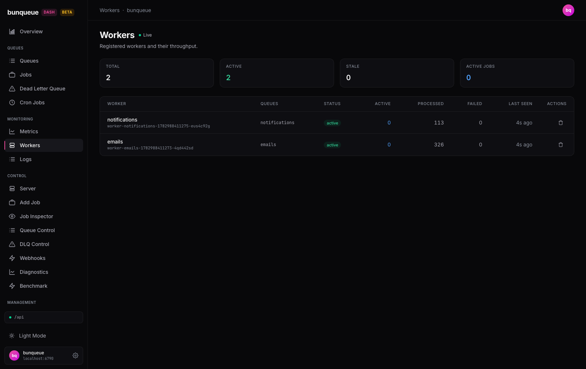

# Workers

A live registry of every worker connected to your server, so you can confirm your consumers are alive, see how much work each is doing, and evict one that's stuck.

**Where:** open `/workers` from the sidebar.

## What you'll see

A **Live** indicator next to the title tells you the page is getting fresh data; it drops off if the server stops answering. Four cards summarize the whole fleet, and a table lists each worker underneath.

The summary cards:

| Element | What it tells you |
| --- | --- |
| **Total** | How many workers are registered right now |
| **Active** | Workers that are heartbeating (healthy) |
| **Stale** | Workers that stopped heartbeating (turns amber when any exist) |
| **Active Jobs** | Jobs being processed across the whole fleet |

Each row in the table is one worker:

| Column | What it tells you |
| --- | --- |
| **Worker** | The worker's name, with its full id below it |
| **Queues** | The queues this worker consumes (`—` if none) |
| **Status** | A pill: green **active** or amber **stale** |
| **Active** | Jobs this worker is processing right now |
| **Processed** | Jobs it has completed over its lifetime |
| **Failed** | Jobs it has failed over its lifetime |
| **Last Seen** | How long ago its last heartbeat arrived (e.g. "4s ago") |
| **Actions** | An Unregister button for the row |

## What you can do

- **Unregister a worker** — click the trash icon on its row. You'll be asked to confirm; on success a green message appears above the table, and the list refreshes. This is meant for clearing out a dead or stuck registration.
- **Retry** — if the server is unreachable, an offline banner appears with a **Retry** button to fetch again.

Workers aren't created or edited here — they're started by your own consumer processes and register themselves. This screen is for watching them and evicting stuck ones.

::: warning
Unregister is **not permanent**. A worker that's still running will re-register on its next heartbeat, so its row can reappear moments after you remove it. Use it to evict a genuinely dead registration, not to pause an active consumer.
:::

## Good to know

- **Stale doesn't mean gone.** A worker that stops heartbeating turns amber and counts toward **Stale**, but stays in the list — with its Last Seen climbing — until you unregister it or the server drops it.
- **The summary cards always reflect the full fleet.** Even when the table is capped, Total, Active, Stale, and Active Jobs are counted across every worker.
- **The table shows at most 100 workers**, with no pagination. Past that, a note reads "Showing first 100 of N workers." See [Known issues](/known-issues).
- **First load shows a brief "Loading workers…"**; after that, updates happen quietly in place with no flicker. If no workers are connected, you'll see an empty state instead.
- **Don't confuse this with the classic Workers page** (`/workers-classic`), which is read-only, shows fewer rows, and has no status pill or Unregister button.

::: details Under the hood (for developers)
- Reads `GET /workers` via the `bq` client (payload wrapped in `data`); Unregister calls `DELETE /workers/:id`.
- Polls on the global refresh interval (default 3000 ms, adjustable in Settings, floored at 500 ms), pauses while the tab is hidden, and skips re-renders when the worker list is unchanged.
- The response carries more fields than are shown (e.g. `concurrency`, `hostname`, `pid`, `registeredAt`, `uptime`); the table renders a subset.
:::
