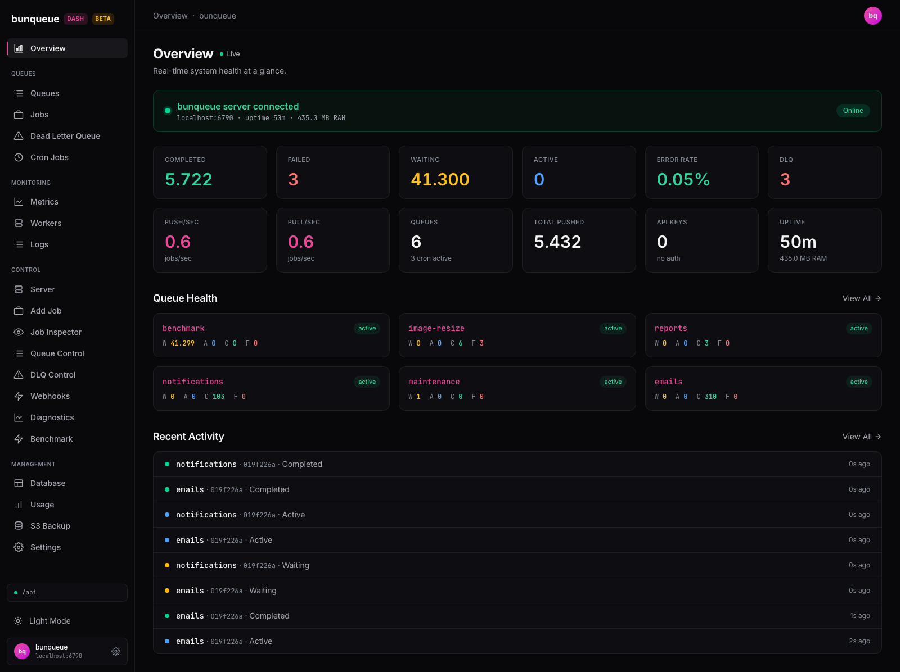
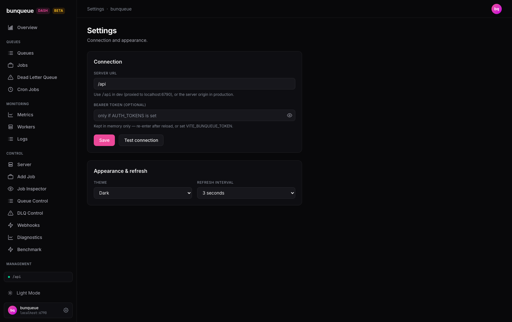
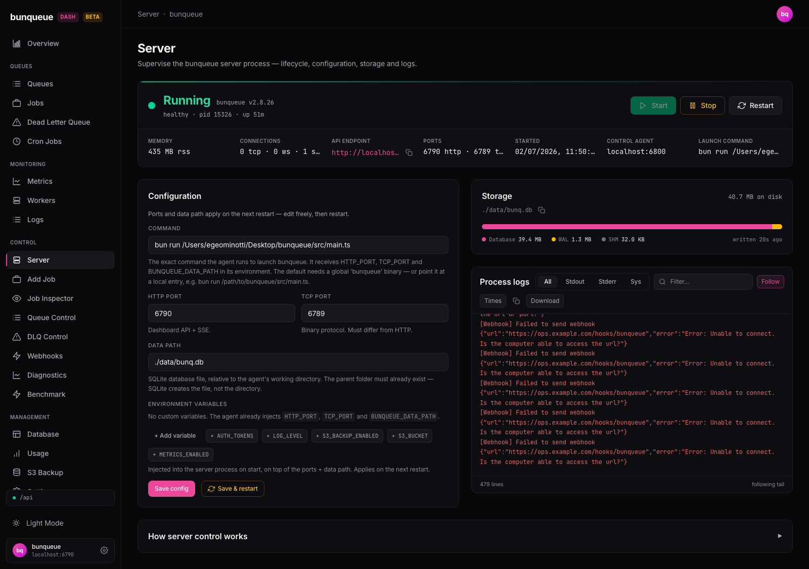
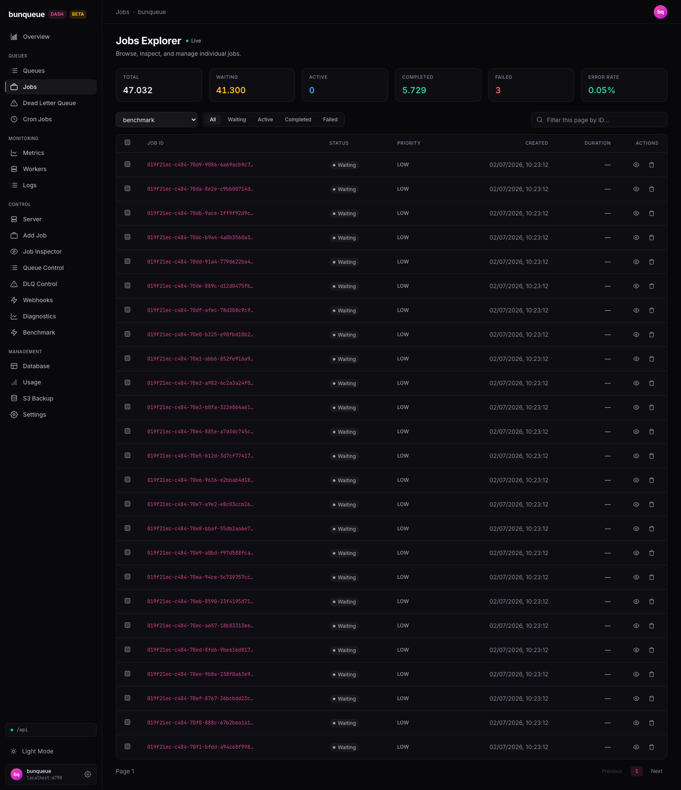

<div class="lp">

<section class="lp-hero">

<p class="lp-chip">bunqueue dashboard</p>

<h1 class="lp-h1">Web dashboard for bunqueue<br>with full control and server lifecycle</h1>

<p class="lp-sub">A free, open source web UI that <strong>fully drives</strong> a bunqueue server: queues, jobs, dead-letter queue, cron, webhooks, workers and live activity — plus start / stop / restart of the server process itself. It talks only to bunqueue's public HTTP API and a tiny loopback control agent.</p>

<p class="lp-ctas">
<a class="lp-btn lp-btn-primary" href="https://egeominotti.github.io/bunqueue-dashboard/">Open the live demo</a>
<a class="lp-btn" href="/quickstart">Quick start</a>
<a class="lp-btn" href="https://github.com/egeominotti/bunqueue-dashboard">GitHub</a>
</p>

<a class="lp-window" href="https://egeominotti.github.io/bunqueue-dashboard/" aria-label="Open the live demo of the bunqueue dashboard">
<span class="lp-window-bar"><span class="lp-dot"></span><span class="lp-dot"></span><span class="lp-dot"></span><span class="lp-live">● live demo — click to drive it</span></span>

{.lp-window-shot}

</a>

</section>

<section class="lp-proof" aria-label="Project facts">
<span>MIT license</span>
<span>Zero-dependency npm package</span>
<span>Standalone binaries for 5 platforms</span>
<span>Multi-arch Docker image</span>
<a href="/known-issues">Limits documented honestly →</a>
</section>

<section class="lp-section">

<p class="lp-chip">Overview</p>

## Features {.lp-title}

<p class="lp-lead">Everything an operator needs to run a bunqueue server from the browser — from state-gated job actions to the process lifecycle. Every card below is a shipped page you can open in the demo right now.</p>

<div class="lp-cards">

<article class="lp-card"><span class="lp-num">1</span>

### State-gated job actions

Add, inspect, promote, retry, requeue and cancel jobs. Every action is gated by the job's <em>actual</em> current state, so the UI never offers something the server would reject. <a href="/guide/job-inspector">Job Inspector →</a>

</article>

<article class="lp-card"><span class="lp-num">2</span>

### Live activity stream

A Server-Sent-Events feed with automatic reconnect shows jobs flowing in real time — built on fetch so it works with bearer-token auth, unlike EventSource. <a href="/guide/logs">Live logs →</a>

</article>

<article class="lp-card"><span class="lp-num">3</span>

### DLQ triage

A fleet-wide dead-letter dashboard plus a single-queue triage surface: failure reasons, per-attempt history, retry one / retry all / purge, CSV export. <a href="/guide/dlq-control">DLQ Control →</a>

</article>

<article class="lp-card"><span class="lp-num">4</span>

### Cron manager

Schedule by cron expression or interval-in-ms with a next-runs preview, then list and delete existing schedules. <a href="/guide/cron">Cron →</a>

</article>

<article class="lp-card"><span class="lp-num">5</span>

### Webhooks

Register endpoints with event scoping and an optional HMAC secret; watch success/failure counts, toggle, delete. <a href="/guide/webhooks">Webhooks →</a>

</article>

<article class="lp-card"><span class="lp-num">6</span>

### Server lifecycle

The one thing HTTP can't do — start, stop, restart the bunqueue process — is delegated to a small loopback-bound agent with an Origin + Host allowlist, locked CORS and an optional bearer token. <a href="/guide/server">Server Control →</a>

</article>

<article class="lp-card"><span class="lp-num">7</span>

### SQLite inspector

Browse tables, schema and indexes, page through rows, run SELECT-only queries with EXPLAIN and CSV/JSON export — over a read-only connection, capped at 500 rows. <a href="/guide/database">Database →</a>

</article>

<article class="lp-card"><span class="lp-num">8</span>

### Metrics & throughput

Rolling live throughput charts, error-rate gauge, per-operation latency percentiles (push / pull / ack × p50 / p95 / p99). <a href="/guide/metrics">Metrics →</a>

</article>

<article class="lp-card"><span class="lp-num">9</span>

### Client-side alerts

Threshold rules on queue depth, failures, error rate and latency — evaluated in the browser, with in-app toasts and desktop notifications. <a href="/user-guide">Alerts →</a>

</article>

<article class="lp-card"><span class="lp-num">10</span>

### Benchmark

Push and drain load runs against any queue, in count or duration mode, with a live chart and run history. <a href="/guide/benchmark">Benchmark →</a>

</article>

<article class="lp-card"><span class="lp-num">11</span>

### Flow DAG viewer

Parent / children / depends-on relationships drawn as a graph, laid out client-side with no graph library. <a href="/guide/flows">Flows →</a>

</article>

<article class="lp-card"><span class="lp-num">12</span>

### AI Copilot <em class="lp-tag">experimental</em>

An in-app assistant that drives the same API through tools — bring your own key, requests go straight from your browser to your provider. <a href="/guide/copilot">Copilot →</a>

</article>

</div>

</section>

<section class="lp-section">

<p class="lp-chip">Tour</p>

## See it in action {.lp-title}

<p class="lp-lead">A real control surface, not a read-only viewer — every screen in this tour is a live page you can drive in the <a href="https://egeominotti.github.io/bunqueue-dashboard/">demo</a>.</p>

<video class="lp-video" src="/tour.mp4" autoplay muted loop playsinline preload="metadata" aria-label="A guided tour of the bunqueue dashboard: overview, queues, jobs, DLQ, flows, the SQLite inspector, and the AI Copilot"></video>

</section>

<section class="lp-section">

<p class="lp-chip">Surface</p>

## Everything you can drive {.lp-title}

<div class="lp-tiles">
<a href="/guide/queues"><strong>Queues</strong><span>pause · resume · rate-limit · concurrency · drain · obliterate</span></a>
<a href="/guide/jobs"><strong>Jobs</strong><span>add · inspect · promote · retry · requeue · cancel</span></a>
<a href="/guide/dlq"><strong>DLQ</strong><span>reasons · per-row retry · retry-all · purge</span></a>
<a href="/guide/cron"><strong>Cron</strong><span>expressions or intervals · next-runs preview</span></a>
<a href="/guide/webhooks"><strong>Webhooks</strong><span>event scoping · HMAC secrets · delivery stats</span></a>
<a href="/guide/workers"><strong>Workers</strong><span>health · last seen · unregister</span></a>
<a href="/guide/server"><strong>Server</strong><span>start · stop · restart · live process logs</span></a>
<a href="/guide/database"><strong>Database</strong><span>read-only SQLite tables · schema · queries</span></a>
</div>

</section>

<section class="lp-section">

<p class="lp-chip">Process</p>

## Up and running in four steps {.lp-title}

<p class="lp-lead">The priority is simplicity: one command serves the dashboard, proxies the API and runs the control agent. No clone, no build.</p>

<div class="lp-step">
<div class="lp-step-text">
<span class="lp-num">Step 1</span>

### Run it

One process serves the dashboard on `http://127.0.0.1:8080`, proxies `/api/*` to your bunqueue server and runs the control agent.

</div>
<div class="lp-step-media">

```bash
bunx bunqueue-dashboard
```

</div>
</div>

<div class="lp-step">
<div class="lp-step-text">
<span class="lp-num">Step 2</span>

### Point it at your server

Set the server URL and bearer token from the Settings page (tokens stay in memory — never written to localStorage) or via `BUNQUEUE_URL` / `VITE_BUNQUEUE_URL`.

</div>
<div class="lp-step-media">



</div>
</div>

<div class="lp-step">
<div class="lp-step-text">
<span class="lp-num">Step 3</span>

### …or let it run the server for you

From **Control ▸ Server** the agent starts, stops and restarts the bunqueue process, with an editable launch config and a colour-coded live log tail.

</div>
<div class="lp-step-media">



</div>
</div>

<div class="lp-step">
<div class="lp-step-text">
<span class="lp-num">Step 4</span>

### Drive it

Explore jobs, triage the DLQ, schedule cron, watch live activity. Destructive actions are confirmed and name their target; everything else is one click.

</div>
<div class="lp-step-media">



</div>
</div>

</section>

<section class="lp-section">

<p class="lp-chip">Get started</p>

## How to install {.lp-title}

<p class="lp-lead">Four ways to run it — pick the one that fits. All of them serve the same app.</p>

::: code-group

```bash [npm (recommended)]
bunx bunqueue-dashboard
# → http://127.0.0.1:8080 — SPA + /api proxy + control agent, zero dependencies
```

```bash [Standalone binary]
# Download the binary for your platform from the GitHub Releases page,
# then make it executable and run it — nothing else to install:
chmod +x bunqueue-dashboard-v*-darwin-arm64
./bunqueue-dashboard-v*-darwin-arm64
# → http://localhost:8080
```

```bash [Docker]
docker run --rm -p 8080:80 ghcr.io/egeominotti/bunqueue-dashboard:edge
# → http://localhost:8080 — set the server URL from the Settings page
```

```bash [From source]
bun install
bun start
# agent (http://127.0.0.1:6800) + dashboard (http://localhost:5273) together
```

:::

**[Full quickstart guide →](/quickstart)**

</section>

<section class="lp-section">

<p class="lp-chip">FAQ</p>

## Frequent questions {.lp-title}

<div class="lp-faq">

<article class="lp-card">

### What is this, and why not just curl the API?

A complete operator surface over bunqueue's HTTP API: scheduling, triage, limits, live activity and process lifecycle in one UI, with every job action gated by the job's real state — instead of hand-rolled curl scripts and guesswork about which action a job will accept.

</article>

<article class="lp-card">

### Does it touch my server's code or data?

No. It never imports or modifies bunqueue source — it speaks only to the public HTTP API. The SQLite inspector opens its own read-only connection and accepts SELECT-style statements only, so it cannot write even if asked to.

</article>

<article class="lp-card">

### Is the control agent safe to run?

The agent can spawn processes, so it's locked down: bound to 127.0.0.1, an Origin allowlist with CORS never set to `*`, a Host-header allowlist against DNS rebinding, and an optional `AGENT_TOKEN` on state-changing requests. The full threat model is in <a href="/agent">the agent docs</a>.

</article>

<article class="lp-card">

### Where do my tokens and secrets live?

In memory only. Server tokens, agent tokens, S3 keys and webhook targets are deliberately excluded from localStorage — re-enter them per session or supply them via environment variables.

</article>

<article class="lp-card">

### Can I try it without a bunqueue server?

Yes — the <a href="https://egeominotti.github.io/bunqueue-dashboard/">live demo</a> runs the real app against fixture data in your browser. Every page works, no backend required.

</article>

<article class="lp-card">

### How do I deploy it?

Four ways: the zero-dependency npm package (`bunx bunqueue-dashboard`), a standalone binary for linux/macOS/windows, the multi-arch Docker image, or from source. The binary embeds the SPA, the API proxy and the agent in one file.

</article>

<article class="lp-card">

### What doesn't it do?

Alerts are evaluated in the browser while a tab is open — it's not away-from-desk paging. S3 backup is configured by the server's environment, not from the UI. Every other verified gap is listed, with file references, on the <a href="/known-issues">known issues</a> page.

</article>

<article class="lp-card">

### Is my data sent anywhere?

No telemetry. The only optional egress is the AI Copilot: if you enable it, requests go directly from your browser to the LLM provider you configure, using your own key.

</article>

</div>

</section>

<section class="lp-final">

## Drive your queue server from the browser

<p class="lp-ctas">
<a class="lp-btn lp-btn-primary" href="https://egeominotti.github.io/bunqueue-dashboard/">Open the live demo</a>
<a class="lp-btn" href="/quickstart">Quick start</a>
</p>

</section>

</div>
