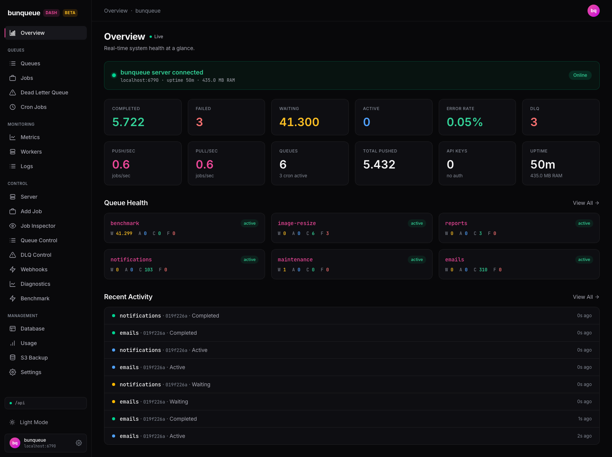
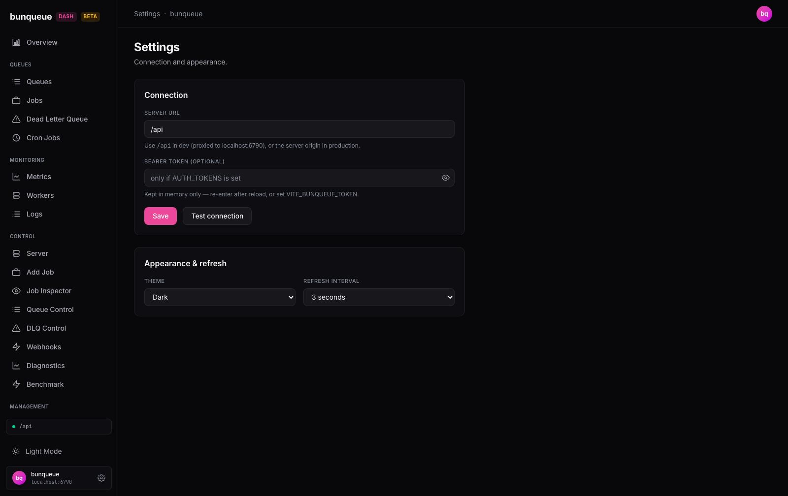
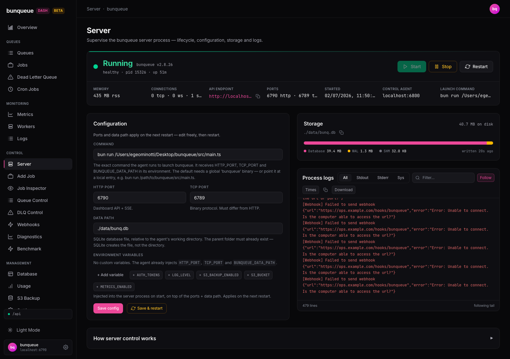
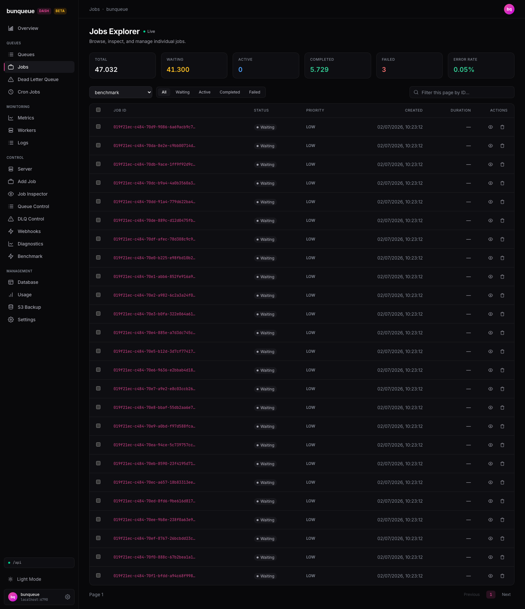

<script setup>
// Public assets and raw-HTML srcs are NOT base-rewritten by VitePress (only
// markdown links/images are), so the tour video must be resolved explicitly,
// because the docs deploy under /bunqueue-dashboard/docs/ on Pages.
import { withBase } from 'vitepress'
</script>

<div class="lp">

<section class="lp-hero">

<p class="lp-chip">bunqueue dashboard</p>

<h1 class="lp-h1">The only queue dashboard that also<br>runs the server</h1>

<p class="lp-sub">A free, open source web UI that <strong>safely operates</strong> a bunqueue server (a fast, Redis-free, Bun-native background-job queue): queues, jobs, dead-letter queue, cron, webhooks, workers and live activity, plus start / stop / restart of the server process itself. Built for Bun developers and AI-agent builders who want to <em>operate</em> their queue, not just watch it. It uses Bunqueue's public HTTP API plus its pinned public client/CLI behind a tiny loopback control agent, and fails closed when the v2.9.2 contract cannot make a mutation atomic.</p>

<p class="lp-ctas">
<a class="lp-btn lp-btn-primary" href="https://egeominotti.github.io/bunqueue-dashboard/" target="_blank" rel="noreferrer">Open the live demo</a>
<a class="lp-btn" href="./quickstart">Quick start</a>
<a class="lp-btn" href="https://github.com/egeominotti/bunqueue-dashboard">GitHub</a>
</p>

<a class="lp-window" href="https://egeominotti.github.io/bunqueue-dashboard/" target="_blank" rel="noreferrer" aria-label="Open the live demo of the bunqueue dashboard">
<span class="lp-window-bar"><span class="lp-dot"></span><span class="lp-dot"></span><span class="lp-dot"></span><span class="lp-live">● live demo, click to drive it</span></span>

{.lp-window-shot}

</a>

</section>

<section class="lp-proof" aria-label="Project facts">
<span>MIT license</span>
<span>Zero-dependency npm package</span>
<span>Standalone binaries for 5 platforms</span>
<span>Multi-arch Docker image</span>
<a href="./known-issues">Limits documented honestly →</a>
</section>

<section class="lp-section">

<p class="lp-chip">Overview</p>

## Features {.lp-title}

<p class="lp-lead">Everything an operator needs to run a bunqueue server from the browser, from state-gated job actions right through to the process lifecycle. Every card below is a shipped page you can open in the demo right now.</p>

<div class="lp-cards">

<article class="lp-card"><span class="lp-num">1</span>

### State-gated job actions

Add and inspect jobs, promote delayed work, and update eligible job data, priority, delay or progress. DLQ retry, completed-job requeue and destructive Cancel fail closed under the v2.9.2 contract. <a href="./guide/job-inspector">Job Inspector →</a>

</article>

<article class="lp-card"><span class="lp-num">2</span>

### Live activity stream

A Server-Sent-Events feed with automatic reconnect shows jobs flowing in real time. It is built on fetch, so it works with bearer-token auth, unlike EventSource. <a href="./guide/logs">Live logs →</a>

</article>

<article class="lp-card"><span class="lp-num">3</span>

### DLQ triage

A fleet-wide dead-letter dashboard plus a single-queue triage surface: failure reasons, per-attempt history and CSV export. Manual, bulk and Copilot retry remain unavailable because the GET + POST sequence has no atomic generation/state/topology precondition; purge is disabled too. <a href="./guide/dlq-control">DLQ Control →</a>

</article>

<article class="lp-card"><span class="lp-num">4</span>

### Cron manager

Schedule by cron expression or interval-in-ms with a next-runs preview, then list and delete existing schedules. <a href="./guide/cron">Cron →</a>

</article>

<article class="lp-card"><span class="lp-num">5</span>

### Webhooks

Register endpoints with event scoping and an optional HMAC secret; watch success/failure counts, toggle, delete. <a href="./guide/webhooks">Webhooks →</a>

</article>

<article class="lp-card"><span class="lp-num">6</span>

### Server lifecycle

The one thing HTTP can't do, namely starting, stopping and restarting the bunqueue process, is delegated to a small loopback-bound agent with an Origin + Host allowlist, locked CORS and an optional bearer token. <a href="./guide/server">Server Control →</a>

</article>

<article class="lp-card"><span class="lp-num">7</span>

### SQLite inspector

Browse tables, schema and indexes, page through rows, run SELECT-only queries with EXPLAIN and CSV/JSON export, all over a read-only connection, capped at 500 rows. <a href="./guide/database">Database →</a>

</article>

<article class="lp-card"><span class="lp-num">8</span>

### Metrics & throughput

Rolling live throughput charts, error-rate gauge, per-operation latency percentiles (push / pull / ack × p50 / p95 / p99). <a href="./guide/metrics">Metrics →</a>

</article>

<article class="lp-card"><span class="lp-num">9</span>

### Client-side alerts

Threshold rules on queue depth, failures, error rate and latency, evaluated in the browser, with in-app toasts and desktop notifications. <a href="./user-guide">Alerts →</a>

</article>

<article class="lp-card"><span class="lp-num">10</span>

### Benchmark

Push and drain load runs against any queue, in count or duration mode, with a live chart and run history. <a href="./guide/benchmark">Benchmark →</a>

</article>

<article class="lp-card"><span class="lp-num">11</span>

### Flow DAG viewer

Explore parent/child/dependency DAGs, create every official FlowProducer shape, and operate safe Flow Job methods. <a href="./guide/flows">Job Flows →</a>

</article>

<article class="lp-card"><span class="lp-num">12</span>

### AI Copilot <em class="lp-tag">experimental</em>

An in-app assistant that reads the same API through tools; its only mutations are Promote, Pause and Resume, each confirmed by you. Bring your own key, and requests go straight from your browser to your provider. <a href="./guide/copilot">Copilot →</a>

</article>

</div>

</section>

<section class="lp-section">

<p class="lp-chip">Tour</p>

## See it in action {.lp-title}

<p class="lp-lead">A real control surface, not a read-only viewer, so every screen in this tour is a live page you can drive in the <a href="https://egeominotti.github.io/bunqueue-dashboard/" target="_blank" rel="noreferrer">demo</a>.</p>

<video class="lp-video" :src="withBase('/tour.mp4')" autoplay muted loop playsinline preload="metadata" aria-label="A guided tour of the bunqueue dashboard: overview, queues, jobs, DLQ, flows, the SQLite inspector, and the AI Copilot"></video>

</section>

<section class="lp-section">

<p class="lp-chip">Surface</p>

## Everything you can drive {.lp-title}

<div class="lp-tiles">
<a href="./guide/queues"><strong>Queues</strong><span>pause · resume · desired-state limits · flow-safe controls</span></a>
<a href="./guide/jobs"><strong>Jobs</strong><span>add · inspect · promote · guarded metadata edits</span></a>
<a href="./guide/dlq"><strong>DLQ</strong><span>reasons · attempt history · CSV · read-only retry controls</span></a>
<a href="./guide/cron"><strong>Cron</strong><span>expressions or intervals · next-runs preview</span></a>
<a href="./guide/webhooks"><strong>Webhooks</strong><span>event scoping · HMAC secrets · delivery stats</span></a>
<a href="./guide/workers"><strong>Workers</strong><span>health · last seen · stale-record cleanup</span></a>
<a href="./guide/server"><strong>Server</strong><span>start · stop · restart · live process logs</span></a>
<a href="./guide/database"><strong>Database</strong><span>read-only SQLite tables · schema · queries</span></a>
</div>

</section>

<section class="lp-section">

<p class="lp-chip">Process</p>

## Up and running in four steps {.lp-title}

<p class="lp-lead">The priority is simplicity: one command serves the dashboard, proxies the API and runs the control agent. No clone, no build.</p>

<div class="lp-step">
<div class="lp-step-text">
<span class="lp-num">Step 1</span>

### Run it

One process serves the dashboard on `http://127.0.0.1:8080`, proxies `/api/*` to your bunqueue server and runs the control agent.

</div>
<div class="lp-step-media">

```bash
bunx bunqueue-dashboard
```

</div>
</div>

<div class="lp-step">
<div class="lp-step-text">
<span class="lp-num">Step 2</span>

### Point it at your server

Create one or more named server + paired-agent profiles in Settings. Tokens stay in memory and are isolated per profile; defaults may come from `BUNQUEUE_URL` / `VITE_BUNQUEUE_URL`.

</div>
<div class="lp-step-media">



</div>
</div>

<div class="lp-step">
<div class="lp-step-text">
<span class="lp-num">Step 3</span>

### …or let it run the server for you

From **Control ▸ Server** the agent starts, stops and restarts the bunqueue process, with an editable launch config and a colour-coded live log tail.

</div>
<div class="lp-step-media">



</div>
</div>

<div class="lp-step">
<div class="lp-step-text">
<span class="lp-num">Step 4</span>

### Drive it

Explore jobs, triage the DLQ, schedule cron, watch live activity. Destructive actions are confirmed and name their target; everything else is one click.

</div>
<div class="lp-step-media">



</div>
</div>

</section>

<section class="lp-section">

<p class="lp-chip">Get started</p>

## How to install {.lp-title}

<p class="lp-lead">Four ways to run it, pick the one that fits. All of them serve the same app.</p>

::: code-group

```bash [Bun 1.4 (recommended)]
bunx bunqueue-dashboard
# → http://127.0.0.1:8080, serves the SPA plus the /api proxy and control agent
```

```bash [Standalone binary]
# Download the binary for your platform from the GitHub Releases page,
# then make it executable and run it, nothing else to install:
chmod +x bunqueue-dashboard-v*-darwin-arm64
./bunqueue-dashboard-v*-darwin-arm64
# → http://localhost:8080
```

```bash [Docker]
docker run --rm -p 8080:80 ghcr.io/egeominotti/bunqueue-dashboard:edge
# → http://localhost:8080, set the server URL from the Settings page
```

```bash [From source]
bun install
bun start
# agent (http://127.0.0.1:6800) + dashboard (http://localhost:5273) together
```

:::

**[Full quickstart guide →](/quickstart)**

</section>

<section class="lp-section">

<p class="lp-chip">FAQ</p>

## Frequent questions {.lp-title}

<div class="lp-faq">

<article class="lp-card">

### What is this, and why not just curl the API?

A complete operator surface over bunqueue's HTTP API: scheduling, triage, limits, live activity and process lifecycle in one UI, with every job action gated by the job's real state, instead of hand-rolled curl scripts and guesswork about which action a job will accept.

</article>

<article class="lp-card">

### Does it touch my server's code or data?

No. It never modifies Bunqueue. Ordinary operations use the public HTTP API; Flow and Workflow controls use the pinned public client through the loopback agent. Source-mode backup controls invoke the installed CLI, while the standalone executable embeds that same pinned backup command in an isolated worker so it never recursively launches itself. The compile and E2E gates make any internal CLI layout drift fail visibly during an upgrade. The SQLite inspector opens its own read-only connection and accepts SELECT-style statements only, so it cannot write even if asked to.

</article>

<article class="lp-card">

### Is the control agent safe to run?

The agent can spawn processes, so it's locked down: a direct loopback listener, an Origin allowlist with CORS never set to `*`, and a Host-header allowlist against DNS rebinding. Truly local access can remain zero-config; a LAN or reverse-proxied `/agent` bridge requires `AGENT_TOKEN` on every route, while the all-in-one `/api` proxy separately requires `BUNQUEUE_TOKEN`. The full threat model is in <a href="./agent">the agent docs</a>.

</article>

<article class="lp-card">

### Where do my tokens and secrets live?

In memory only. Server tokens, agent tokens, S3 keys and webhook targets are deliberately excluded from localStorage, so re-enter them per session or use authentication at your front proxy. Never put secrets in `VITE_*` variables: they become plaintext in the public bundle.

</article>

<article class="lp-card">

### Can I try it without a bunqueue server?

Yes, the <a href="https://egeominotti.github.io/bunqueue-dashboard/" target="_blank" rel="noreferrer">live demo</a> runs the real app against fixture data in your browser. Every page works, no backend required.

</article>

<article class="lp-card">

### How do I deploy it?

Four ways: the prebuilt npm package (`bunx bunqueue-dashboard`), a standalone binary for linux/macOS/windows, the multi-arch Docker image, or from source. The binary embeds the SPA, the API proxy and the agent in one file.

</article>

<article class="lp-card">

### What doesn't it do?

Alerts are evaluated in the browser while a tab is open, so it's not away-from-desk paging. S3 credentials remain session-only even though configuration and operations are available in the UI. Mutations that v2.9.2 cannot make atomic are intentionally disabled, including every DLQ retry and completed-job requeue. DLQ <code>maxAge</code>/<code>maxEntries</code> are shown read-only and omitted from saves; auto-retry can only be disabled. Every verified contract gap is listed on the <a href="./known-issues">known issues</a> page.

</article>

<article class="lp-card">

### Is my data sent anywhere?

No telemetry. The only optional egress is the AI Copilot: if you enable it, requests go directly from your browser to the LLM provider you configure, using your own key.

</article>

</div>

</section>

<section class="lp-final">

## Drive your queue server from the browser

<p class="lp-ctas">
<a class="lp-btn lp-btn-primary" href="https://egeominotti.github.io/bunqueue-dashboard/" target="_blank" rel="noreferrer">Open the live demo</a>
<a class="lp-btn" href="./quickstart">Quick start</a>
</p>

</section>

</div>
